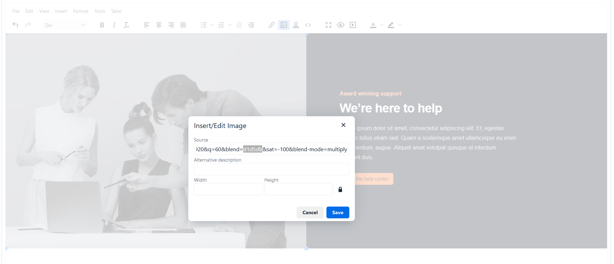

# CMS in the Developer Portal

<head>
  <meta name="guidename" content="API Management"/>
  <meta name="context" content="GUID-2ccae265-18a0-4494-8afb-26172617aa60"/>
</head>

## Developer Portal

In the developer portal you can use the CMS to customize the content of your self-created pages according to your individual wishes. Furthermore, you can add additional content in the predefined static pages in certain areas. To add content like text or images to a page blocks are used. A page can contain no blocks or several blocks. A block contains part or all of the displayed content of a page. A block cannot be added to a page more than once.

## Edit page

 

To edit a page in the developer portal you have to enter the edit mode. You can only access this as a global admin via the 'Edit Mode' toggle in the navigation area.


If the toggle is active, new elements and options are displayed on the current page:

- **Add Block:** With this button you can add new blocks to the current page.

- **Close Edit Mode:** With this button you leave the edit mode and return to the normal view (you can also do this by pressing the toggle in the navigation area).

- **Blocks:** All available blocks of the current page are displayed. Each block is visually separated from the other blocks by a card. Each block has the options:

     - Insert Template: Opens the template selection dialog. In this dialog you can select predefined templates from a dropdown menu, preview them and insert them into your current block. After inserting the template into your block, you can customize it according to your requirements. 
     
     - Edit: Opens the editor for the selected block. Here, texts and images can be edited directly or the HTML mode can be activated via a toggle button.
     
     - Up/Down: This option moves the block within the page in the desired direction.
     
     - Remove: This option removes the selected block from the page (see below for more details).
     
     - Save: This button is only visible when a block is being edited. With this option the block content is saved and the editor of the block is closed.

## Editor


You can access the editor of a block by activating the edit mode and clicking on the 'Edit' button in a block. The editor then opens and loads the existing contents of the block. 

The **green** area is the input area, where you can add text by keyboard input or images by drag and drop. 

In the **red** area are standard text processing tools. 

The blue area contains various tools for advanced editing of the content, e.g. inserting links, inserting images via URL, adding HTML template elements, HTML editor, etc.

### CSS

To customize your own or our template HTML elements you can use CSS in the editor within the 'Source View' dialog. The editor supports the CSS classes of [Tailwindcss](https://tailwindcss.com/docs/responsive-design.).

## Templates


Templates are [predefined](../Topics/cp-CMS_template_library.md) text and HTML elements that you can use for your block content. You can customize these templates within your block according to your requirements, both text and HTML code. To add templates to your block, you can use the button 'Insert Template', in the editor menu the entry 'Insert' and then 'Insert template...' or use the editor quick access button. When you open the template menu, you can select different templates from a dropdown list. You will get a preview of the selected template in the dialog. You can then add it to the current block using the 'Save' button.

### Icons

To add or edit icons in the selected template, you must activate the 'Source Code' view in the editor.


There you can search for the new location of the icon you want to add or search for the icon you want to replace. Then open the page [Heroicons](https://heroicons.com/) in a new tab. There, you select an icon and click on 'Copy SVG'. This will be copied to your clipboard in the form of HTML code, as in this example:

```xml

<svg class="h-6 w-6" fill="none" viewBox="0 0 24 24" stroke-width="1.5" stroke="currentColor" aria-hidden="true"> 
<path stroke-linecap="round" stroke-linejoin="round" d="M12 16.5V9.75m0 0l3 3m-3-3l-3 3M6.75 19.5a4.5 4.5 0 01-1.41-8.775 5.25 5.25 0 0110.233-2.33 3 3 0 013.758 3.848A3.752 3.752 0 0118 19.5H6.75z">
</path> 
</svg>

```
The Html code in your clipboard you can paste into your selected template via the right mouse button 'Paste'. Finally click on 'Save' in the 'Source Code' dialog.

Alternatively, outside of the 'Source Code' dialog, you can drag and drop images from your computer to the required location

### Anchors

First of all, you need to give an Id to a heading.

```
<h1 id="allInOne">All-in-one platform</h1>
```

Then you can give any text a href.

```
<p><a href="#allInOne">Click Me</a></p>
```

So when clicking "Click Me" "allInOne" is added to the URL and page scrolls to the specified heading.

### Images



Within templates there are predefined images. An example is the template ['SplitWithImage'](../Topics/cp-CMS_template_library.md), which is shown above. The color of the image can be changed by clicking on the image. To do this, you have to search for the word 'blend=' in the field 'Source' and replace the value after the '=' with the desired hex color.

## Static pages and blocks


The predefined pages: Home, APIs, API Products and Applications have freely configurable areas, which can be customized with blocks. These predefined pages can be found [listed in the admin portal](../Topics/cp-CMS_in_admin_portal.md) in the corresponding developer portal settings. These pages have default blocks which can be removed but not deleted from the pages.

### Home content block


The welcome page under '/welcome' is initially provided with the 'home_content' block and has the templates configured by default:

- [HeroSections - WithOffsetlmage](../Topics/cp-CMS_template_library.md)

- [FeatureSections - OffsetWithFeatureList](../Topics/cp-CMS_template_library.md)

- [CTASections - SplitWithlmage](../Topics/cp-CMS_template_library.md)

- [Newsletter - SimpleSideBySide](../Topics/cp-CMS_template_library.md)

These templates were adjusted accordingly in text and elements.
You can freely configure or remove the 'home_content' block. To restore the default content of the 'home_content' block you have to delete and save the entire content of the block via the 'Source View'. The block will be reinitialized and the predefined content will appear.

## Add or create block


To add a block to a page you have to activate the edit mode and click on the button 'Add Block'.  In the following dialog you can decide whether you want to add an existing block to the page or create and add a new block. The added block will be added to the end of the block list of the page.

## Remove or delete block


To remove a block from a page you have to activate the edit mode and click on 'Remove' in the corresponding block. If the block is used in other pages, the block will be removed from the page automatically. If the block is not in use on any page, you will be shown a dialog where you can choose whether you want to delete the block forever or just remove it from the page.


