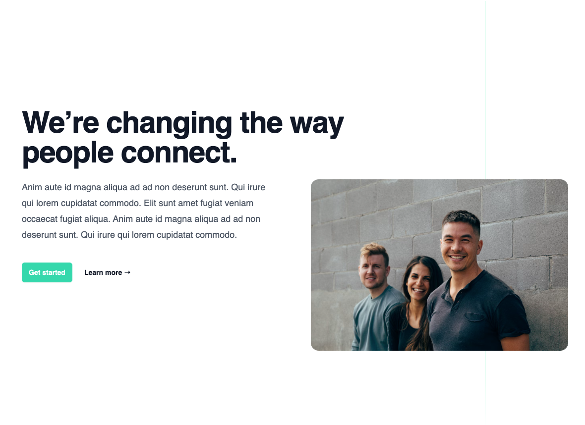

# CMS Template Library

<head>
  <meta name="guidename" content="API Management"/>
  <meta name="context" content="GUID-c1f2bb9f-8e48-44af-bcf6-d74e5b2fb91e"/>
</head>

The following images show all available templates, which are listed in the Developer Portal in the [block editor](../Topics/cp-CMS_in_the_developer_portal.md) of the 'Edit Mode'.

:::note

The templates are based on modified [Tailwind Components](https://tailwindui.com/components).

:::

## Basics - Button

## BlogSections - ThreeColumnWithlmages

## ContactSections - SplitWithPattern

## CTASections - SimpleCentered

## CTASections - SimpleCenteredOnBrand

## CTASections - SimpleStacked

## CTASections - SplitWithlmage

## FeatureSections - Offset2x2grid

## FeatureSections - Centered2x2grid

## FeatureSections - OffsetWithFeatureList

## FeatureSections - Simple

## FeatureSections - SimpleThreeColumnWithSmallicons

## FeatureSections - WithProductScreenshot

## FeatureSections - WithProductScreenshotPanel

## FeatureSections - WithProductScreenshotOnLleft

## HeaderSections - CenteredWithEyebrow

## HeaderSections - SimpleWithEyebrow

## HeroSections - SplitWithScreenshot

## HeroSections - WithOffsetlmage

## Newsletter - SimpleSideBySide

## Newsletter - SideBySideWithDetails

## Newsletter - SimpleStacked

