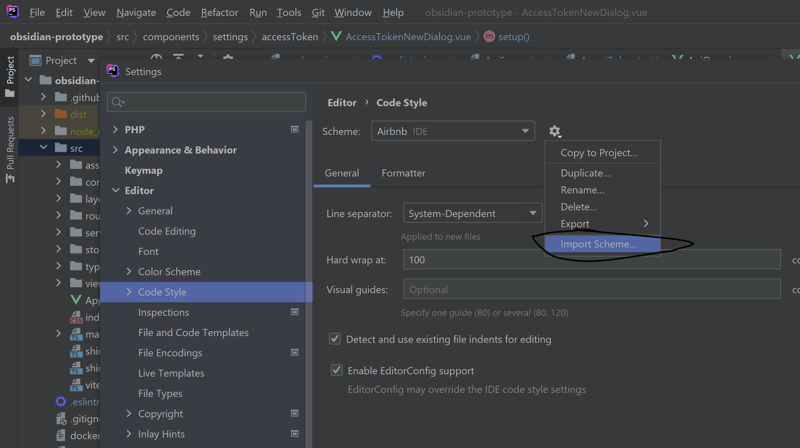
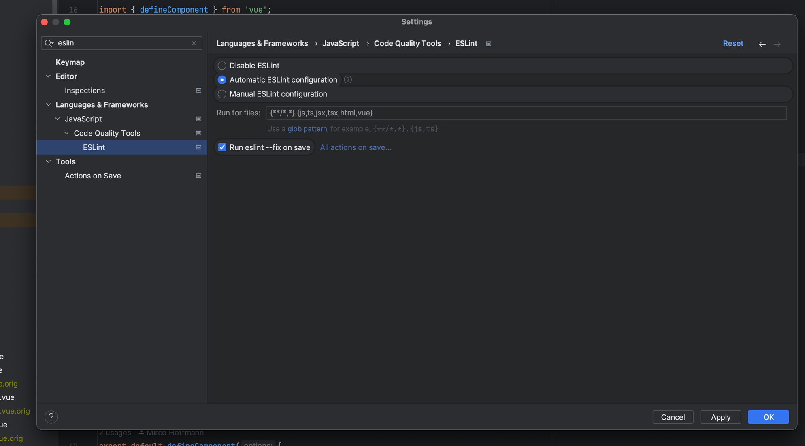
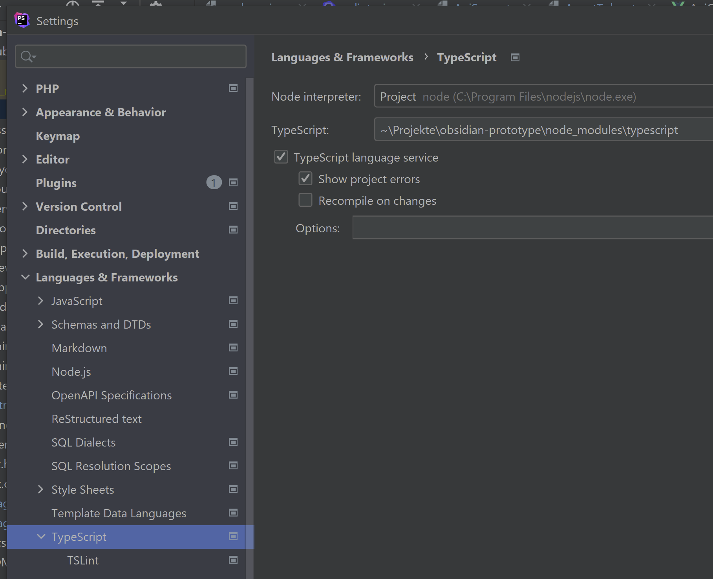
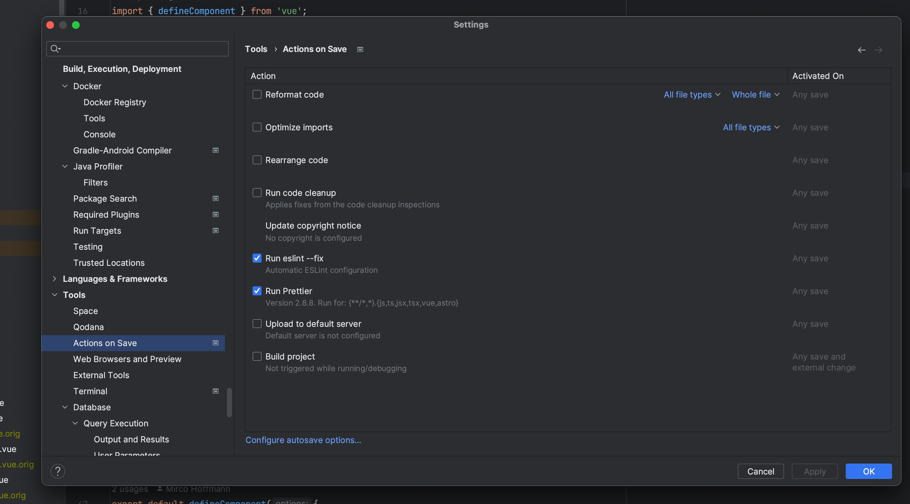
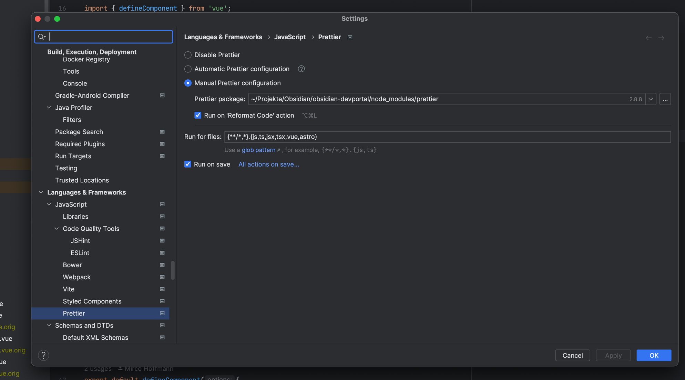

# Coding Guidelines

<head>
  <meta name="guidename" content="API Management"/>
  <meta name="context" content="GUID-935b88f7-84e2-4a5e-9614-9f3be012dc04"/>
</head>

## Language

We use TypeScript as much as we can. We only resort to vanilla JavaScript when there are dependencies that do not work well with Typescript enabled. 

Naming guidelines see [Google TypeScript Style Guide](https://google.github.io/styleguide/tsguide.html) 

## Vue

We use the Vue.js 3 composition API together with TypeScript. See the Vue.JS docs for details. In a nutshell our components will look like this. 

```xml

<template>
  <div class="font-bold">
    {{ testString }}
  </div>
  <div class="font-bold">
    {{ getHelloWorldText() }}
  </div>
  <template>
  <button type="button" class="rounded bg-indigo-500 py-1 px-2 text-xs font-semibold text-white shadow-sm hover:bg-indigo-400 focus-visible:outline focus-visible:outline-2 focus-visible:outline-offset-2 focus-visible:outline-indigo-500">Button text</button>
</template>
<script lang="ts">
import { defineComponent } from 'vue'
export default defineComponent({
    props: {
        // Type-Safe properties! 
        myComplexProperty: {
          type: Object as PropType<MyInterface>,
          required: true,
        }
    }, 
    emits: [],
    setup(props, { emit }) {
    },
})
</script>
<style scoped>
</style>
</template>
<script lang="ts">
import { defineComponent } from 'vue'
export default defineComponent({
    props: {
        // Type-Safe properties! 
        myComplexProperty: {
          type: Object as PropType<MyInterface>,
          required: true,
        }
    }, 
    emits: [],
    setup(props, { emit }) {
    const testString = ref<String>('Hello');
    function getHelloWorldText(): string{
      return `${testString.value} World`;
    }
    return { testString, getHelloWorldText },
    },
})
</script>
<style scoped>
</style>

```

We also use the Vue.js style guide [that can be found here](https://vuejs.org/)

## ESLint & Prettier


## WebStorm/PHPStorm

- Upload the xml Airbnb Schema on Code Style



```xml

<code_scheme name="Airbnb copy" version="173">
  <option name="LINE_SEPARATOR" value="&#xA;" />
  <option name="RIGHT_MARGIN" value="100" />
  <DBN-PSQL>
    <case-options enabled="false">
      <option name="KEYWORD_CASE" value="lower" />
      <option name="FUNCTION_CASE" value="lower" />
      <option name="PARAMETER_CASE" value="lower" />
      <option name="DATATYPE_CASE" value="lower" />
      <option name="OBJECT_CASE" value="preserve" />
    </case-options>
    <formatting-settings enabled="false" />
  </DBN-PSQL>
  <DBN-SQL>
    <case-options enabled="false">
      <option name="KEYWORD_CASE" value="lower" />
      <option name="FUNCTION_CASE" value="lower" />
      <option name="PARAMETER_CASE" value="lower" />
      <option name="DATATYPE_CASE" value="lower" />
      <option name="OBJECT_CASE" value="preserve" />
    </case-options>
    <formatting-settings enabled="false">
      <option name="STATEMENT_SPACING" value="one_line" />
      <option name="CLAUSE_CHOP_DOWN" value="chop_down_if_statement_long" />
      <option name="ITERATION_ELEMENTS_WRAPPING" value="chop_down_if_not_single" />
    </formatting-settings>
  </DBN-SQL>
  <HTMLCodeStyleSettings>
    <option name="HTML_SPACE_INSIDE_EMPTY_TAG" value="true" />
  </HTMLCodeStyleSettings>
  <JSCodeStyleSettings version="0">
    <option name="FORCE_SEMICOLON_STYLE" value="true" />
    <option name="FORCE_QUOTE_STYlE" value="true" />
    <option name="SPACES_WITHIN_OBJECT_LITERAL_BRACES" value="true" />
    <option name="SPACES_WITHIN_IMPORTS" value="true" />
    <option name="INDENT_CHAINED_CALLS" value="false" />
  </JSCodeStyleSettings>
  <TypeScriptCodeStyleSettings version="0">
    <option name="FORCE_SEMICOLON_STYLE" value="true" />
    <option name="FORCE_QUOTE_STYlE" value="true" />
    <option name="SPACES_WITHIN_OBJECT_LITERAL_BRACES" value="true" />
    <option name="SPACES_WITHIN_IMPORTS" value="true" />
  </TypeScriptCodeStyleSettings>
  <codeStyleSettings language="CSS">
    <indentOptions>
      <option name="INDENT_SIZE" value="2" />
      <option name="CONTINUATION_INDENT_SIZE" value="2" />
      <option name="TAB_SIZE" value="2" />
    </indentOptions>
  </codeStyleSettings>
  <codeStyleSettings language="HTML">
    <option name="RIGHT_MARGIN" value="100" />
    <indentOptions>
      <option name="INDENT_SIZE" value="2" />
      <option name="CONTINUATION_INDENT_SIZE" value="2" />
      <option name="TAB_SIZE" value="2" />
    </indentOptions>
  </codeStyleSettings>
  <codeStyleSettings language="Jade">
    <indentOptions>
      <option name="INDENT_SIZE" value="2" />
      <option name="TAB_SIZE" value="2" />
    </indentOptions>
  </codeStyleSettings>
  <codeStyleSettings language="JavaScript">
    <option name="RIGHT_MARGIN" value="100" />
    <option name="KEEP_FIRST_COLUMN_COMMENT" value="false" />
    <option name="WHILE_ON_NEW_LINE" value="true" />
    <option name="CATCH_ON_NEW_LINE" value="true" />
    <option name="CALL_PARAMETERS_WRAP" value="5" />
    <option name="PREFER_PARAMETERS_WRAP" value="true" />
    <option name="METHOD_CALL_CHAIN_WRAP" value="5" />
    <option name="DOWHILE_BRACE_FORCE" value="3" />
    <indentOptions>
      <option name="INDENT_SIZE" value="2" />
      <option name="CONTINUATION_INDENT_SIZE" value="2" />
      <option name="TAB_SIZE" value="2" />
    </indentOptions>
  </codeStyleSettings>
  <codeStyleSettings language="TypeScript">
    <indentOptions>
      <option name="INDENT_SIZE" value="2" />
      <option name="CONTINUATION_INDENT_SIZE" value="2" />
      <option name="TAB_SIZE" value="2" />
    </indentOptions>
  </codeStyleSettings>
  <codeStyleSettings language="Vue">
    <indentOptions>
      <option name="CONTINUATION_INDENT_SIZE" value="2" />
    </indentOptions>
  </codeStyleSettings>
</code_scheme>

```

- Set EsLint to “Automatic ESLint configuration“



- Enable Typescript  language service



- Auto Save





## Links

[Prettier | PhpStorm](https://www.jetbrains.com/help/phpstorm/prettier.html)

[Prettier · Opinionated Code Formatter](https://prettier.io/)

[GitHub - airbnb/javascript: JavaScript Style Guide](https://github.com/airbnb/javascript) 

[Find and fix problems in your JavaScript code - ESLint - Pluggable JavaScript Linter](https://eslint.org/) 


