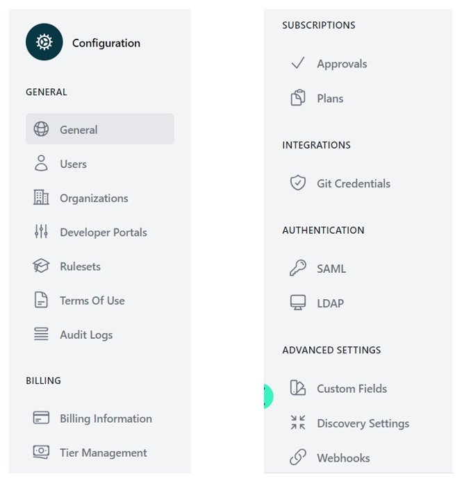

# Configuration

<head>
  <meta name="guidename" content="API Management"/>
  <meta name="context" content="GUID-106c6dae-8b78-4add-8849-9130cf35f3fb"/>
</head>

As you delve into the world of API management, one fundamental aspect that stands as the backbone of seamless operations is the "Configuration" menu. This component of the API management interface is your command center for tailoring the platform to fit your organization's unique requirements. Let’s take a guided tour through this menu, highlighting the crucial settings that empower you to keep your API ecosystem robust, secure, and efficient.

:::info

The Configuration menu is only visible for global admin users.

:::

## General Settings

At the heart of the "Configuration" menu, the "General" settings act as the foundation for your API platform. From here, you can define the global properties of your system, such as server configurations and platform-wide preferences. The "Users" section is particularly vital—it's where you can onboard new talent into your API platform and define their roles, ensuring that everyone has the right level of access.

The "Organizations" subsection helps you keep your API endeavors neatly compartmentalized. Whether you’re managing multiple teams or catering to different departments, this area allows you to set up and maintain clear organizational structures within the platform.

## Communication and Compliance

For communication, the "SMTP" settings are crucial for setting up the email relay for outbound emails from your API platform. Whether it's alerting developers to changes or sending subscription confirmations, this section ensures your email communications are up and running.

The transparency of operations is paramount in API management, and that's where the "Audit Logs" come into play. They provide a detailed and chronological trail of all the activities, modifications, and access patterns within the platform—indispensable for tracking usage and maintaining compliance.

## Developer Portals

A standout feature in the general settings is the "Developer Portals" option. Here, you tailor the developer portal. 

## Rules and Regulations

Next, we have "Rulesets." These are the frameworks within which your APIs operate. They determine the behavior of your APIs under certain conditions, like setting up rate limits or configuring response actions for specific scenarios.

## Subscription Management

Under the "Subscriptions" heading, the "Approvals" option allows you to oversee the process through which users gain access to your API products. It's a gatekeeping feature that ensures only authorized usage of your API resources.

In "Plans," you configure the different API subscription models available to users. Each plan can be tailored with its own set of usage policies, rate limits, and access to specific API sets, allowing for flexible and tiered API product offerings.

## Integrations and Authentications

Moving into more specialized territories, the "INTEGRATIONS" section shines a light on external partnerships and tooling. For instance, "Git Credentials" suggests a symbiotic relationship with version control systems, a must-have for continuous integration and deployment pipelines.

Under "AUTHENTICATION," we find options for "SAML" and "LDAP," each representing a cornerstone of user authentication and single sign-on capabilities. These protocols are integral in securing your APIs and ensuring that users' identities are properly managed across the board.

## Advanced Customization

Last but not least, "Advanced Settings" like "Custom Fields" provide the fine-tuning capabilities that can make or break an API platform’s usability. These settings allow for a higher degree of personalization, ensuring that your API management interface reflects the unique needs and nuances of your organization.

Also part of the Advanced Settings are the sections Discovery and Webhooks.

## Subjects to Configurate
 
- [Configuration General](../Topics/cp-Configuration_general.md)
- [Configuration User Management](../Topics/cp-Configuration_user_management.md)
- [Configuration Organizations](../Topics/cp-Configuration_organisation.md)
- [Configuration Developer Portal](../topics/cp_Configuration_developer_portal.md)
- [Configuration Rulesets](../Topics/cp-Configuration_ruleset.md)
- [Configuration Terms of Use](../Topics/cp-Configuration_term_of_use.md)
- [Configuration Audit Logs](../Topics/cp-Configuration_audit_logs.md)
- [Configuration Approvals](../Topics/cp-Configuration_approvals.md)
- [Configuration Plans](../Topics/cp-Configuration_plans.md)
- [Configuration Git Credentials](../Topics/cp-Configuration_Git_credentials.md)
- [Configuration SAML](../Topics/cp-Configuration_SAML.md)
- [Configuration LDAP](../Topics/cp-Configuration_LDAP.md)
- [Configuration Custom Fields](../Topics/cp-Configuration_custom_fields.md)
- [Configuration Discovery Settings](../Topics/cp-Configuration_discovery_settings.md)
- [Configuration Webhooks](../Topics/cp-Configuration_webhooks.md)

