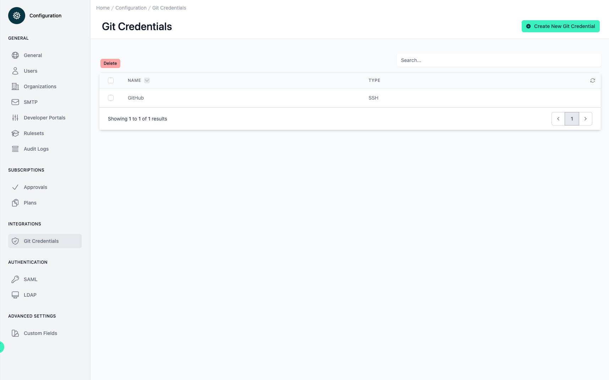
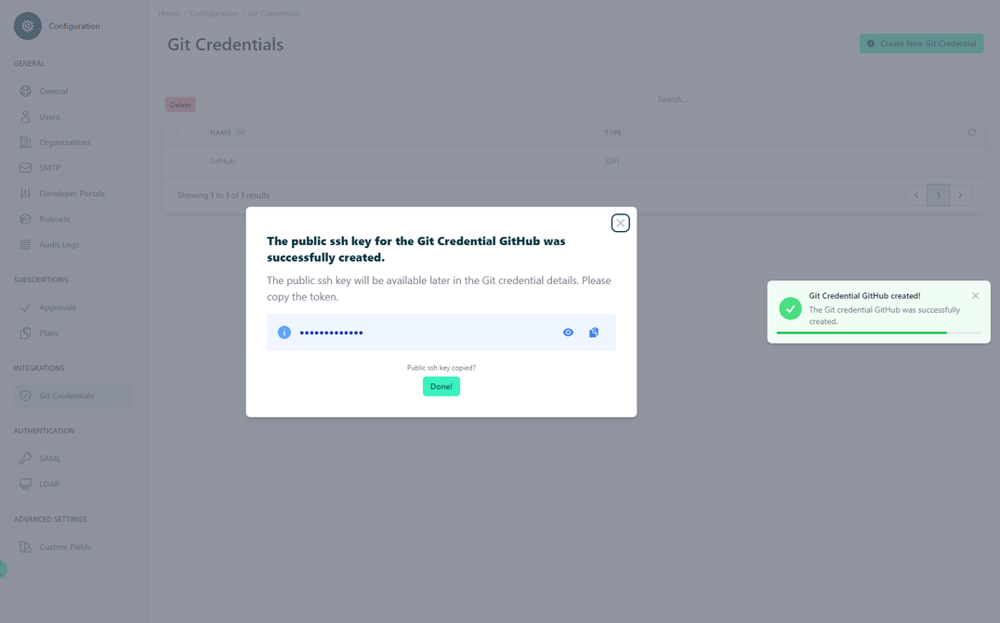

# Configuration Git Credentials

<head>
  <meta name="guidename" content="API Management"/>
  <meta name="context" content="GUID-e0960da8-b645-4c46-9f55-999eb2b8d302"/>
</head>

## Overview

This interface is focused on the management of Git credentials. This component allows users to handle various credentials required to interact with Git repositories, essential for operations involving source control and versioning.

## Git Credential Management

At the core of the interface is a straightforward layout where Git credentials are listed. The credentials are presented in a table format, which at a glance, shows the name of the credential—like "GitHub"—and the type, which is categorized as "SSH" in this example. SSH, or Secure Shell, is a common secure protocol for accessing Git repositories.

The interface features a search bar at the top right, facilitating the quick location of specific credentials by name. This is a time-saver for users dealing with multiple credentials.

Adjacent to the search bar is a prominent green button labeled "Create New Git Credential". This button is an actionable item inviting users to add new credentials, suggesting the process is likely streamlined and guided to enhance user experience.

The generated SSH key is displayed immediately after creation.

But even after you have created it, you can still edit the corresponding Git credential or retrieve the public key by clicking in the table.

## Credential Actions

On the leftmost part of the credential listing, checkboxes allow for the selection of one or more credentials. This batch action feature enables the user to delete multiple credentials at once. The "Delete" button positioned above the table is enabled when one or more credentials are selected, which facilitates the management and housekeeping of the credentials.

