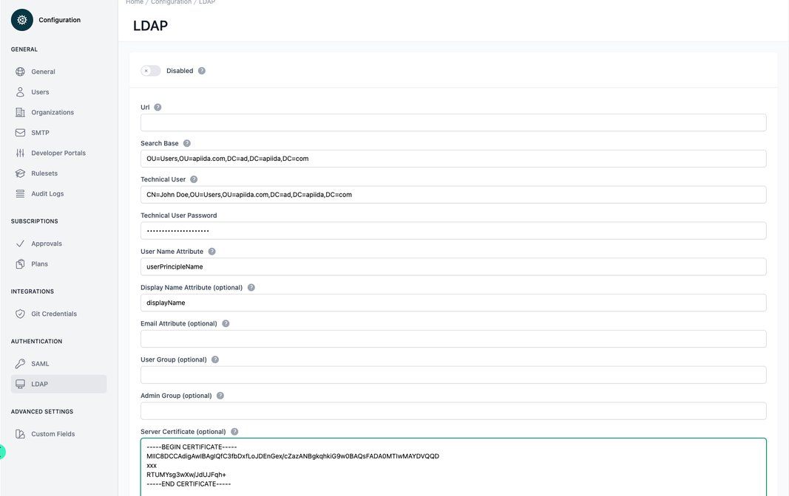

# Configuration LDAP

<head>
  <meta name="guidename" content="API Management"/>
  <meta name="context" content="GUID-654baee6-4e43-47fb-904d-7d4b870e59ac"/>
</head>

## Overview

The LDAP (Lightweight Directory Access Protocol) Configuration page in the API Control Plane is where administrators can set up and manage LDAP integration for user authentication and directory services. This setup allows the platform to authenticate users against an LDAP directory such as Active Directory, OpenLDAP, or other LDAP-compliant directories.

## Layout and Functionalities

A toggle switch allows for quick enablement or disablement of LDAP integration. In the form below, all relevant subjects can be specified.

The form includes fields for:

- "Url": Where the LDAP server's URL is specified, indicating where the API platform should direct its authentication requests.

- "Search Base": Denoting the starting point within the LDAP directory from where to begin the search for user entries.

- "Technical User": A distinguished name (DN) of a user with permissions to carry out actions in the LDAP directory, perhaps used for querying user data.

- "Technical User Password": A password field, obfuscated for security, corresponding to the technical user.

- "User Name Attribute": The attribute used to log in or identify the user within the LDAP directory, which is typically 'userPrincipalName'.

- "Display Name Attribute (optional)": If provided, this attribute would specify how user names are displayed within the platform.

- "Email Attribute (optional)": An attribute for the user's email, which might be used for notifications or integration with other services.

- "User Group (optional)": To designate a particular user group from LDAP for special privileges or restrictions within the API management platform.

- "Admin Group (optional)": To define an LDAP group whose members are granted administrative privileges on the platform.

- "Server Certificate (optional)": Add the LDAP server's SSL certificate to enable secure communications.

