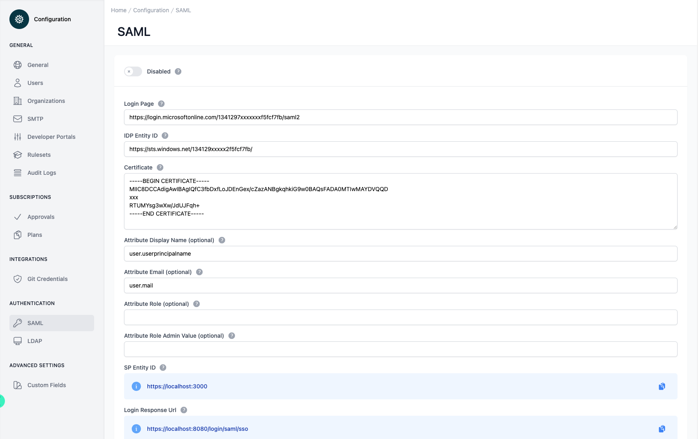

# Configuration SAML

<head>
  <meta name="guidename" content="API Management"/>
  <meta name="context" content="GUID-4862fe05-72ee-4a2d-a444-4e91327e2a00"/>
</head>

## Overview

The interface is dedicated to configuring Security Assertion Markup Language (SAML) settings. The purpose of SAML is to enable secure, single sign-on (SSO) capabilities across different domains. This particular interface allows an administrator to manage the identity provider (IdP) configuration required to establish a trust relationship between the service provider (the application) and the IdP. Security Assertion Markup Language (SAML) is a login standard that helps users access applications based on sessions in another context. It’s a single sign-on (SSO) login method offering more secure authentication (with a better user experience) than usernames and passwords.

## Configuration Elements

At the top of the interface, we have a toggle switch labeled "Disabled", which indicates that the SAML configuration is currently inactive. Below this is a series of input fields grouped into logical sections for the administrator to populate or review.

The "Login Page" field holds a URL, which is the entry point for users to initiate a login process via their IdP. The "IdP Entity ID" is next, providing a unique identifier for the IdP within the SAML configuration.

Following this, we encounter the "Certificate" section containing a digital certificate in PEM format. This is crucial for establishing a secure connection, as it contains the public key that will be used to verify SAML assertions from the IdP.

Further down, there are optional fields for "Attribute Display Name", "Attribute Email", and "Attribute Role", which specify the attribute names that the application expects to receive within the SAML assertion. These names correspond to the user's display name, email address, and role, respectively. An additional field, "Attribute Role Admin Value", allows the specification of a value that, if received in the role attribute, would grant administrative rights to the user.

Lastly, the "SP Entity ID" and "Login Response Url" fields specify the service provider's unique identifier and the endpoint to which the IdP should send its response after authenticating a user, respectively. These endpoints are typically where the application expects to receive SAML assertions.

