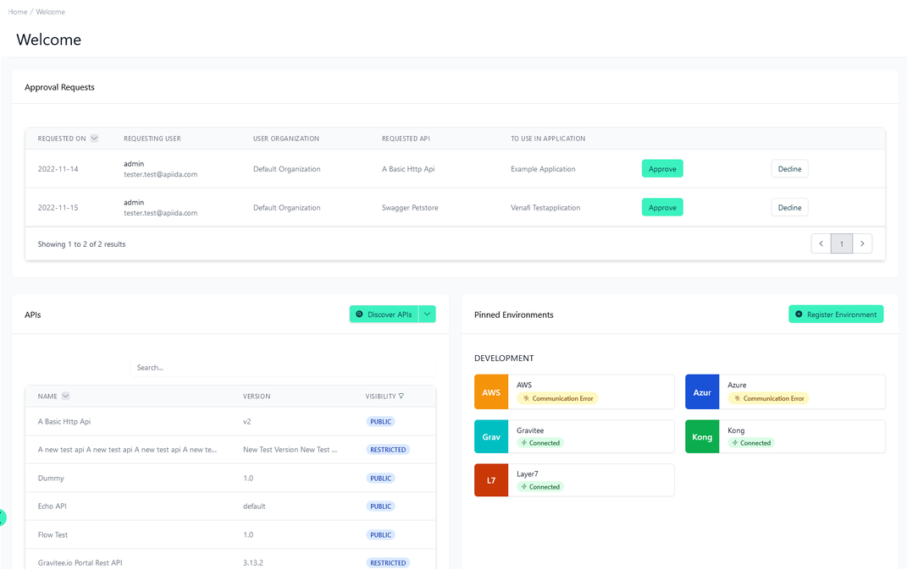
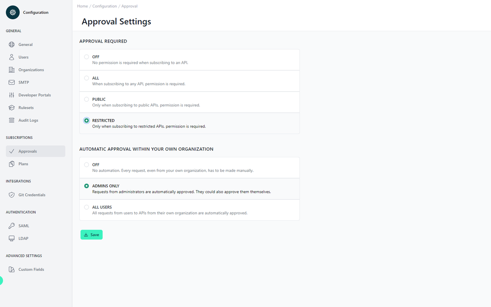

# Configuration Approvals

<head>
  <meta name="guidename" content="API Management"/>
  <meta name="context" content="GUID-79f27963-125d-470a-a3ae-7a3b2ae84a45"/>
</head>

## Overview

Here you control who can subscribe to APIs, enable Approvals and approve or deny subscriptions. This configuration section is a key part of the governance and control aspect of API management. It dictates how subscriptions to APIs are handled, whether approval is required, and under what conditions automatic approval may be granted. For more information see: [Approvals](../Topics/cp-Applications_subscriptions_and_approval_requests.md).

## Approval Requests

## Approval Settings

At the heart of the "Approval Settings" is the "APPROVAL REQUIRED" section. This area allows administrators to define the circumstances under which API access is granted. The options available are:

- **OFF:** This setting signifies a very open approach, where no approval is necessary for subscribing to an API.

- **ALL:** This is the most controlled setting, where permission is mandatory for any API subscription, ensuring that all access is reviewed.

- **PUBLIC:** This intermediate setting requires permission only for public APIs, implying a selective gating process based on API visibility.

- **RESTRICTED:** Tailored for sensitive APIs, this option demands approval for restricted APIs only, reflecting a focused oversight on critical services.

## Automatic Approval Within Your Own Organization

For efficiency, the platform offers settings for "AUTOMATIC APPROVAL WITHIN YOUR OWN ORGANIZATION". This helps streamline the internal workflows by:

- **OFF:** Defaulting to no automation, requiring manual approval for all requests, even those from within the organization.

- **ADMINS ONLY:** Allowing an exception for administrator requests, which are approved automatically. This trusts that administrators will self-regulate appropriately.

- **ALL USERS:** Expanding automatic approvals to all users within the organization, implying a high degree of trust and a decentralized governance model.