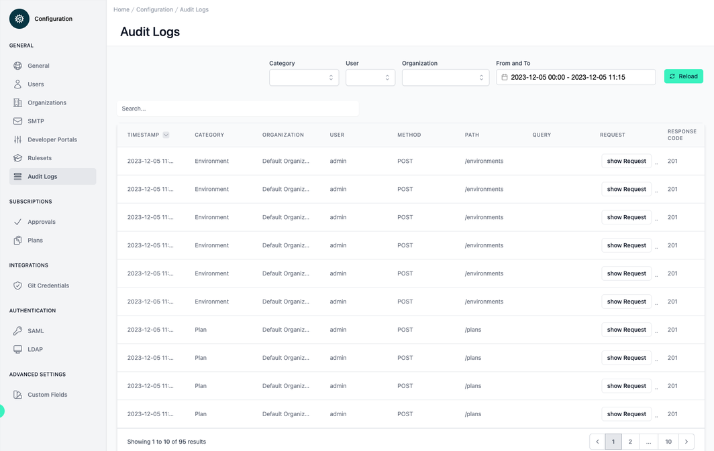

# Configuration Audit Logs

<head>
  <meta name="guidename" content="API Management"/>
  <meta name="context" content="GUID-52f303f0-cf53-46dc-9c3a-01751626f600"/>
</head>

## Overview

The section "Audit Logs" is integral for monitoring and tracking user actions and system responses within the system. This interface serves as a critical tool for system administrators to oversee and ensure the integrity of interactions with the API environment. Filtering by Category, User or Organization allow for further analysis. 

## Interface Layout

The top portion of the interface features a filtering panel that allows for refining the logs displayed based on categories, user activities, or organizations. Adjacent to this is a date and time range selector that empowers users to specify the logs' time frame. The ‘Reload’ button allows for refreshing the log display, which may be particularly useful after setting new filters or when monitoring the platform in real-time.

Below this panel is the main content area where the audit logs are listed. The logs are organized in a table format, with sortable columns for timestamp, category, organization, user, method, path, query, request, and response code—offering a comprehensive view of each recorded action.

## Audit Log Details

The first column, "Timestamp," records the precise date and time of each action, enabling users to chronologically track changes and events. "Category" denotes the area within the API Control Plane which is  affected by the action, for instance, 'Environment' or 'Plan'.

"Organization" and "User" columns identify the context and the specific user who performed the action, allowing for accountability and traceability. The "Method" column indicates the HTTP method used for the API call, such as POST.

The "Path" column shows the specific API endpoint that was interacted with, and adjacent to it, the "Query" field includes query parameters that were part of the API request. A 'Show Request' link is present, which allows users to view the detailed request payload associated with each log entry.

The last column, "Response Code", displays HTTP status codes.

## Navigational Elements

At the bottom of the table, there's a pagination control. Navigating through multiple pages of logs is an essential feature for exploring extensive audit records.