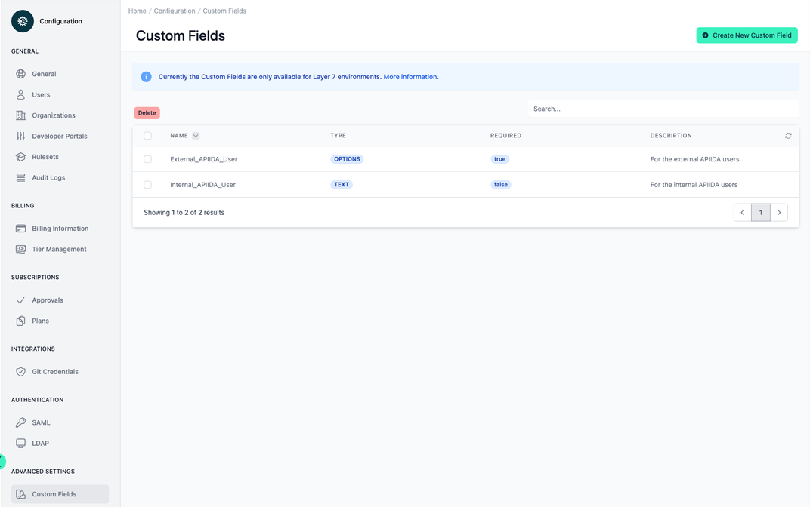
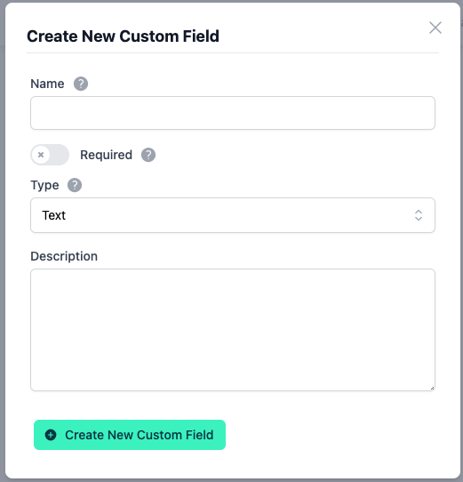
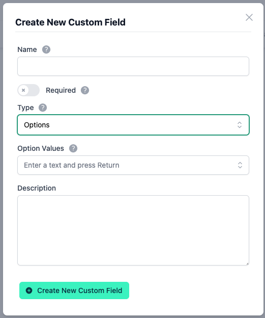

# Configuration Custom Fields

<head>
  <meta name="guidename" content="API Management"/>
  <meta name="context" content="GUID-2dd8214a-7847-49f0-8398-809e474e3b21"/>
</head>

## Overview

:::note

If you create custom fields here, the new menu item "Custom Fields" appears **in every application**: [applications|customFields](../Topics/cp-Application_custom_fields.md).

:::

:::note

Currently Custom Fields are only effective for applications in **Layer 7** environments.

:::

## Create New Custom Fields

To create a new custom field you should press the "Create New Custom Field" button.

To edit an existing custom field, select it from the table with a mouse click and an edit dialog will appear.

In this menu item you can only create and configure custom fields, but not assign values. You must assign the values in the respective application: [applications|customFields](../Topics/cp-Application_custom_fields.md).

There are two types of Custom Fields:

1. **Text:** With this type a free text can be entered.

2. **Options:** Here only predefined values can be selected from a dropdown list. These values can be edited under configuration/customFields. If the **required is set to false**, the dropdown field will have the option "empty" which will not set a value for the field.

Fields which have a "*" at the end of their name are **required**.
The **description** of a field can be found in the info icon next to the name of the field.

- **Name:** This field specifies the name of the Custom Field. With this name it can be found within an application under the menu item "Custom Field".

- **Required:** The required option means that the Custom Field is mandatory to be used in the Applications.

- **Type:** A Custom Field can have the type "Text" or "Options". This type determines which type of value can later be assigned to the Custom Field within the application. With the type "Text" any string value can be entered. The type "Options" limits the value input of the Custom Field to the predefined values.

- **Option Values:** The option values of a Custom Filed are only active if the "Options" type is selected. The predefined values of the Custom Filed are specified here.

- **Description:** The description of the Custom Field.

