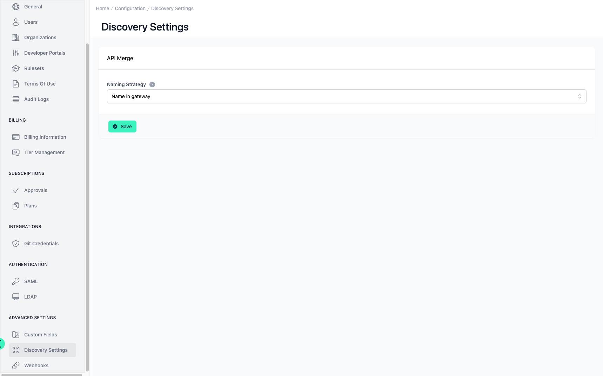

# Configuration Discovery Settings

<head>
  <meta name="guidename" content="API Management"/>
  <meta name="context" content="GUID-8ca49a99-eae9-4a52-9170-ec6d33e847f7"/>
</head>

## Overview

During API discovery, APIs that are present in multiple environments are merged into one API in the API Control Plane. This setting configures which strategy is used to identify APIs across the different environments. Further information about the discovery can be found here: [Discovery](../Topics/cp-Discovery.md).

## Discovery Settings

- **Name in gateway:** Use the API name as configured in the gateway. This is also the fallback if any other strategy fails to find a name

- **Title in API specification:** Use the title field inside the API specification file.

- **First tag in API specification:** Use the name of the first tag in the API specification file.

This only affects the technical API name, which is used to determine if two APIs are the same. The displayName will still be as configured in the gateway (for new APIs) and not be changed when merging a discovered API with an existing one.