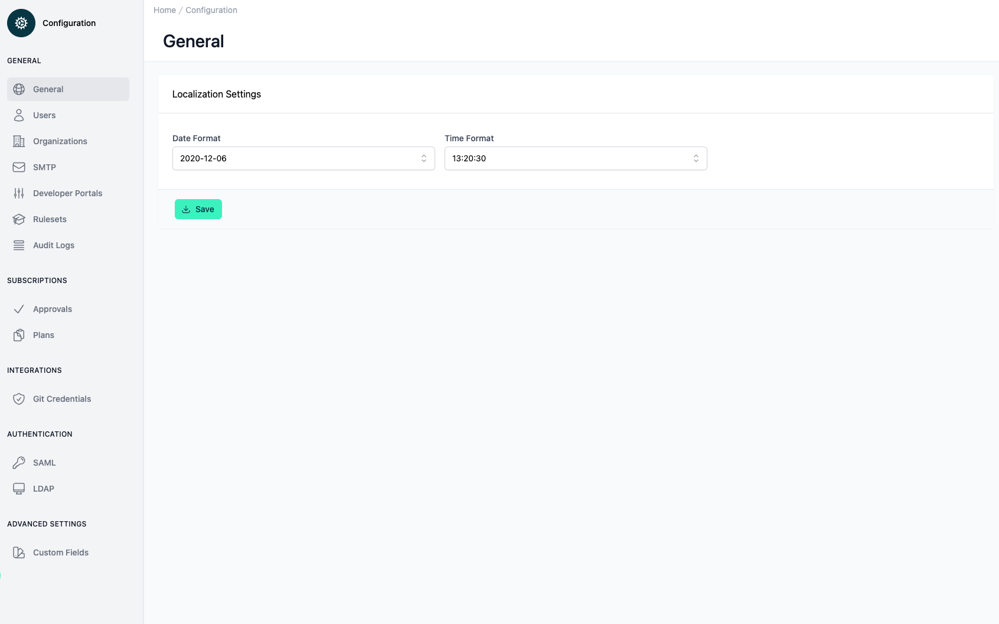

# Configuration General

<head>
  <meta name="guidename" content="API Management"/>
  <meta name="context" content="GUID-d304d4a1-e81a-43e8-b760-ebb5a5614b66"/>
</head>

## Overview

In this section, users have the opportunity to adjust localization settings, which include the Date Format and Time Format.

## Localization Settings

The layout is straightforward and user-friendly, with drop-down menus for each setting that allow for a quick selection of the preferred format. For the Date Format, the displayed example is "2020-12-06", suggesting the YYYY-MM-DD format is either currently selected. The Time Format is shown as "13:20:30", indicating the 24-hour time notation.

At the bottom of the section, there's a prominent "Save" button with a save icon, signaling to the user that any changes made to the settings can be applied and preserved by clicking this button.

Ensuring that the display of dates and times throughout the platform will match user’s localization preferences could be particularly useful for collaborating across different time zones or for those who prefer different date-time representations.

