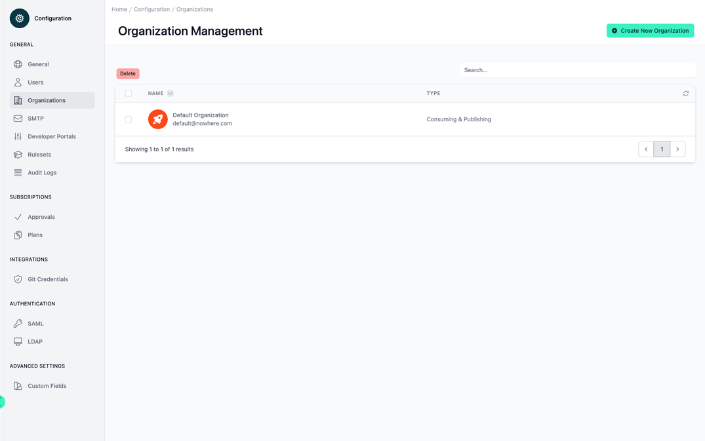
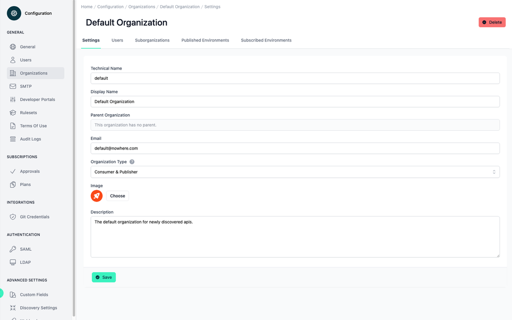
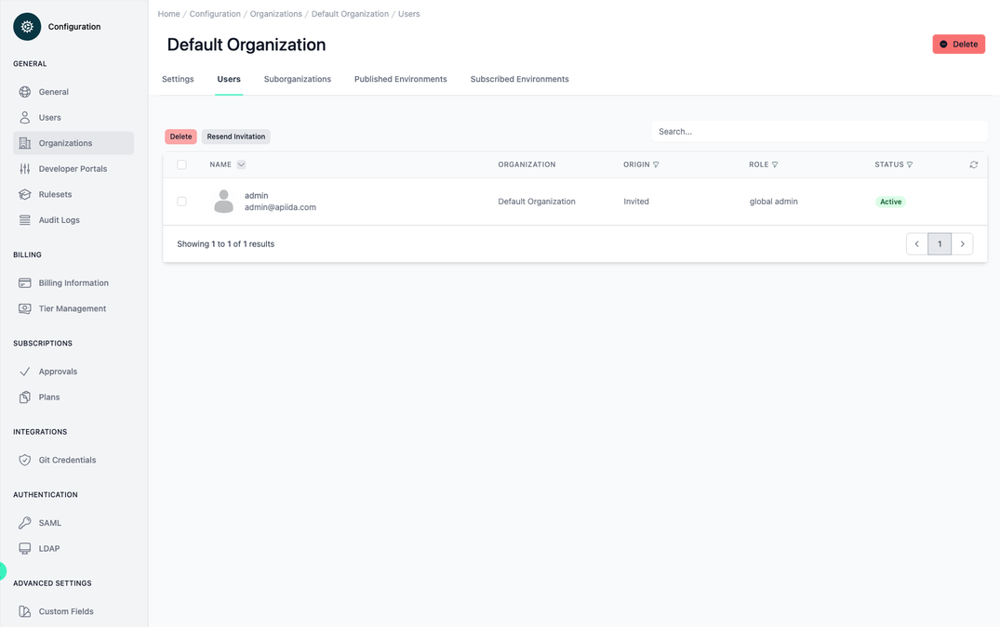
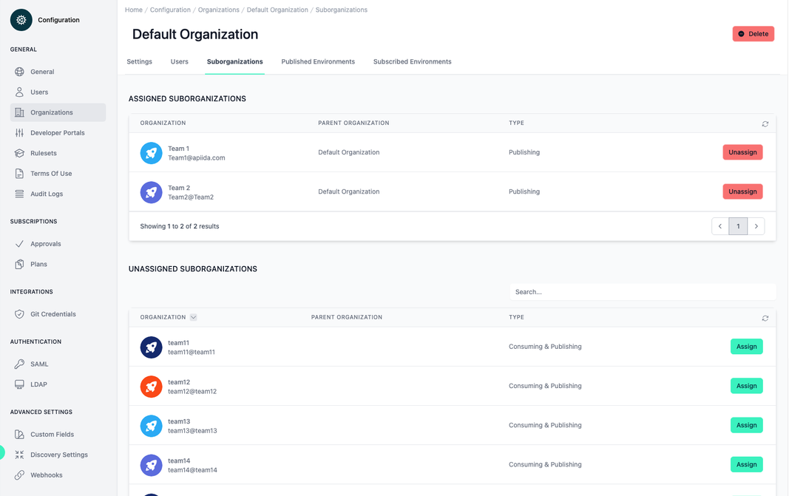
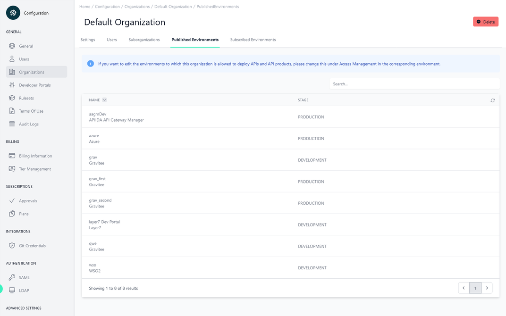
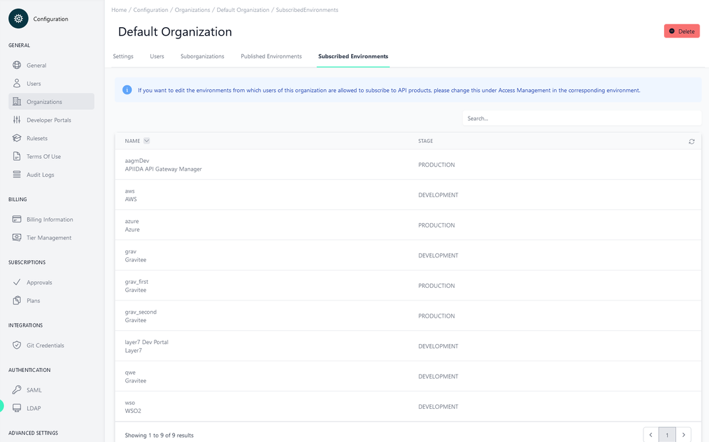

# Configuration Organizations

<head>
  <meta name="guidename" content="API Management"/>
  <meta name="context" content="GUID-c71713e0-2fe6-4c09-9617-70c751deab6d"/>
</head>

## Overview

The default organization is created at startup and everything is fed to it first. The global admin can later sort everything into the corresponding organizations.

## All your Organizations

Here you can see the list of all organizations and the respective type.

## Organization Type

There are three types of organizations:

- Consuming

- Publishing

- Consuming & Publishing

**Consuming organizations** have access only to the Developer Portals. They do not see other organizations.

**Publishing organizations** have access to the Admin and Developer Portals. They can see "Consuming" and "Consuming & Publishing" organizations. They cannot see other "Publishing" organizations and cannot create applications.

**Consuming & Publishing organizations** organizations can see all organizations. They have no restrictions and have access to the Admin and Developer Portal.

## Settings

If you select one of the organization from the table, the individual values of the organization can be viewed and edited in the first tab 'Settings'. The organization can be deleted via the button at the top right.

|Settings|Description|
|--------|-----------|
|Technical Name|The technical name of an organization must be unique.|
|Display Name|The display name can differ from the technical name and does not have to be unique.|
|Parent Organization|The 'parent organization' field is read only. The display name of the parent organization is specified here. This field can also be empty.|
|Email|The recipient is understood as the contact person or person responsible.|
|Organization Type|The organization type controls access rights and visibility in the Admin and Developer Portal. [Organizations > Organization Type](../Topics/cp-Configuration_organisation.md)|
|Image|Image of the organization.|
|Description|Description|

## Users

All users of the organization are listed on the second tab "Users". Here you can manage the users of the organization, to add a user to an organization see here: [Configuration User Management](../Topics/cp-Configuration_user_management.md)

## Suborganizations

In this view, you can add suborganizations to the current organization. There are two tables within this view:

- Assigned Suborganizations

     - This table contains all organizations that have been added to the current organization.

- Unassigned Suborganizations

     - This table lists all possible suborganizations that can be added to the current organization.

By clicking on the corresponding button in the respective table, organizations can be added to the current organization, assigned, or removed, unassigned.

## Published Environments

All environments to which a user of this organisation is allowed to publish (deploy) APIs are listed here. 

Changes to the environments are made in the environments themselves: [Environment Access Management](../Topics/cp-Environment_access_management.md)

## Subscribed Environments

All environments from which a user of this organisation is allowed to subscribe an API are listed here. 

Changes to the environments are made in the environments themselves: [Environment Access Management](../Topics/cp-Environment_access_management.md)

