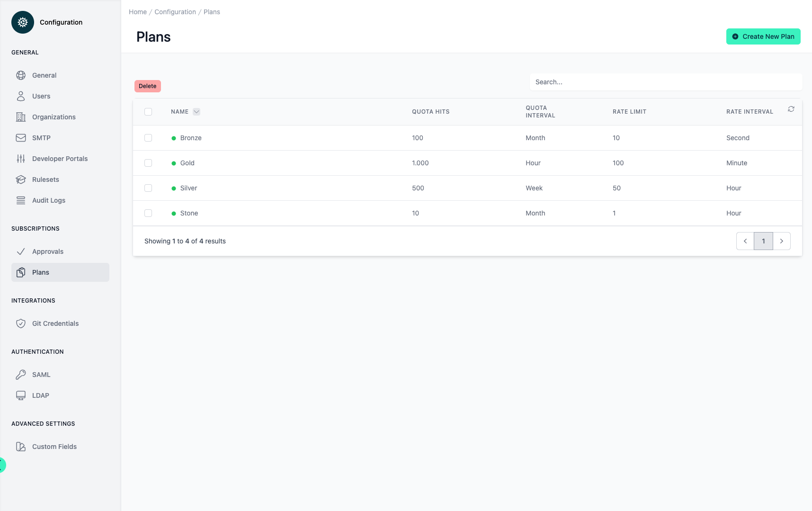
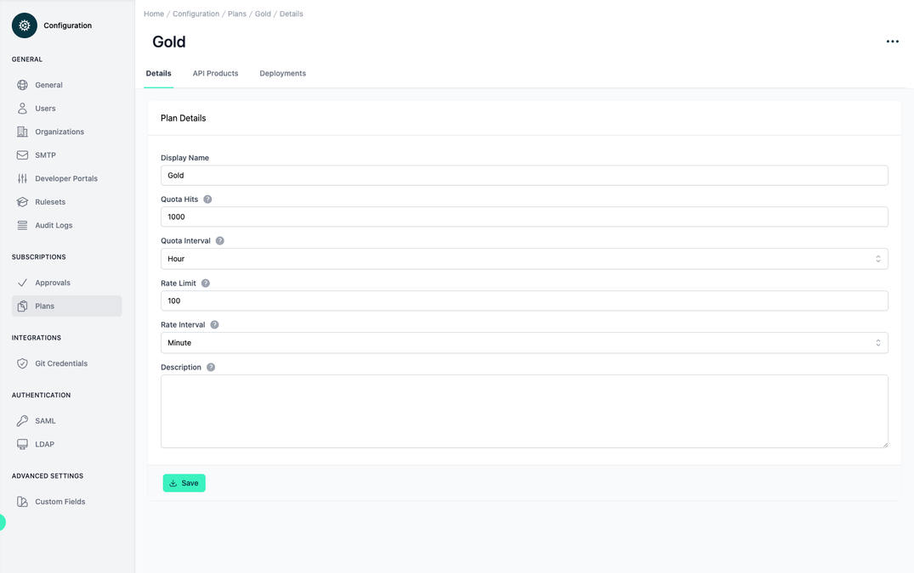
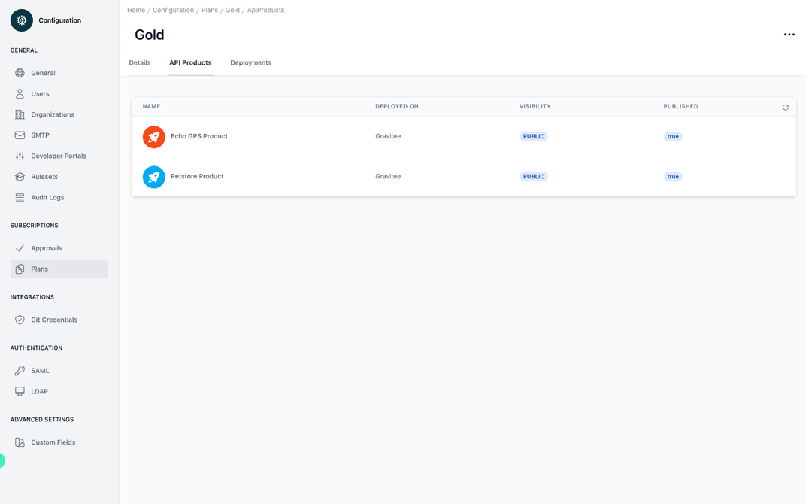
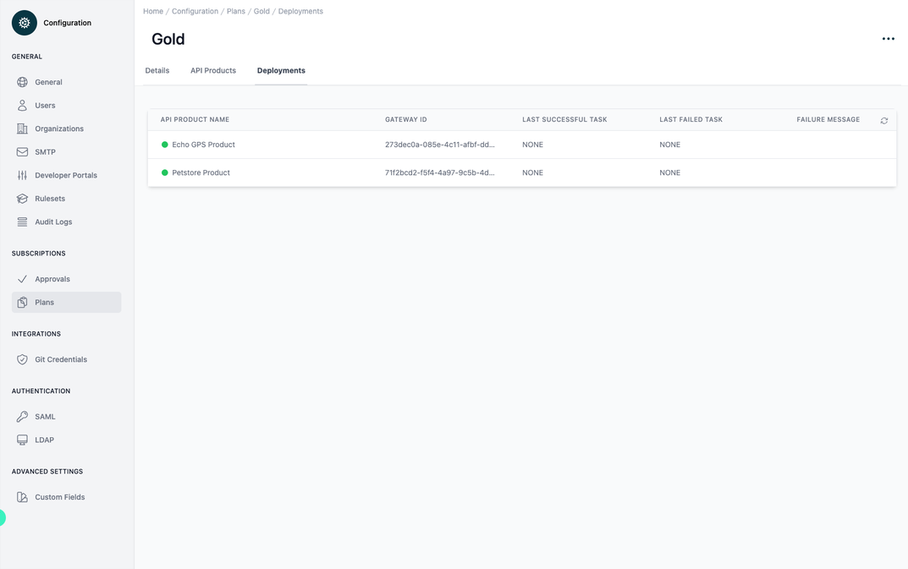
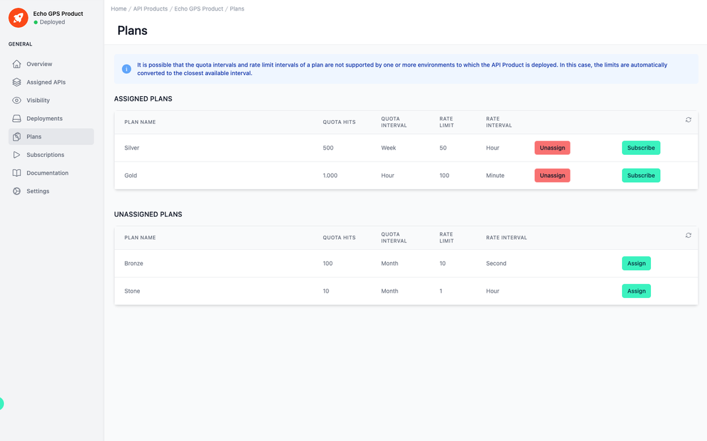
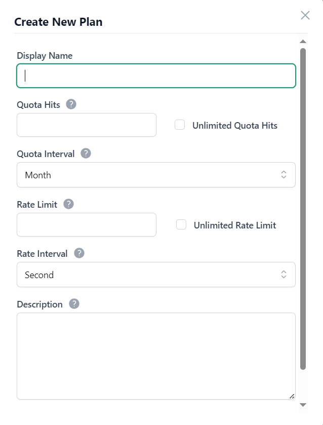

# Configuration Plans

<head>
  <meta name="guidename" content="API Management"/>
  <meta name="context" content="GUID-ba3eb563-afd9-4170-9170-d80edef08b4b"/>
</head>

## Overview

Under the Configuration/Plan menu item, all plans are displayed in table format. You can also create new plans and delete existing ones.

|Settings|Description|
|--------|-----------|
|Display Name|The name of the plan. Must be unique.|
|Quota Hits|The maximum number of API requests per quota interval. Set to 0 for unlimited quota.|
|Quota Interval|The quota interval defines the time unit in which the quota hits are available.|
|Rate Limit|The maximum number of API requests per rate interval. Set to 0 to disable rate limit.|
|Rate Interval|The rate interval defines the time unit in which the rate limit is available.|
|Description|A description for this plan. This will be visible in developer portal.|

If you select one of the plans from the table, the individual values of the plan can be viewed and edited in the first tab 'Details'. The plan can be deployed or deleted via the three-point menu at the top right.

The second tab 'API Products' lists all API products that contain the plan.

The third tab 'Deployments' shows all information where the plan has been deployed.

## Assigning Plans to API Products

In order to subscribe to an API Product, one or more plans must have been assigned to it. This is done in the Plans view of that API Product.

## Choosing the correct Quota/Rate Intervals

Not all platforms provide native support for all available intervals. When a plan is deployed to a platform that does not natively support a selected interval, the chosen limit will be converted to the closest available interval. This also means that deploying the same plan to multiple platforms may lead to different quota/rate configurations within those platforms.

Take a plan with 100.000 quota hits per week as an example. If the target platform does not support weekly quotas, but supports daily quotas instead, API Control Plane will configure a quota of 14.286 hits per day in that platform. 

The following table lists all natively available intervals for each platform. If you wish to avoid all limit conversions, you should only configure intervals that are natively supported by all your target platforms. 

|Platform|Quota Intervals|Rate Intervals|
|--------|---------------|--------------|
|Apigee|MINUTE, HOUR, DAY, MONTH|not supported|
|AWS|DAY, WEEK, MONTH|SECOND|
|Azure|SECOND, MINUTE, HOUR, DAY, WEEK, MONTH|SECOND, MINUTE|
|Gravitee|HOUR, DAY, WEEK, MONTH|SECOND, MINUTE|
|Kong|SECOND, MINUTE, HOUR, DAY, MONTH|SECOND, MINUTE, HOUR|
|Layer 7|DAY, MONTH|SECOND|
|Layer 7 + apiida|SECOND, MINUTE, HOUR, DAY, MONTH|SECOND|
|WSO2|MINUTE, HOUR, DAY, MONTH|SECOND, MINUTE|

The following intervals are natively supported in all platforms:

- Quota: DAY or MONTH

- Rate: SECOND

## Create new Plan

In order to create a new Plan, click the button “Create new Plan” in the top-right corner and fill out the following form.

