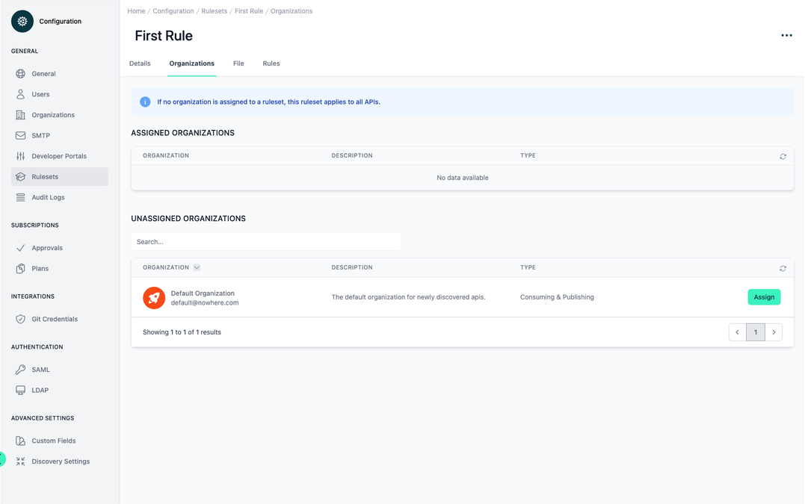

# Configuration Rulesets

<head>
  <meta name="guidename" content="API Management"/>
  <meta name="context" content="GUID-28b2a942-354c-4d9f-afff-a9038832e369"/>
</head>

## Overview

Based on [Create a Ruleset | Spectral](https://docs.stoplight.io/docs/spectral/01baf06bdd05a-create-a-ruleset), the implemented rulesets ensure consistent quality and adherence to security guidelines across all APIs. This tool effectively standardizes API development, maintaining high standards for both performance and security uniformly across the API landscape.

You can find out exactly how they work and how you can create your own set of rules here.

[Rulesets explained](../Topics/cp-Rulesets_explained.md)

## Default and Custom Ruleset Management

In the configuration section under 'rulesets', the upper table displays the default rulesets. These include one provided by Spectral, which focuses on verifying compliance with OpenAPI standards, and another from OWASP, emphasizing security and best practices. This arrangement allows for a comprehensive approach to API validation, combining standard adherence with robust security measures.

You have the flexibility to create your own custom rulesets and define rules that cater specifically to your needs. Additionally, there is the option to extend or modify the existing default rulesets. [Rulesets explained](../Topics/cp-Rulesets_explained.md)

:::note

Rulesets have the option to be deactivated, and when this is done, they no longer impact the API score. It's important to note that if there is any adjustment to a ruleset or a new ruleset is introduced, the APIs must undergo [revalidation](../Topics/cp-API_overview.md). This process ensures that the APIs are consistently evaluated against the most current set of rules and standards in place.

:::

If you select one of the rulesets from the table, the individual values of the ruleset can be viewed and edited in the first tab 'Details'. The ruleset can be deleted or downloaded via the three-point menu at the top right.

On the second tab "Organizations" you can add organizations of the type **'Publishing'** and **'Consuming & Publishing'** to the ruleset. The ruleset is only applied to the APIs that are in the organizations. If no organization has been assigned to the ruleset, the ruleset is applied to all APIs.

On the third tab "File", the stored file of the ruleset is displayed. You can also edit and save the uploaded ruleset directly here.

The fourth tab, "Rules", lists all the rules in the ruleset.

