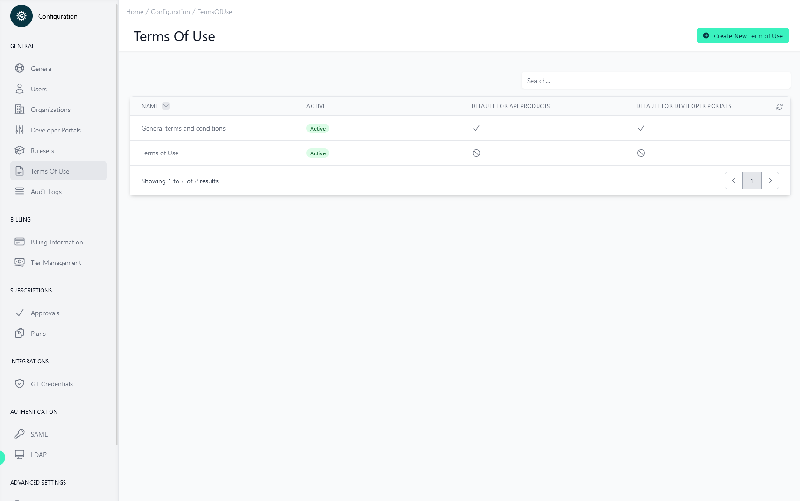

# Configuration Terms of Use

<head>
  <meta name="guidename" content="API Management"/>
  <meta name="context" content="GUID-55a0dc7e-2c97-40cc-9e0d-a1210ea3c2a2"/>
</head>

## Overview

To use the Developer Portal or subscribe an API Product in the Developer Portal, users must first accept the Terms of Use, which are defined here.

You can mark individual terms of use as "default". For example, the "General terms and conditions" must be accepted by everyone who wants to subscribe to an [API product](../Topics/cp-API_product_terms_of_use.md) in the [Developer Portal](../Topics/cp-Developer_portal_details.md) or activate their user in the Developer Portal. 

Terms of Use not marked as default must be assigned individually to each [Developer Portal](../Topics/cp-Developer_portal_details.md) or [API product](../Topics/cp-API_product_terms_of_use.md).

You can see exactly what a user has accepted in [Application > Subscription > Terms of Use](../Topics/cp-Application_subscriptions.md) or [Configuration User Management | Terms of Use](../Topics/cp-Configuration_user_management.md).

By clicking on the respective Terms of Use, you can access the settings and versioning.

## Settings

Here you can change the displayed name or mark your terms of use as default.

- **Name**

The name of the terms of use

- **Status**

If a Terms Of Use file is not inactive, it does not have to be accepted by anyone. Attention! If it is activated at a later date, there may be users or subscriptions that have not accepted it.

- **Default for API Products**

This Terms of Use file is automatically added to all API products and must be accepted by anyone who wants to subscribe to it.

- **Guest Access**

This Terms of Use file is automatically added for all developer portals and every user must accept it when activating his account (setting his password).

## Versioning

If the individual documents change, you can simply upload the latest one and a new version will be created. But this does not invalidate existing subscriptions and the Terms of Use do not have to be accepted again.

## Create new Terms of Use

Creating new Terms of Use can be done by clicking the button “Create new Terms of Use” in the top-right corner and fill out the following form.

 