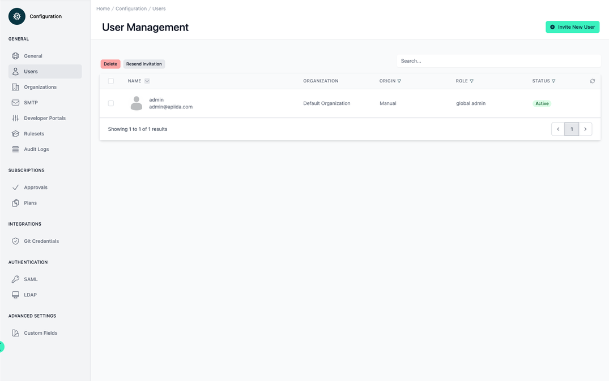
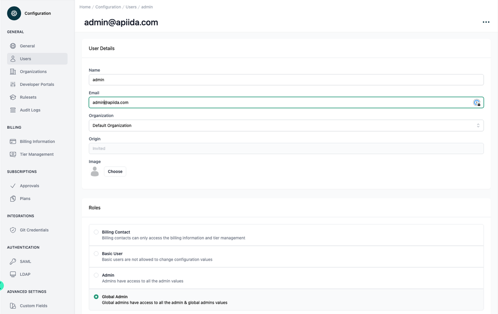
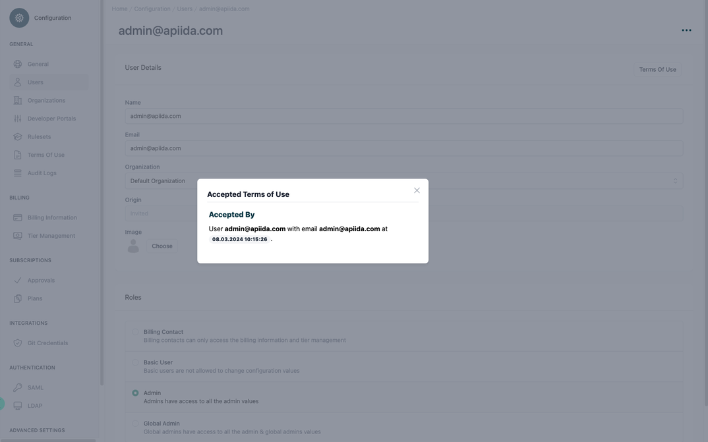

# Configuration User Management

<head>
  <meta name="guidename" content="API Management"/>
  <meta name="context" content="GUID-3a95f63b-92d8-4935-b1f0-6296604a4b41"/>
</head>

## Overview

Each user belongs to exactly one organization and also has exactly one role. 

For security reasons, only users with the origin "Internal" can reset their password.

## All your Users

You see a list of all users.

 
## Settings of an User

If you select one of the user from the table, the individual values of the user can be viewed and edited. The user can be deleted, unlocked, or re-invited via the three-point menu at the top right. If a user is blocked, they can no longer log in to the Administration or Developer Portal (see [Unlock user](../Topics/cp-unlock_user.md)).

 

All relevant setting options are listed and described in the table below.

|Settings|Description|
|--------|-----------|
|Display Name|The display name of the user.|
|Email|The email of the user|
|Organization|The organization of the user. [Organizations and Visibility](../Topics/cp-Organizations_and_visibility.md)|
|Origin|The description of the user.
|Image|The image of the user.|

## Terms of Use

If it is a user who has registered via the Developer Portal or has been invited, she must accept the configured Terms of Use, which you can check using the "Terms of Use" button.

 

## Roles

### Billing Contact

Billing contact can only access the billing and tier configuration.

### Basic User

A normal user can create applications, subscribe to APIs and much more. However, he is not allowed to change any settings.

### Admin

The admin is also allowed to change all settings within his organization.

### Global Admin

Although the global admin is assigned to an organization. But he can set everything across all organizations. He can also move everything that belongs to an organization to another.

## Origin of the user

### Internal User Management 

Users are managed using the administration portal that can be used to invite additional users as well. If the self-registration feature of the developer portal is used all users that registered themselves are stored within the internal user system. 

### Connect to your organization’s LDAP 

The API Control Plane can connect to any user directory that makes use of LDAP. Logins to the administration portal are then forwarded to the directory. Using this option, no passwords are stored within the API Control Planes databases. However, you should always keep at least one global administrator stored in the internal user database, in case the connection to your LDAP is not available or needs reconfiguration. 

### Connect to a SAML identity provider

Single Sign On (SSO) is really popular with a lot of companies. Using SAML you can connect the API Control Plane to a wide variety of Identity Providers like Okta, Ping or Azure AD. 

