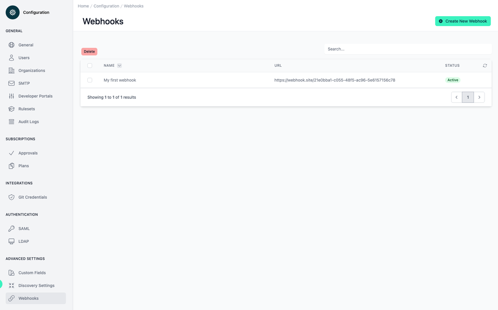
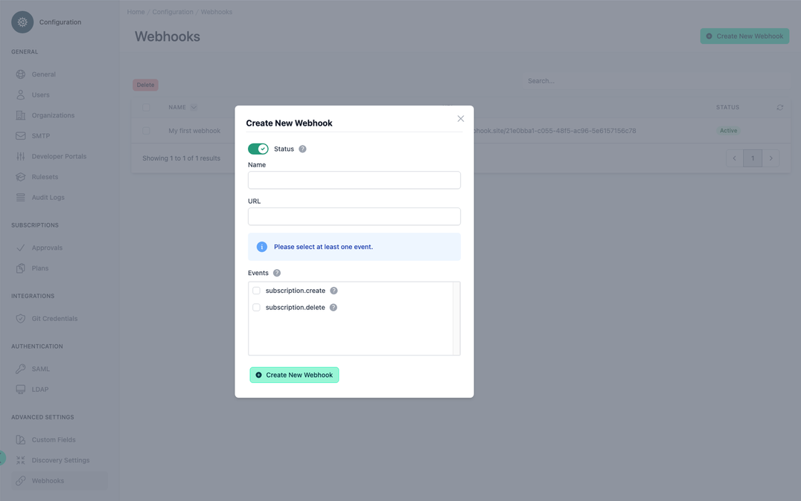
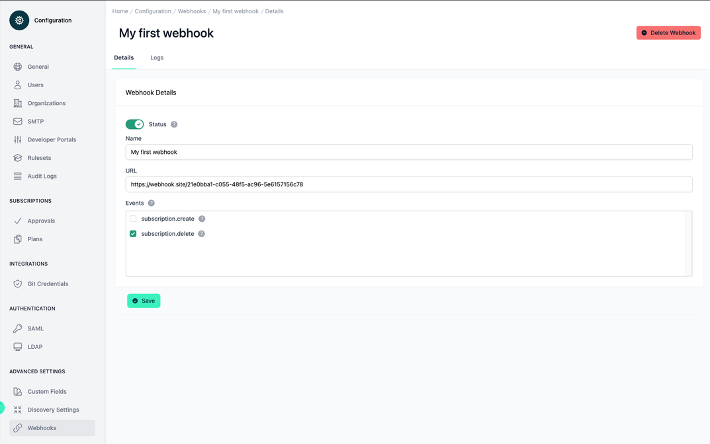
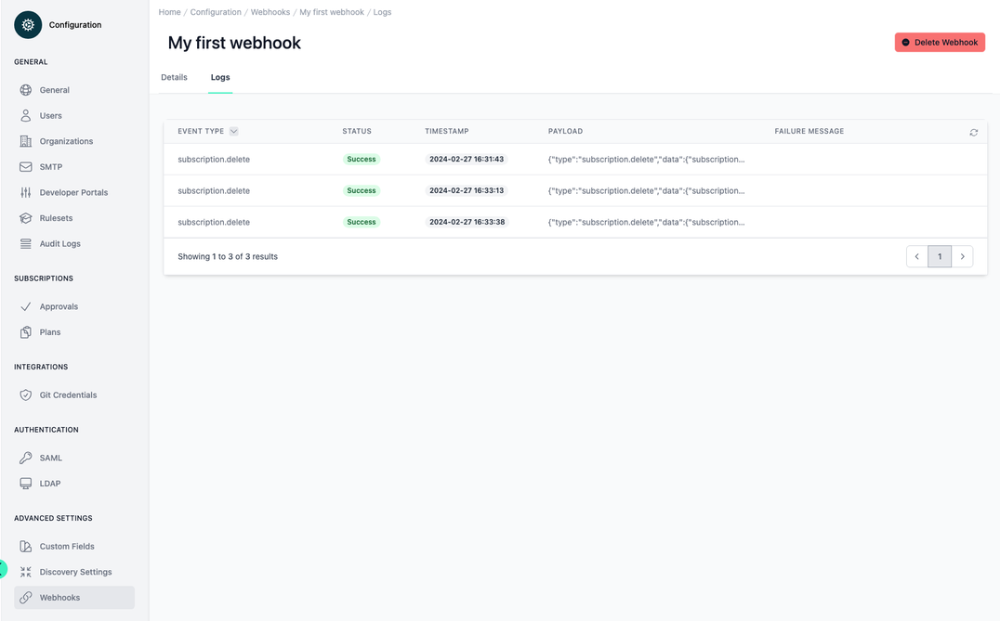
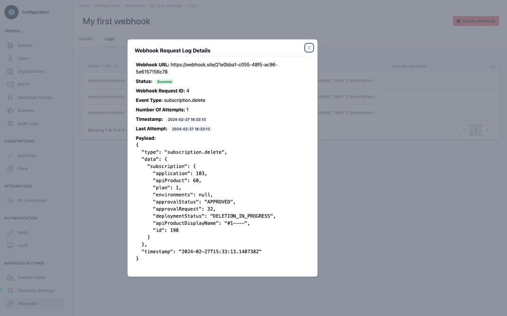

# Configuration  Webhooks

<head>
  <meta name="guidename" content="API Management"/>
  <meta name="context" content="GUID-d19bd3ab-0900-4649-8dda-ee961b8eb7af"/>
</head>

## Overview

The webhooks configuration page allows you to manage all configured webhooks within the API Control Plane. Webhooks are http calls that are issued when specific events within the API Control Plane happens. They can be used to invoke external applications and to react on events like e.g. the need for an approval to a new API subscription. 

For an overview of how to integrate the API Control Plane with other applications, please see this documentation page: [Integration with other Systems](../Topics/cp-integration_with_other_systems.md)

All webhooks share the following basic information:

|||
|-|-|
|Display Name|The name of the webhook.|
|URL|The url to be called by the webhook.|
|Events|This is a selection of [events](../Topics/cp-Webhook_events.md) for the webhook. You must select at least one [event](../Topics/cp-Webhook_events.md) to create a webhook.|
|Status|The status indicates whether the webhook is executed or not.|

## Webhooks

Under the Webhooks menu item, all webhooks are displayed in a table. You can also create new webhooks and delete existing ones. Webhooks can be active or inactive. Inactive webhooks are not invoked when the associated events happen. 

As long as the target URL is the same you can attach one webhook entry to as many events as you like. The payload sent to the external application differs between events. See the documentation page for each event for details on the included data. 

In the webhook overview you can create new webhooks by clicking on the corresponding button at the top right.

If you select one of the existing webhooks from the table, the individual values of the webhook can be viewed and edited in the first tab 'Details'. The webhook can be deleted via the button at the top right. Changes to the webhook config are active immediately. If there are messages that are still in status “Retrying” the next attempt will use the newly entered address. 

The second tab 'Logs' lists all messages that were sent to the respective webhook. Besides the event that caused the message and the timestamp the log also includes the data that was sent as well as the current status of the message. The following statuses are possible: 

|Status|Description|
|------|-----------|
|Created|The message was just created and is waiting for the first delivery attempt. You won’t see this status very often as the first delivery attempt is done almost immediately. |
|Retrying|The last delivery attempt failed. The Control Plane will try again to deliver the message. The wait time before the next attempt will increase exponentially to prevent too much stress on the receiving system. After 10 days the message is considered undeliverable. You can trigger a new attempt by using the “Retry” button in the message details (see below).|
|Cancelled|The message has been cancelled by the user using the button in the message details (see below).|
|Success|The message has been successfully delivered. All 2xx response codes are considered to be a success.|
|Failed|The system was unable to deliver the message successfully and will not try again.|

If you click on an entry in the table, a detailed view of the message opens. This screen also contains the options to immediately retry or cancel any message. 

