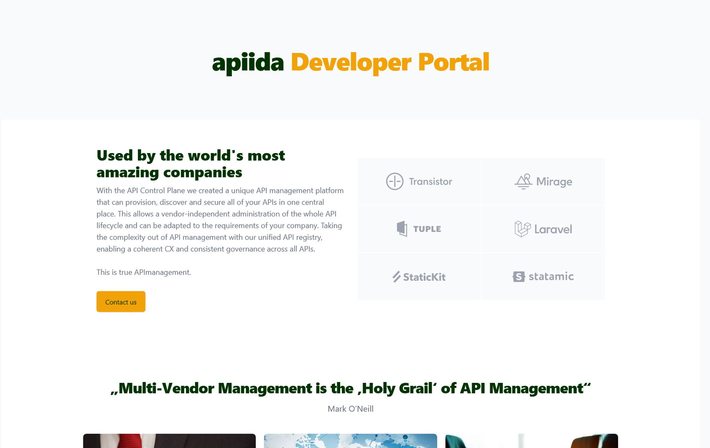

# Customize logo and colors

<head>
  <meta name="guidename" content="API Management"/>
  <meta name="context" content="GUID-2bbccefc-18d9-4d1a-a3d5-e8a0149f9089"/>
</head>

## Colors

You can change the colors directly in tailwind.config.js. Here is an alternative color scheme.
[Customizing Colors - Tailwind CSS](https://tailwindcss.com/docs/customizing-colors#color-object-syntax)

```xml
const { backgroundColor } = require('tailwindcss/defaultTheme');
const defaultTheme = require('tailwindcss/defaultTheme');
module.exports = {
  darkMode: 'class',
  content: [
    './index.html',
    './src/**/*.{vue,js,ts,jsx,tsx}',
    './node_modules/@apiida/**/*.{css,js,ts}',
  ],
  theme: {
    extend: {
      fontFamily: {
        sans: ['Inter var', ...defaultTheme.fontFamily.sans],
      },
      screens: {
        '2.5xl': '1743px',
        '3xl': '1950px',
        '4xl': '2350px',
      },
      colors: {
        apiida: {
          50: '#f8d184',
          100: '#f7c76b',
          200: '#f5be52',
          300: '#f4b539',
          400: '#f2ab21',
          DEFAULT: '#F1A208',
          500: '#d99207',
          600: '#c18206',
          700: '#a97106',
          800: '#916105',
          900: '#795104',
        },
        'apiida-blue': {
          100: '#668566',
          200: '#4d704d',
          300: '#335c33',
          400: '#1a471a',
          DEFAULT: '#003300',
          500: '#002e00',
          600: '#002900',
          700: '#002400',
          800: '#001f00',
          900: '#001a00',
        },
        'apiida-dark': {
          100: '#6a7d82',
          200: '#51676d',
          300: '#385159',
          400: '#1f3c44',
          DEFAULT: '#06262f',
          500: '#06262f',
          600: '#051e26',
          700: '#04171c',
          800: '#020f13',
          900: '#010809',
        },
        'apiida-dark-lighter': {
          50: '#F9FAFB',
          100: '#F3F4F6',
          200: '#E5E7EB',
          300: '#D1D5DB',
          400: '#9CA3AF',
          DEFAULT: '#6B7280',
          500: '#6B7280',
          600: '#4B5563',
          700: '#374151',
          800: '#1F2937',
          900: '#111827',
        },
      },
    },
  },
  plugins: [require('@tailwindcss/forms'), require('@tailwindcss/line-clamp')],
};
```

## Logo

We can exchange the logo via a so-called slot.

[Vue.js](https://vuejs.org/guide/components/slots.html) 

You will add your own logos to the `/src/components/app/ObsidianAppShell.vue` class. This class contains the structure of the entire Developer Portal. The navigation, the menus for desktop and mobile view and much more.

1. Add your logo to the `src/assets` folder

     a. You need your logo in 3 formats. About three times as wide as high (here APIIDA_DARK_LOGO), square (here LOGO_BLACK_SMALL) and as .ico file. Please make sure that the files are not too big.

2. Import your logo as an object

```xml

import APIIDA_DARK_LOGO from '../../assets/apiidaGray/Logo_Black.png';
import LOGO_BLACK_SMALL from '../../assets/apiidaGray/LOGO_BLACK_SMALL.png';
```

3. And add the Imported Image Objects to the return at the very end of the class.
     
```xml
return {
      config,
      APIIDA_DARK_LOGO, <!-- NEW -->
      LOGO_BLACK_SMALL, <!-- NEW -->
      localStorageKey,
      [...]
    };
  },
});
</script>
```

4. Replace your logo with the help of a slot.

     a. To do this, add the following to `<TheAppShell>` component.
     
```xml

<template #logo>                
  
</template>
<template #logoSmall>
  
</template>
```

5. For the last step, go to the index.html class. There you replace the .ico file.

 After that, the class should look something like this.

```xml

<template>
  <TheAppShell
[..]
    title-below-logo="Developer Portal"
    @lvl1-bar-open="lvl1BarOpenHandler"
    @login="login"
    @forgot-password="requestPassword"
    @logout="logout"
    @support="support"
    @settings="settings"
    @login-without-credentials="loginAnon"
  >
  <!-- NEW -->
    <template #logo>                
      
    </template>
    <template #logoSmall>
      
    </template>
    <!-- NEW -->
    <template #level2Bar>
      <ApiSidebarController
        v-if="level2BarType === Level2BarEnum.API"   
[...]
import NotifyCenter from '../../services/NotifyCenter';
import APIIDA_DARK_LOGO from '../../assets/apiidaGray/Logo_Black.png'; <!-- NEW -->
import LOGO_BLACK_SMALL from '../../assets/apiidaGray/LOGO_BLACK_SMALL.png'; <!-- NEW -->
const baseNavigation = [
  { name: 'Home', route: 'WelcomeView', icon: HomeIcon },
  { name: 'APIs', route: 'APIs', icon: CubeIcon },
  { name: 'API Products', route: 'ApiProducts', icon: CubeTransparentIcon },
];
export default defineComponent({
[...]
    return {
      config,
      APIIDA_DARK_LOGO, <!-- NEW -->
      LOGO_BLACK_SMALL, <!-- NEW -->
      localStorageKey,
      [...]
    };
  },
});
</script>
```

## Result



