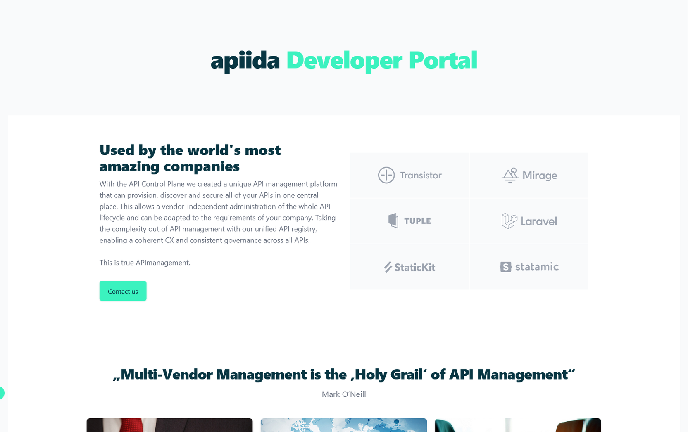
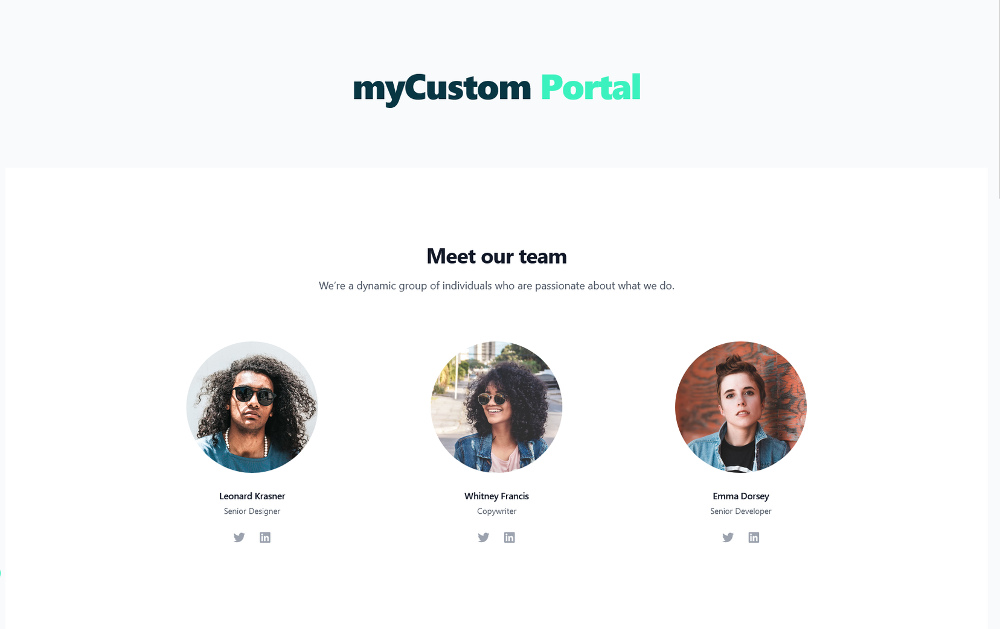

# Customize the home page

<head>
  <meta name="guidename" content="API Management"/>
  <meta name="context" content="GUID-a3daecb0-9948-4c6c-a08d-434b4b04166e"/>
</head>

Let's start with the home page. The file we are looking at is `src/views/WelcomeView.vue`
This is the page that is loaded by the router when someone clicks on Home.

As you can see, the sections of the home page are divided into components that are imported and embedded here.

```xml
<template>
  <single-column-layout>
    <!-- Catcher -->
    <WelcomeHeader></WelcomeHeader>
    <!-- Logos -->
    <WelcomeLogoCloud></WelcomeLogoCloud>
    <!-- Blog -->
    <WelcomeBlog></WelcomeBlog>
    <!-- Help Center FAQ Forum -->
    <WelcomeHelpCenterBanner></WelcomeHelpCenterBanner>
    <!-- Support -->
    <WelcomeSupport></WelcomeSupport>
  </single-column-layout>
</template>
<script lang="ts">
import { defineComponent } from 'vue';
import WelcomeHeader from '../components/welcome/WelcomeHeader.vue';
import WelcomeBlog from '../components/welcome/WelcomeBlog.vue';
import WelcomeHelpCenterBanner from '../components/welcome/WelcomeHelpCenterBanner.vue';
import WelcomeSupport from '../components/welcome/WelcomeSupport.vue';
import WelcomeLogoCloud from '../components/welcome/WelcomeLogoCloud.vue';
export default defineComponent({
  components: {
    WelcomeLogoCloud,
    WelcomeSupport,
    WelcomeHelpCenterBanner,
    WelcomeBlog,
    WelcomeHeader,
  },
  setup() {
    return {};
  },
});
</script>

```

## Edit a component

Let's jump into one of the components used above. `src/components/welcome/WelcomeHeader.vue`

```xml
<template>
  <div class="mt-16 mb-28 mx-auto max-w-7xl px-4 sm:mt-24 sm:px-6">
    <div class="text-center">
      <h1 class="text-4xl tracking-tight font-extrabold sm:text-5xl md:text-6xl">
        <span class="text-apiida-blue">apiida</span>
        <span class="text-apiida"> Developer Portal</span>
      </h1>
    </div>
  </div>
</template>
```

Here you can change the title for example. 
If you have started the Develop Portal with Vite, the modification will be visible immediately.

## Create a new component

You can also create and import completely new components. Create a new file!
`src/components/welcome/OurTeam.vue`

```xml
<template>
  <div class="bg-white py-32">
    <div class="mx-auto max-w-7xl px-6 text-center lg:px-8">
      <div class="mx-auto max-w-2xl">
        <h2 class="text-3xl font-bold tracking-tight text-gray-900 sm:text-4xl">Meet our team</h2>
        <p class="mt-4 text-lg leading-8 text-gray-600">
          We’re a dynamic group of individuals who are passionate about what we do.
        </p>
      </div>
      <ul
        role="list"
        class="mx-auto mt-20 grid max-w-2xl grid-cols-1 gap-x-8 gap-y-16 sm:grid-cols-2 lg:mx-0 lg:max-w-none lg:grid-cols-3"
      >
        <li v-for="person in people" :key="person.name">
          
          <h3 class="mt-6 text-base font-semibold leading-7 tracking-tight text-gray-900">
            {{ person.name }}
          </h3>
          <p class="text-sm leading-6 text-gray-600">{{ person.role }}</p>
          <ul role="list" class="mt-6 flex justify-center gap-x-6">
            <li>
              <a :href="person.twitterUrl" class="text-gray-400 hover:text-gray-500">
                <span class="sr-only">Twitter</span>
                <svg class="h-5 w-5" aria-hidden="true" fill="currentColor" viewBox="0 0 20 20">
                  <path
                    d="M6.29 18.251c7.547 0 11.675-6.253 11.675-11.675 0-.178 0-.355-.012-.53A8.348 8.348 0 0020 3.92a8.19 8.19 0 01-2.357.646 4.118 4.118 0 001.804-2.27 8.224 8.224 0 01-2.605.996 4.107 4.107 0 00-6.993 3.743 11.65 11.65 0 01-8.457-4.287 4.106 4.106 0 001.27 5.477A4.073 4.073 0 01.8 7.713v.052a4.105 4.105 0 003.292 4.022 4.095 4.095 0 01-1.853.07 4.108 4.108 0 003.834 2.85A8.233 8.233 0 010 16.407a11.616 11.616 0 006.29 1.84"
                  />
                </svg>
              </a>
            </li>
            <li>
              <a :href="person.linkedinUrl" class="text-gray-400 hover:text-gray-500">
                <span class="sr-only">LinkedIn</span>
                <svg class="h-5 w-5" aria-hidden="true" fill="currentColor" viewBox="0 0 20 20">
                  <path
                    fill-rule="evenodd"
                    d="M16.338 16.338H13.67V12.16c0-.995-.017-2.277-1.387-2.277-1.39 0-1.601 1.086-1.601 2.207v4.248H8.014v-8.59h2.559v1.174h.037c.356-.675 1.227-1.387 2.526-1.387 2.703 0 3.203 1.778 3.203 4.092v4.711zM5.005 6.575a1.548 1.548 0 11-.003-3.096 1.548 1.548 0 01.003 3.096zm-1.337 9.763H6.34v-8.59H3.667v8.59zM17.668 1H2.328C1.595 1 1 1.581 1 2.298v15.403C1 18.418 1.595 19 2.328 19h15.34c.734 0 1.332-.582 1.332-1.299V2.298C19 1.581 18.402 1 17.668 1z"
                    clip-rule="evenodd"
                  />
                </svg>
              </a>
            </li>
          </ul>
        </li>
      </ul>
    </div>
  </div>
</template>
<script lang="ts">
import { defineComponent } from 'vue';
export default defineComponent({
  components: {},
  setup() {
    const people = [
      {
        name: 'Leonard Krasner',
        role: 'Senior Designer',
        imageUrl:
          'https://images.unsplash.com/photo-1519345182560-3f2917c472ef?ixlib=rb-1.2.1&ixid=eyJhcHBfaWQiOjEyMDd9&auto=format&fit=facearea&facepad=8&w=1024&h=1024&q=80',
        twitterUrl: '#',
        linkedinUrl: '#',
      },
      {
        name: 'Whitney Francis',
        role: 'Copywriter',
        imageUrl:
          'https://images.unsplash.com/photo-1517365830460-955ce3ccd263?ixlib=rb-=eyJhcHBfaWQiOjEyMDd9&auto=format&fit=facearea&facepad=8&w=1024&h=1024&q=80',
        twitterUrl: '#',
        linkedinUrl: '#',
      },
      {
        name: 'Emma Dorsey',
        role: 'Senior Developer',
        imageUrl:
          'https://images.unsplash.com/photo-1505840717430-882ce147ef2d?ixlib=rb-1.2.1&ixid=eyJhcHBfaWQiOjEyMDd9&auto=format&fit=facearea&facepad=8&w=1024&h=1024&q=80',
        bio: 'Praesentium iure error aliquam voluptas ut libero. Commodi placeat sit iure nulla officiis. Ut ex sit repellat tempora. Qui est accusamus exercitationem natus ut voluptas. Officiis velit eos ducimus.',
        twitterUrl: '#',
        linkedinUrl: '#',
      },
      // More people...
    ];
    return { people };
  },
});
</script>
```
 
Now you just need to add it to the welcome page.

```xml
<template>
  <single-column-layout>
    <!-- Catcher -->
    <WelcomeHeader></WelcomeHeader>
    <!-- OurTeam -->
    <OurTeam></OurTeam> 
    <!-- Logos -->
    <WelcomeLogoCloud></WelcomeLogoCloud>
    <!-- Blog -->
    <WelcomeBlog></WelcomeBlog>
    <!-- Help Center FAQ Forum -->
    <WelcomeHelpCenterBanner></WelcomeHelpCenterBanner>
    <!-- Support -->
    <WelcomeSupport></WelcomeSupport>
  </single-column-layout>
</template>
<script lang="ts">
import { defineComponent } from 'vue';
import WelcomeHeader from '../components/welcome/WelcomeHeader.vue';
import WelcomeBlog from '../components/welcome/WelcomeBlog.vue';
import WelcomeHelpCenterBanner from '../components/welcome/WelcomeHelpCenterBanner.vue';
import WelcomeSupport from '../components/welcome/WelcomeSupport.vue';
import WelcomeLogoCloud from '../components/welcome/WelcomeLogoCloud.vue';
import OurTeam from '../components/welcome/OurTeam.vue';
export default defineComponent({
  components: {
    OurTeam,
    WelcomeLogoCloud,
    WelcomeSupport,
    WelcomeHelpCenterBanner,
    WelcomeBlog,
    WelcomeHeader,
  },
  setup() {
    return {};
  },
});
</script>
```

## Result

You have changed the title and added a completely new component to the home page.





