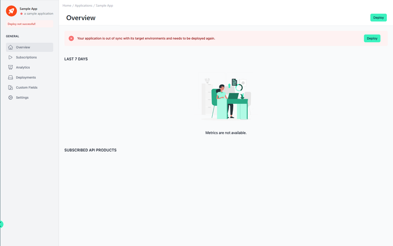
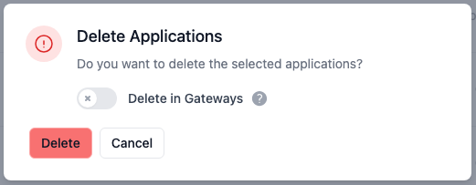
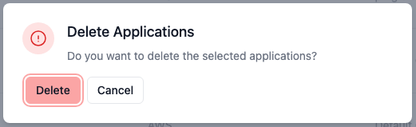
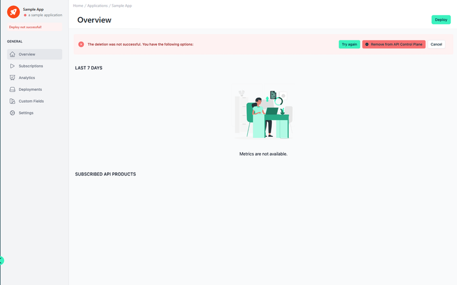

# Deploy APIs, API Products, Plans, Applications and Subscriptions

<head>
  <meta name="guidename" content="API Management"/>
  <meta name="context" content="GUID-8adc5562-2136-42f1-83a4-ceef0b34ef79"/>
</head> 

Subscribing to an API product automatically deploys the subscription, application, and selected plan to all environments containing the product's APIs.

When a plan or application is updated, you can manually deploy them again. This will update the deployment in all environments where that plan or application is already deployed. The API Control Plane will never deploy a plan or application into an environment where it is not required.

## Deployment Failures

Deployment failures may occur (e.g., due to an offline agent). 
In this case you'll receive an error notification and can retry the deployment from the component's overview.

## Deleting Components

There are two options for deleting the applications, subscriptions, plans and API products components. With the first option, if the component has a deployment in a gateway, you can select whether the component should only be deleted in the API Control Plan or you can also delete it in the gateway. With the second option, you can only delete the component in the API Control Plan.

:::note
For some API products it is not possible to delete them from the gateway because the corresponding environment does not have the appropriate capability: [API Products](../Topics/cp-API_products.md).
:::

- **Option 1:** The component is first deleted on the gateways and then after success in the Boomi API Control Plane.

    - **Toggle 'Delete in Gateways':** All existing deployments will be removed from the gateways as long as they support native API products.

- **Option 2:** The component is removed from the Boomi API Control Plane only. The component is not deleted in the corresponding gateway! 

If a delete operation fails, e.g. due to a connection problem, it will be aborted. In the overview of the component you will then find different options.

- **Try Again: The previously selected one will be tried again.**

- **Remove from API Control Plane:** The component is removed from the API Control Plane only.

- **Cancel:** A new deployment is executed.