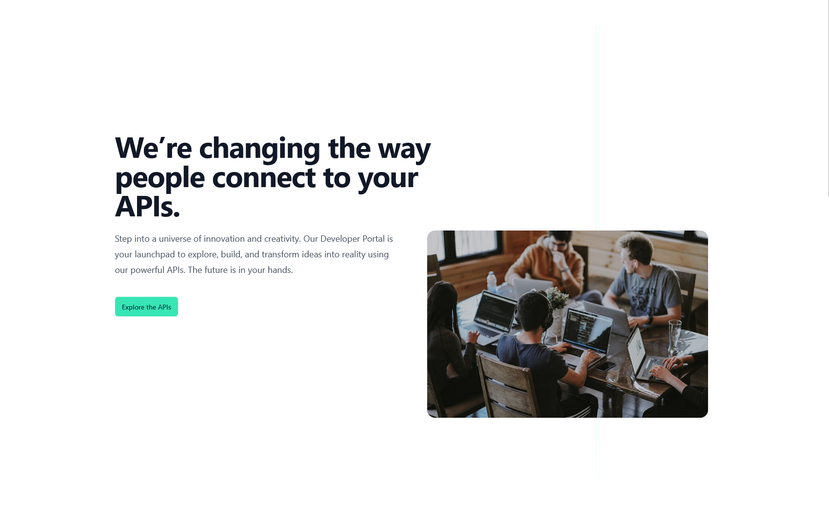
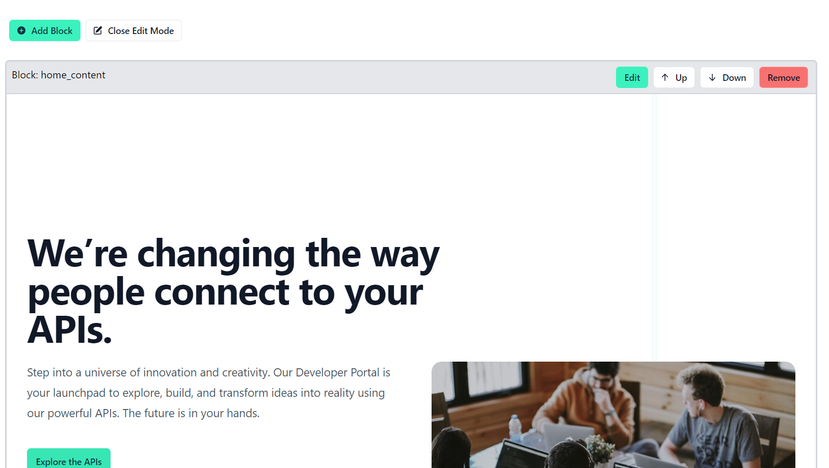

# Developer Portal 

<head>
  <meta name="guidename" content="API Management"/>
  <meta name="context" content="GUID-0f5bb7f5-e5f8-489a-8e0b-72d1a00acbd9"/>
</head> 

## Introduction

The developer portal is used by consumers like internal developers or external third parties to discover and get access to your APIs.

For a quick start, we provide you with a developer portal but you can also completely redesign it!

Visit [Customize your Developer Portal](../Topics/cp-Customize_your_developer_portal.md) 

## Customizability

Switching on the “Edit Mode” allows you to fully customize your Developer Portal according to your desires. This goes for every page within the Developer Portal, not only the “Home”-view.

