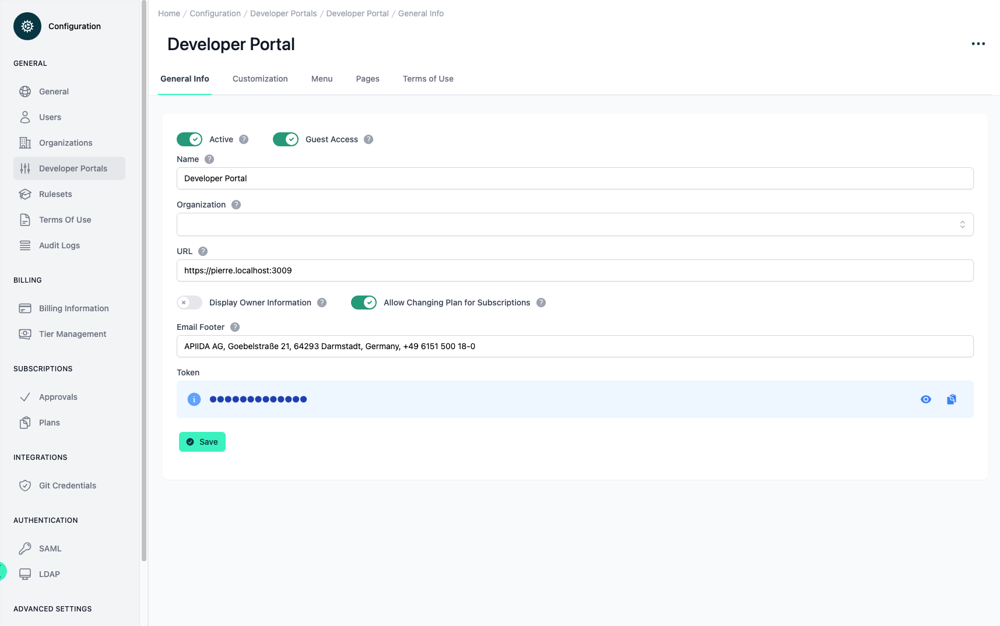
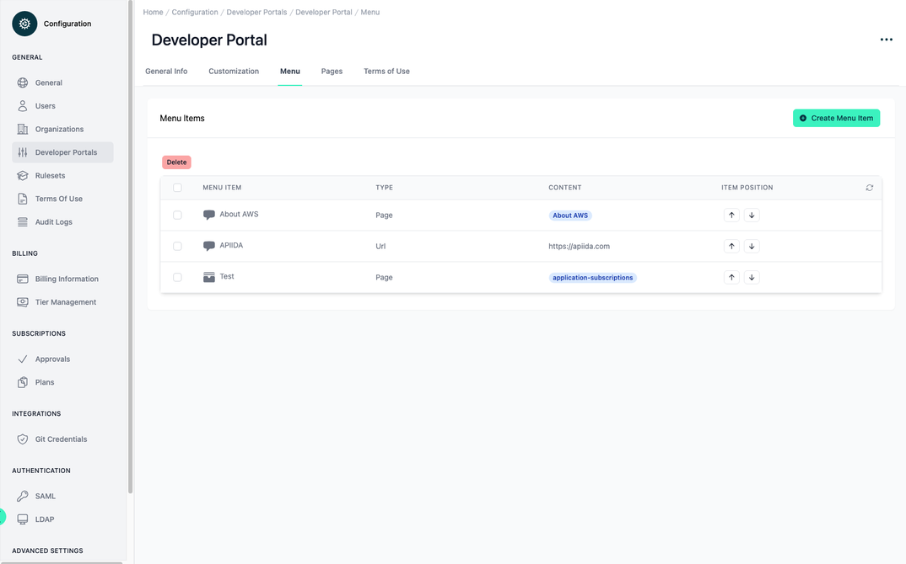
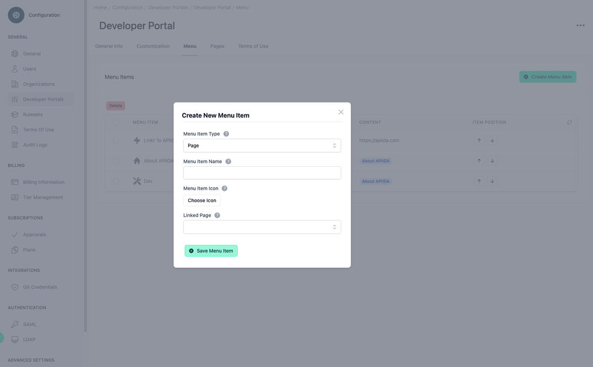
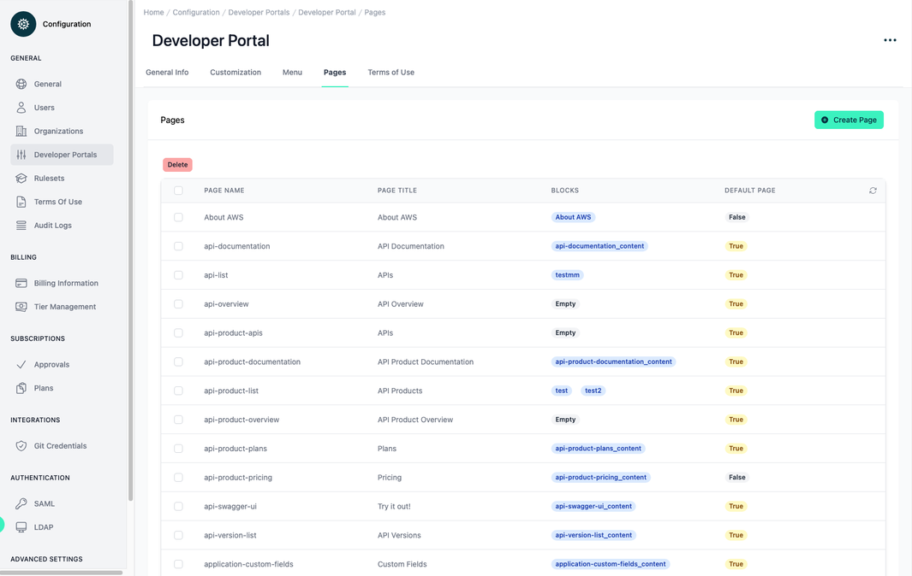
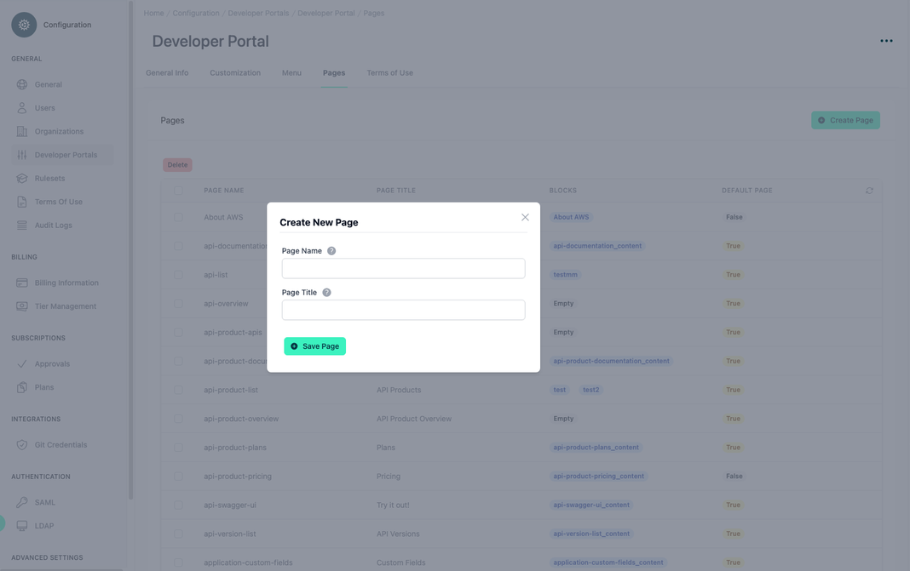
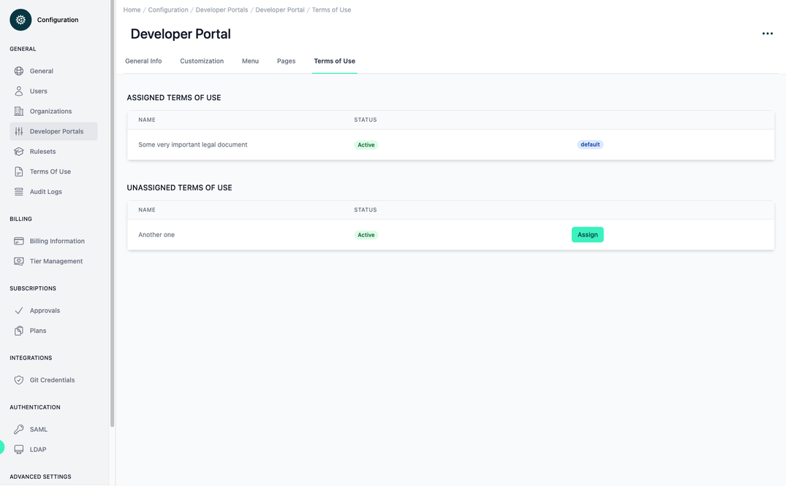

# Developer Portal - Details

<head>
  <meta name="guidename" content="API Management"/>
  <meta name="context" content="GUID-a40249a3-a8ff-4ce2-8e72-309c64975edf"/>
</head>

## General Info

If you select one of the developer portals from the table, you can view and edit details about the developer portal on the first tab 'General Info'. The Developer Portal can be deleted or the authentication token can be renewed via the three-dot menu at the top right.

- **Status**

A disabled Developer Portal, is no longer accessible.

- **Guest Access**

With this option you can enable/disable the guest access in the Developer Portal. If the option is disabled, a user must log in. Except for the login screen, there is no function for users who are not logged in. If the option is enabled, users can access the home page and list of APIs of their Developer Portal without login. The list of available APIs in guest mode is composed of all 'published' APIs that have the visibility setting 'Public'. Furthermore, Guests can register in their Developer Portal to subscribe to APIs.

- **Name**

The name of the Developer Portal is displayed in the login screen.

- **Organization**

If the organization is set for a Developer Portal, this Developer Portal is exclusive for this organization and has e.g. an impact on the visibility of APIs.

- **Developer Portal URL**

The URL of the Developer Portal. Important for the CORS. The initial Developer Portal has the link: `https://<tenantID>.portal.na.controlplane.boomi.com`

- **Display Owner Information**

If this option is active, the owner information organization name and organization email will be displayed in each overview of API and API product.

- **Allow Changing Plan for Subscriptions**

Allow users in the DevPortal to switch the plan of a subscription at a later date without having to delete and recreate the subscription. No approval request is triggered.

- **Email Footer**

The footer of all emails sent by the developer portal. For example, when a user is invited.

- **Token**

This is the special token for the developer portal, which is required for hosting the developer portal.

## Customization

On the second tab "Customization" you can customize the general look and feel of the developer portal. The preview shown below gives you a first impression of how your customized developer portal will look.

Firstly, you can define your own color scheme. The following color schemes are available to you:

- Primary Color

- Secondary Color

- Menu Text Color

- Primary Button Text Color

You can also insert your own logos for your developer portal. You have the following logo options:

- **Logo**

The logo is displayed in the login view. The logo can be up to 2 MB. Allowed image file types: .jpg, .jpeg, .png, .gif, .webp

- **Logo Small**

The small logo is displayed in the main menu bar at the top. If no small logo is set, the normal logo is automatically used. The logo can be up to 2 MB. Allowed image file types: .jpg, .jpeg, .png, .gif, .webp

- **Logo Favicon**

The logo favicon is displayed in the browser as a favicon in the tabs. The logo can be up to 2 MB. Allowed image file type: .png

When you are finished with your custom settings, you must save them permanently by clicking the 'Save' button. With the button 'Restore Factory Settings' you can reset the colors and logos to the Boomi style.

## Menu

On the third tab, "Menu", you can create additional main menu items for your developer portal and determine their position. The menu items created here are displayed below the default menu.

All customized menu items are listed in the menu table. The order in the table is the same as later in the developer portal. The table has the columns:

- **Menu Item:** The name of the menu item with the selected icon.

- **Type:** An item can only have one of the following types:

     - URL: A literal URL with valid protocol information, e.g. `https://boomi.com` 

     - Page: A default page or a previously created page from the 'Pages' tab.

- **Content:** If the type of the item is 'URL', then the content contains the URL. If the type is 'Page', the page name is displayed.

- **Item Position:** This column contains two buttons that can be used to change the position of the item in the table.

If you select an entry from the table and click on it, an editing dialogue opens. In this dialogue, you can edit the individual data fields from the creation of an item (see below).

When creating a new item, you first select whether it refers to an external page (e.g. `https://boomi.com`) or an internal page. You can manage the internal pages under the fourth tab item 'Pages'. You also assign a name and an icon to the new menu item. 

Finally, depending on the type, select an internal page or enter a link to an external page. The internal pages are divided into default and custom pages. 

## Pages

On the fourth tab, "Pages", you can view all existing default and custom pages. Default pages are placeholders on **'predefined pages'**. The name of a default page indicates on which **'predefined page'** it is used. The page is always displayed at the top of the **'predefined page'**. A default page cannot be deleted.

Within this menu item is the 'Pages' table, which lists all default pages and custom pages. This table has the following columns:

- **Page Name:** The technical name of a page which must be unique. This is used to identify the page.

- **Page Title:** The title of the page is displayed in the developer portal in the header of the page.

- **Blocks:** The blocks contained in the page.

- **Default Page:** This column indicates whether a page is a default page, true, or a custom page, false.

If you select an entry from the table and click on it, an editing dialogue opens. In this dialogue, you can edit the individual data fields from the creation of an item (see below). In addition, you get the information which blocks are available in the page: 

- **Blocks in Page:** A page can contain no blocks, one block, or multiple blocks. Blocks can be added to a page in the Developer Portal. Blocks contain the actual page content (html code).

To create a customized page, click on the 'Create New Page' button. A dialogue with the following input fields appears:

- **Page Name:** The page name must be unique, because it is used to identify the page. A page can be added to one or more menu items.The name cannot be changed afterwards.

- **Page Title:** The page title is displayed in the Developer Portal in the header section of the web page. This title is freely selectable and can be changed.

## Terms of Use

On the fifth tab, "Terms of use", you can view and manage all terms of use for the Developer Portal. 

The terms of use assigned here are displayed to a new registered user before the password is set. The user must agree to these terms of use in order to gain access to the Developer Portal. The terms of use are managed here: [Configuration Terms of Use](../Topics/cp-Configuration_terms_of_use.md)

The first table 'Assigned Terms Of Use' shows all assigned terms of use for the selected developer portal. The table has the columns:

- **Name:** The name of the term of use.

- **Status:** The status of the term of use, which can be active or inactive.

- **'Actions':** This column does not remove a title. Here can be a button to unassign the term of use or the information 'default'. If the value default is displayed, it has been decided within the term of use that this is active for all developer columns (see [Configuration Terms of Use | Settings](../Topics/cp-Configuration_terms_of_use.md))

In the second table 'Unassigned Terms Of Use' all unassigned terms of use are displayed, which could be added to this developer portal. The table has the same columns as the first table, only the last column of the table can only contain an 'Assign' button. This button is used to add the selected term of use to the developer portal.

