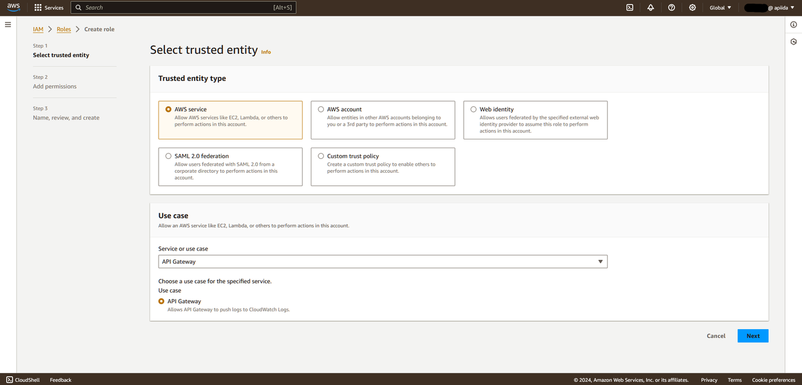
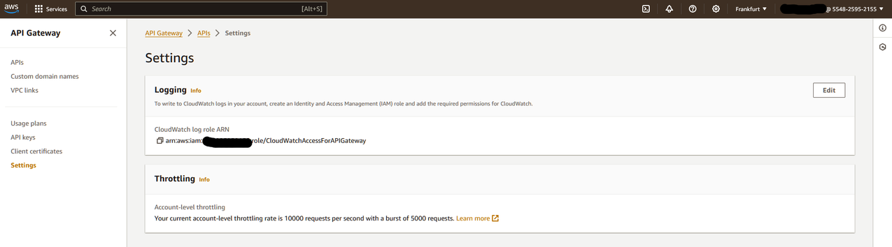
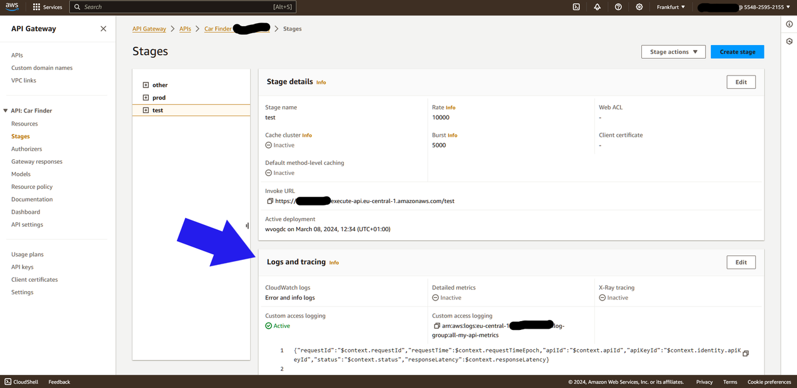
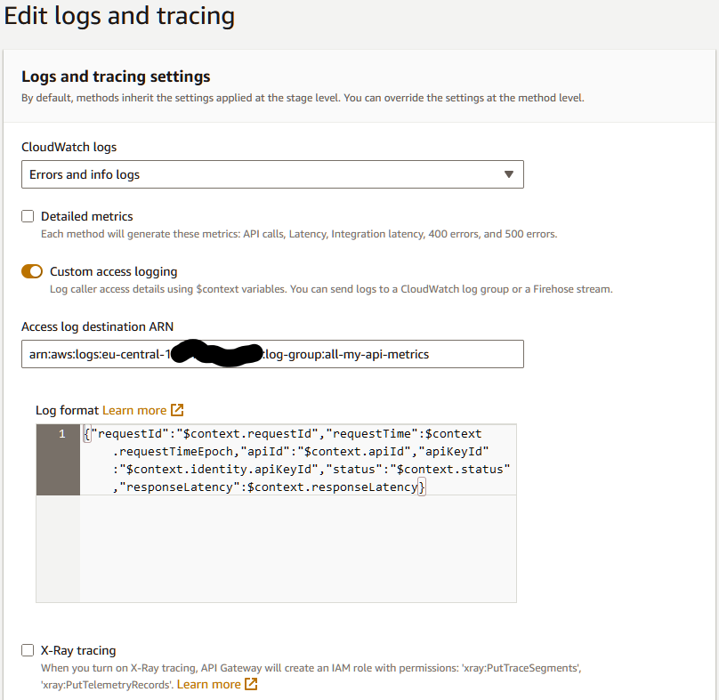

# Enable raw Metrics for AWS

<head>
  <meta name="guidename" content="API Management"/>
  <meta name="context" content="GUID-d32a9723-6956-48c5-ba05-7008ff9441fe"/>
</head> 

To enable raw metrics in AWS, you have to configure custom access logging via CloudWatch for each API you want to collect metrics for. Unfortunately, as of now, there is no way to globally enable this for all APIs. We may add an auto-configuration feature to the API Control Plane agent in the future. 

:::note
As the additional logs are collected by and stored in AWS, this comes with extra cost! We do not expect it to be much, but you may want to check your AWS bills, to see how expensive the custom access logging is for you.
:::

First, you should read this article on [Set up CloudWatch logging for REST APIs in API Gateway - Amazon API Gateway](https://docs.aws.amazon.com/apigateway/latest/developerguide/set-up-logging.html). There are two types of CloudWatch logging - we care about access logging, not execution logging.

## Granting API Gateway access to CloudWatch

The first step (if you haven’t already done so) is to create a new IAM role and configure it in the API gateway settings. Go to IAM -> Roles and create a new role. In the first step, select AWS service as trusted entity type and select the API Gateway use case. Proceed through the remaining steps with default settings.

Next, in AWS API gateway, go to settings and under logging, select the role you just created.

## Creating a CloudWatch log group

Go to CloudWatch → Logs → Log groups and create a new log group. A retention time of 1 day is sufficient. You should copy the ARN of the log group after it has been created, as you will need it in the next step.

## Configure access logging for an API

As of now, you will need to repeat this step for each of your APIs. 

In the API gateway, select the API, then go to stages and select the stage that you have configured in the API Control Plane agent. You will see a configuration box labeled Logs and tracing.

Open grafik-20240318-150112.png
grafik-20240318-150112.png

Click the Edit button. In the editing page, you have to configure three things. The other settings are related to execution logging, not access logging, and you can leave them as the are.

- Make sure custom access logging is enabled.

- Enter the ARN of the CloudWatch log group you created in the previous step. You will see this ARN in the overview page when selecting the log group in CloudWatch. Note: The ARN displayed in CloudWatch may end in :* You must not include this here. The ARN should end with its name and no extra characters after that.

- Enter the following log format, as a single line:

It must be noted that if you are already using custom access logging for other purposes, you may run into a conflict here, as only one custom access log can be configured per API stage. However, if your existing use of the logs allows for JSON format, you can use that and just add the fields needed by API Control Plane. The agent will ignore any additional fields in the JSON.

## Configuring the API Control Plane agent

Now that the API gateway is logging API access, you have to configure the API Control Plane agent, to import these logs. Add a configuration parameter named logGroupId (either in agent config file, or as environment variable gateway.logGroupId) and set it to the ARN of the CloudWatch log group. As with the log configuration in API gateway, the ARN must end with the log group name and not with any extra characters, so you may want to remove the :* at the end.

With this extra property, the agent will read the logs from CloudWatch. For this, the agent requires permissions to access the log group. If your agent is configured with explicit long term credentials, you must add the permission to the corresponding user. If your agent is running in one of the AWS container services, you can add the permission to the containers task role.