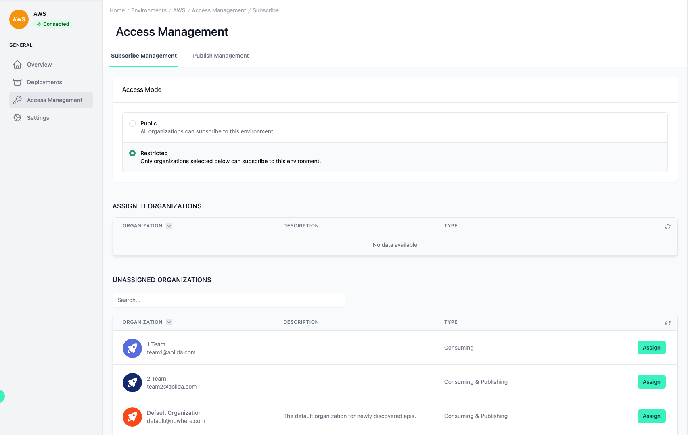

# Environment Access Management

<head>
  <meta name="guidename" content="API Management"/>
  <meta name="context" content="GUID-5dc40e09-2054-41ae-9256-5494208a7ad2"/>
</head>

Under the menu item 'Access Management' you can set which organizations are allowed to subscribe to or publish their APIs and API products.

You can find out more about organizations here: [Configuration Organizations](../Topics/cp-Configuration_organisation.md) 

## Subscribe Management

The 'Public' mode allows every organization to subscribe to the APIs and API products within the environment. 

In the first tab 'Subscribe Management' you can set the general access mode of the environment for subscriptions. 

Restricted mode only allows a selected list of organizations. If you select this mode, two tables appear in which you can manage the organizations. Only organizations of the types 'Consuming & Publishing' and 'Consuming' are displayed in the tables. You can add organizations within the lower table using "Assign". Users of this organization can then subscribe to API products from this environment.

 

:::note

**Effect on the developer portal**

- **Public:** The APIs and API products can be subscribed by everyone.
- **Private:** Only users from the selected organization can subscribe. Furthermore, the selection for the server URL in the API 'Try it out!' screen is only displayed to the permitted organizations.

:::

## Publish Management

In the second tab 'Publish Management' you can set the general access mode of the environment for deploying APIs and API products. 

The 'Public' mode allows any organization to deploy APIs and API products to this environment. 

 

Restricted mode only allows a selected list of organizations. If you select this mode, two tables appear in which you can manage the organizations. Only organizations of the types 'Consuming & Publishing' and 'Consuming' are displayed in the tables.

