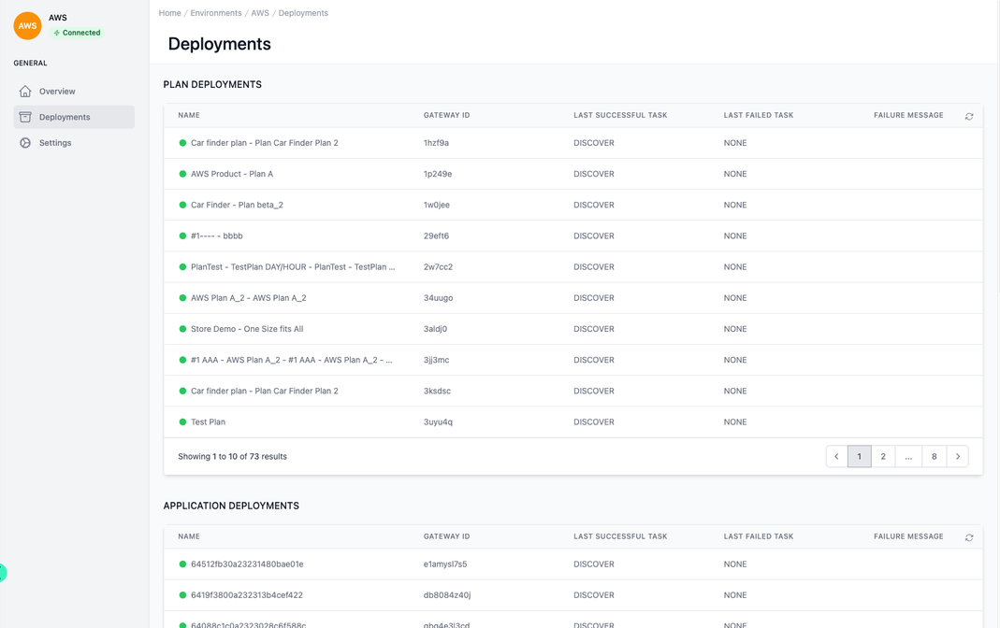

# Environment Deployments

<head>
  <meta name="guidename" content="API Management"/>
  <meta name="context" content="GUID-394dfadc-9e60-4d28-b9d6-030b19b49085"/>
</head>

## Overview

In the deployment environment overview you can see all [deployments](../Topics/cp-Deploy_APIs_APIproducts_plans_applications_and_subscriptions.md) found from the gateway. The deployments for plans, applications and subscriptions are listed here.

The "Deployments" section under a specific environment (AWS in this case) is dedicated to managing the deployment of API plans and applications. It provides a comprehensive view of all deployment activities within this environment.

## Interface Structure

The interface is divided into two main sections:

1. Plan Deployments: Displays a list of API plans that have been deployed within this environment.

2. Application Deployments: Shows individual applications deployed under the API plans.

## Plan Deployments Section

This list includes the following columns with deployment details:

- **Name:** The name of the deployed API plan, which is indicative of the service provided (e.g., "Car finder plan - Plan Car Finder Plan 2").

- **Gateway ID:** A unique identifier for the API gateway where the plan is deployed.

- **Last Successful Task:** Shows the last successful task performed in the deployment lifecycle, which is "DISCOVER" for all entries in this snapshot, possibly indicating a stage in a continuous integration/continuous deployment (CI/CD) pipeline.

- **Last Failed Task:** Indicates if there were any recent tasks related to the deployment that have failed. Currently, all are marked as "NONE".

- **Failure Message:** If there was a failure in the deployment process, the message or reason would be displayed here. This field is empty for all the listed deployments.

## Application Deployments Section

Below the plan deployments, we have a similar structured table for application deployments:

- **Name:** The name of the application, which seems to follow a unique identifier format.

- **Gateway ID:** Corresponds to the API gateway identifier for the specific application deployment.

- **Last Successful Task:** As above, it marks the last successful operation for the application deployment.

- **Last Failed Task:** Documents any recent unsuccessful deployment tasks.

- **Failure Message:** Provides details on the reason for any failures in deployment tasks.

## Interface Features

- **Search Functionality:** Both sections offer a search bar, allowing users to filter deployments by name or other criteria.

- **Pagination Controls:** Both lists support pagination to navigate through a large number of deployments. Indicated by the presence of page numbers and navigation arrows at the bottom of the lists.

- **Information Accessibility:** Hovering over or clicking certain interface elements may provide additional details or actions related to the deployment (such as viewing logs, editing configurations, or initiating rollback processes).