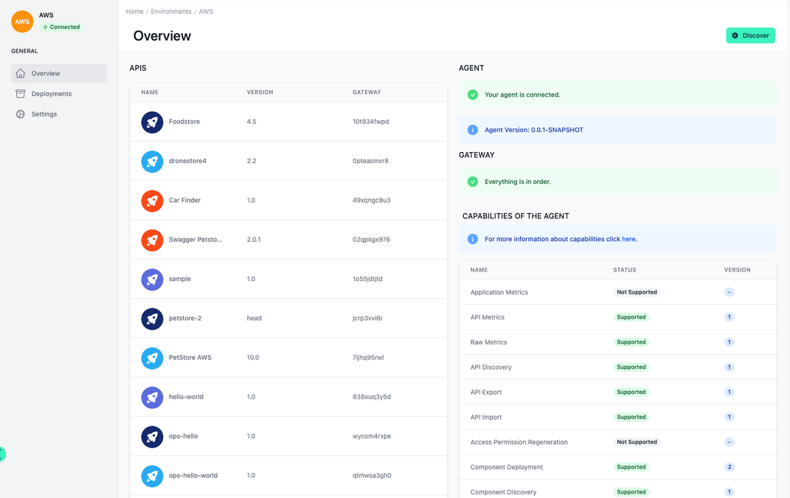
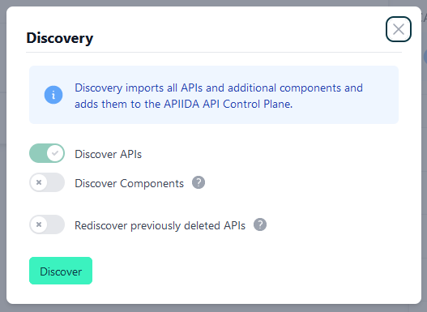

# Environment Overview

<head>
  <meta name="guidename" content="API Management"/>
  <meta name="context" content="GUID-16101f5e-8c4f-46bb-8afe-a3785b1b647c"/>
</head>

## Overview

On the one hand you see the agent status, which represents the connection to your gateways and on the other hand the status of the gateway itself. Furthermore you see all supported capabilities for your environment in tabular form. In a further table all found APIs are listed. To find the APIs and other components from the gateway, you can trigger the discover here.

## Discover

The basic functionality of the Discovery is explained here: [Discovery](../Topics/cp-Discovery.md) 

In this dialogue, you can select whether you want to discover not only APIs, but also other components such as plans, applications or subscriptions.
With "Rediscover previously ..." you can re-include APIs or components removed from the API Control Plane. Otherwise they would be ignored.

The discover dialog has different options depending on the environment capabilities.

## Agent and Gateway

The current status of the connection between the API Control Plan and the agent is displayed under Agent and the connection between the agent and the environment you have set up and connected is displayed under Gateway.

If errors are displayed here in yellow or red boxes, check the agent configuration and your stored access data. 

Refer to [this link](https://apiida.com/request-free-trial-apiida-api-control-plane/) to start your FREE trial or contact support for further assistance. 

## Capabilities

The capabilities describe which functionality is supported on which platform with your current agent. 

You can find more information on which capabilities exist, what they do and on which platform they are available here: [Environment Capabilities](../Topics/cp-Environment_capabilities.md).

Update your agent from time to time to be able to use new functions.
