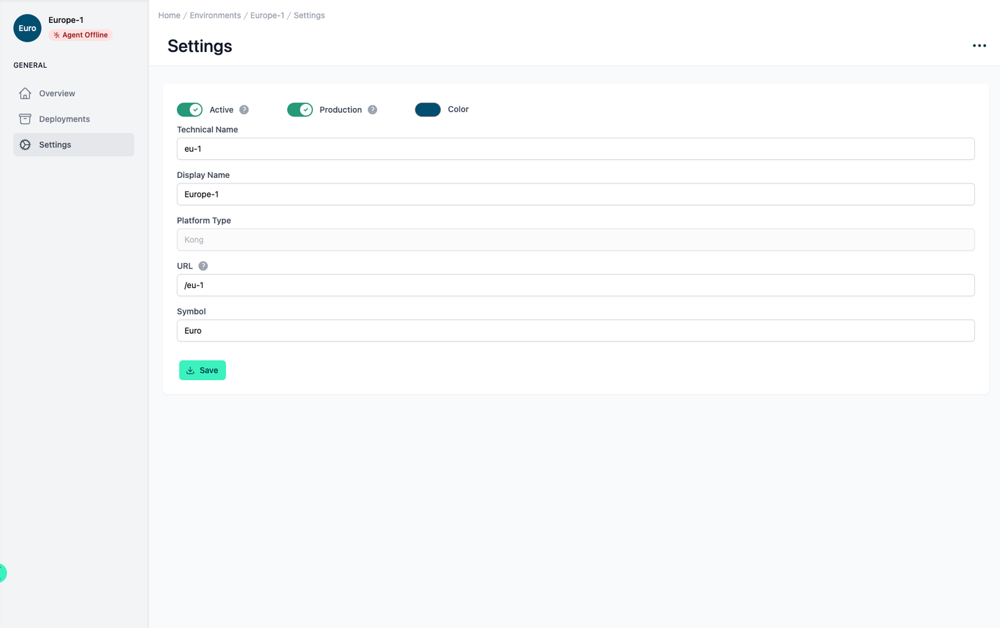

# Environment Settings

<head>
  <meta name="guidename" content="API Management"/>
  <meta name="context" content="GUID-11bbde43-81af-4b1b-af95-c831c5dffa75"/>
</head>

## Overview

In the environment settings, you can make basic configurations, such as changing the name or the color of the environment. You can also use the three-point menu at the top right of the page to access more advanced options. You can delete the entire environment, call the environment wizard again or renew your environment token.

## Settings of the Environment

All relevant setting options are listed and described in the table below.

|Settings|Description|
|--------|-----------|
|Technical Name|The technical name of an API must be unique.|
|Display Name|The display name can differ from the technical name and does not have to be unique.|
|URL|The base URL at which the APIs from this environment are made available. It is used to generate the full API Url that is displayed to users after subscribing to an API. [Environment Settings > Environment URLs](../Topics/cp-Environment_settings.md)|
|Platform Type|The platform type of the environment cannot be changed afterwards.|
|Agent|Here you can see the status of the agent. [Platforms, Environments and Stages](../Topics/cp-Platforms_environments_and_stages.md)|
|Status|If the environment is inactive, the agent will not be able to connect.|
|Production|The Stage of the environment.|
|Color, Symbol|This allows you to distinguish your environments more easily.|

## Environment Urls

This article explains what url you should configure for your environment and how it is used to build the specific API urls that your users will see after subscribing to an API in that environment.

- **Boomi API Gateway** The public URL. If a public URL is not specified, it is the bind address.
- **Kong:** The url of your Kong proxy (e.g. `http://my-kong:8000`). API urls are built by appending the path of the first route of a service (e.g. `http://my-kong:8000/petstore`).

- **WSO2:** The url of your WSO2 gateway (e.g. `http://my-wso2:8280`). API urls are built by appending the context and version of the API (e.g. `http://my-wso2:8280/petstore/1.0.6`)

- **Gravitee:** The url of the gravitee gateway (e.g. `http://my-gravitee:8082`). API urls are built by appending the API context path to the environment url (e.g. `http://my-gravitee:8082/petstore`).

- **AWS:** The url depends on the region where your AWS API gateway is hosted and the stage you want to use with this environment: `https://execute-api.<region>.amazonaws.com/<stage>` (e.g. `https://execute-api.eu-central-1.amazonaws.com/development`). API urls are built by prepending the API id (e.g. `https://22abcgc8u3.execute-api.eu-central-1.amazonaws.com/test`). 

- **Azure:** The url is the gateway url that can be found in Azure on the overview page of your API management service (e.g. `https://my-api-management-service.azure-api.net`). API urls are built by appending the API URL suffix of that API (e.g. `https://apiim-hello-world-resource.azure-api.net/petstore`).

- **Apigee:** API urls are built by appending the path from the first proxy endpoint of an API Proxy.

- **Layer7:** The url of your Layer7 gateway (e.g. `https://my-gateway:8443`) Not the Url of the Layer7 developer portal! API urls are built by appending the custom resolution path configured for the corresponding service in the gateway (e.g. `https://my-gateway:8443/petstore`).

- **Layer7 + Boomi:** The url of your Layer7 gateway (e.g. `https://my-gateway:8443`) Not the Url of your AAGM instance! API urls are built by appending the custom resolution path configured for the corresponding service in the gateway (e.g. `https://my-gateway:8443/petstore`).

