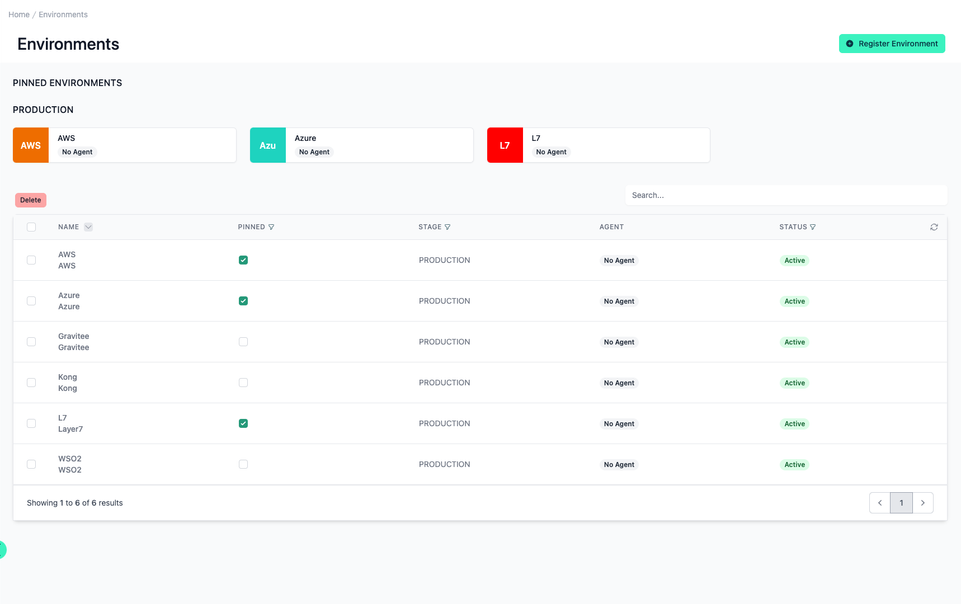
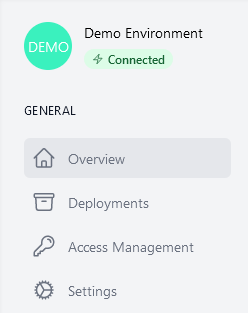

# Environments

<head>
  <meta name="guidename" content="API Management"/>
  <meta name="context" content="GUID-b063b7a5-24fc-4345-9d9e-ded6b2f6867c"/>
</head>

The Environments management interface, as part of an API management platform, allows users to monitor different deployment environments that serve as instances for deploying, testing and monitoring APIs. These environments are critical to ensure the seamless transition of APIs from the development to production phase, facilitate rigorous testing and enable efficient monitoring of API performance and behavior. The environments give users centralised control over the entire API lifecycle, streamlining the management process and improving operational efficiency.

## All your Environments

Below, there is a table listing all environments. Each row provides details about a specific environment, such as:

- **Name:** The designated name of the environment (e.g., "AWS", "Azure").

- **Pinned:** This column shows whether the environment is pinned for quick access, with a green pin icon indicating it is pinned.

- **Stage:** Indicates the stage of deployment, with all listed as "PRODUCTION" in this view.

- **Agent:** Denotes if a monitoring agent is associated with the environment, which is currently "No Agent" for all.

- **Status**: Reflects the current operational status of the environment. Here, each environment is marked as "Active".

In the top right, there is a "Register Environment" button, allowing users to add new environments to the platform.

## Interface Features

- **Search Bar**: Enables filtering the list of environments by name.

- **Pagination Controls:** Allow navigation through multiple pages if there are more environments than can be displayed on a single page.

- **Edit and Delete:** The interface likely has edit and delete capabilities for each environment, as suggested by the interactive elements in the "Pinned" and "Status" columns.

## Pinned Environments Section

At the top, we have the "PINNED ENVIRONMENTS" section which highlights key environments for quick access. Environments such as "AWS", "Azure", and "L7" are displayed with a clear indication of whether they have an associated monitoring agent. The presence of an "Agent" status suggests the possibility of enhanced monitoring features for the respective environment. Users can manage these pinned environments, including removing them by clicking the "Delete" button.

## Detailed View Navigation Bar

Clicking on an environment takes you to the detailed view of this environment. This detailed view contains a further navigation bar with these options.

### Overview  

A tile of the current environment. This contains the color and symbol, the display name and the agent status.

### General

This category houses the navigation pane for the application, which includes:

- [**Overview:**](../Topics/cp-Environment_overview.md) Shows a general summary.

- [**Deployments:**](../Topics/cp-Environment_deployments.md) Shows all deployments in this environment.

- [**Access Management:**](../Topics/cp-Environment_access_management.md) Which organizations are allowed to subscribe to or publish their APIs and API products.

- [**Settings:**](../Topics/cp-Environment_settings.md) Where configuration settings for the environment are managed.

## Register a new Environment

Press the "Register Environment" button at the top right and follow the wizard. For each platform, we have an additional instruction article for you.

- [How to connect to Boomi](../Topics/cp-How_to_connect_to_Boomi.md)
- [How to connect to AWS](../Topics/cp-How_to_connect_to_AWS.md)
- [How to connect to Azure](../Topics/cp-How_to_connect_to_Azure.md)
- [How to connect to Gravitee](../Topics/cp-How_to_connect_to_Gravitee.md)
- [How to connect to Kong](../Topics/cp-How_to_connect_to_Kong.md)
- [How to connect to Apigee](../Topics/cp-How_to_connect_to_Apigee.md)
- [How to connect to Layer7](../Topics/cp-How_to_connect_to_Layer7.md)
- [How to connect to Layer7 without the Layer7 API Developer Portal](../Topics/cp-How_to_connect_to_Layer7_without_the_Layer7_API_developer_portal.md)
- [How to connect to WSO2](../Topics/cp-How_to_connect_to_WSO2.md)
- [Advanced Configuration](../Topics/cp-Advanced_configuration.md)
