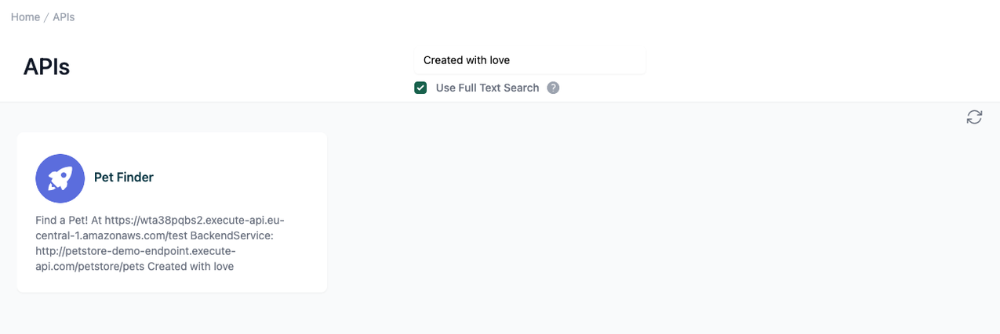
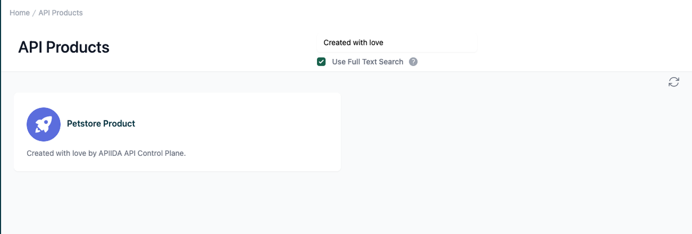

# Full Text Search

<head>
  <meta name="guidename" content="API Management"/>
  <meta name="context" content="GUID-0de4e986-7f96-4ab0-918e-ecc9d9136d2d"/>
</head> 

## API

By default, the "Title Search" is enabled. To enable the "Full Text Search", the checkbox of the same name below the search field must be activated. 

If this checkbox is enabled, the search terms will be considered individually and not as a construct belonging together. The example search term "Created with love" is split into its individual words, so that all APIs with the terms "Created", "with" and "love" are displayed. Filler words like "a" or "the" are ignored.

If APIs are added or edited, it can take up to 10 minutes until they can be found by the "Full Text Search".

- **Title Search:** The search is limited to the display name of the API.

- **Full Text Search:** Like the title search, but extended by the search areas description, current specification and documentation files of the API.

## API Product

By default, the "**Title Search**" is enabled. To enable the "**Full Text Search**", the checkbox of the same name below the search field must be activated. 

If this checkbox is enabled, the search terms will be considered individually and not as a construct belonging together. The example search term "Created with love" is split into its individual words, so that all API products with the terms "Created", "with" and "love" are displayed. Filler words like "a" or "the" are ignored.

If API products are added or edited, it can take up to 10 minutes until they can be found by the "**Full Text Search**".

 

- **Title Search:** The search is limited to the display name of the API product.

- **Full Text Search:** Like the title search, but extended by the search areas description, current specification and documentation files of the APIs and the description and documentation files of the API product.