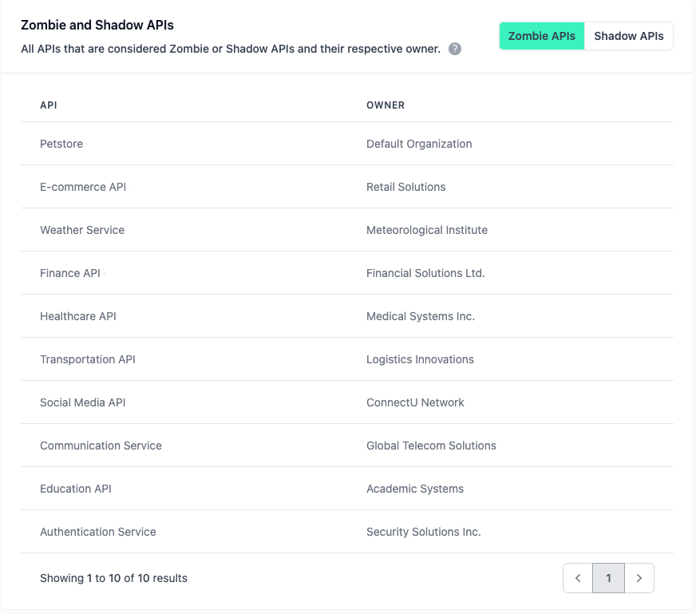

# Governance

<head>
  <meta name="guidename" content="API Management"/>
  <meta name="context" content="GUID-027bbbc2-cf8f-4e7d-b9fa-e60a0155faa3"/>
</head>

## Overview

API Governance is not just a corporate buzzword, but a cornerstone of effective API management. It is a set of rules and guidelines that helps a company effectively manage and control all its APIs. The goal? Make API usage across the company a smooth and trouble-free experience for everyone involved even with changing requirements.

One of the biggest challenges in API governance is complexity. APIs are not static, but evolve to meet changing business requirements and technological leverage. Given these dynamics, governance strategies must also be flexible and adapt to changing requirements or trends. When the time comes to federate governance across different vendors or runtimes, another layer of complexity is added. Rules need to be clear and consistent so they are not opaque, enforceable but not inflexible, and more importantly, creating an environment for innovation and growth.

The Governance Dashboard will support you in mastering the challenges.

## Governance Dashboard

The governance dashboard is available to global admins. It provides various insights into the security and quality scores of your APIs, as well as the most commonly violated rules from your rulesets. In addition, you can find lists of zombie APIs and shadow APIs.

Here is a quick overview. Use the Table of Content to get more detailed information.

## Active APIs Over Time

Overview of all active APIs for each day in the specified interval. The interval must be less than 1000 days. Parts of the interval that are too far in the past can be cut off.

## Active Subscriptions Over Time

Overview of all approved subscriptions to active applications for each day in the specified interval. The interval must be less than 1000 days. Parts of the interval that are too far in the past can be cut off.

## Average Scores per Organization

All organizations that are owners of APIs are displayed here. An average value is calculated across all security and quality scores of the APIs in the organizations.

## APIs with Lowest Scores

All APIs with a security or quality score below 100% are displayed here.

# Most Violated Rules

All violated rules are displayed here, sorted according to the severity and number of violations.

## Zombie and Shadow APIs

All APIs that are considered Zombie or Shadow APIs. An API is considered a Zombie API if it has not been subscribed to in the last 90 days. An API is considered a Shadow API if it does not contain an API specification file (e.g. OpenAPI).

## Number Of API and API Product Subscriptions

All API products and APIs are displayed here with their owner and the corresponding number of subscriptions, sorted by number of subscriptions. 

## Number Of Application Subscriptions

All applications are displayed here with their owner and the corresponding number of subscriptions, sorted by number of subscriptions.

## Slowest APIs

The APIs with the highest latencies only include APIs for which raw metrics are stored. 

- **Mean**: The average value can be distorted by outliers. 

- **Median**: 50% of requests are faster and 50% are slower than this value. 

- **95th Percentile**: 95% of all requests have a latency below this value.

