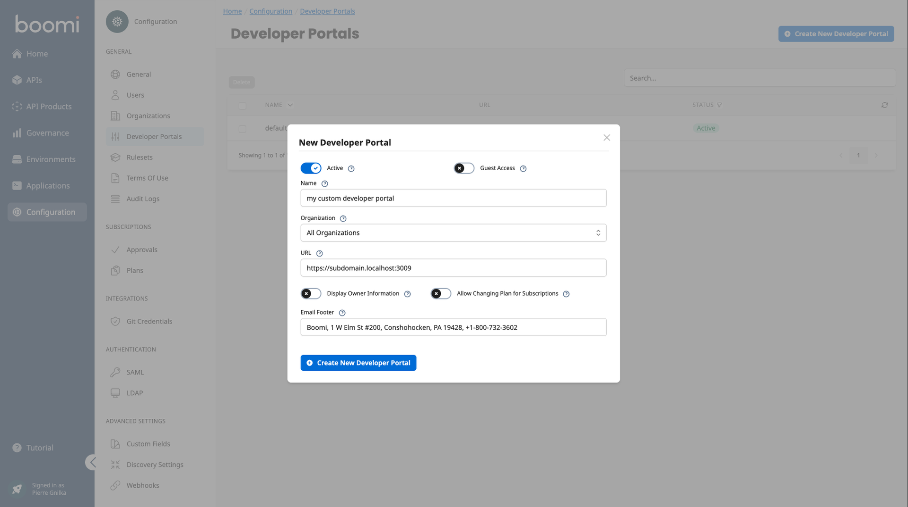
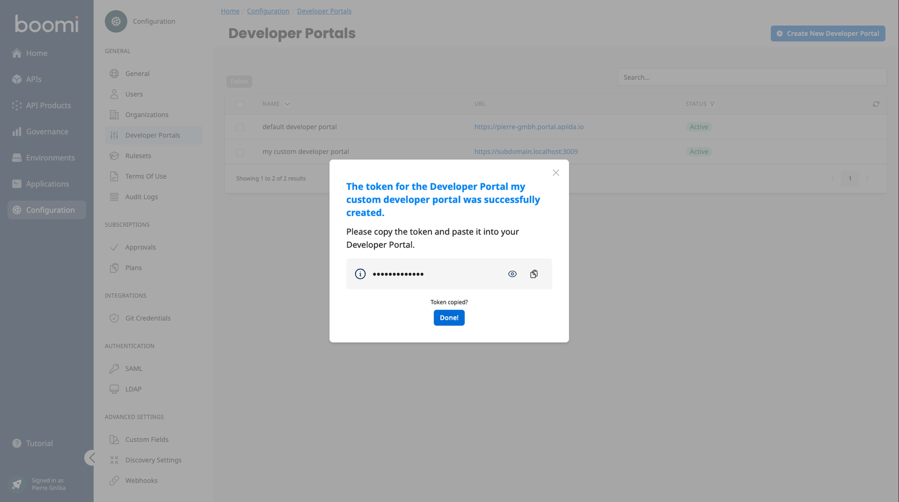

# Host an additional Developer Portal

<head>
  <meta name="guidename" content="API Management"/>
  <meta name="context" content="GUID-d0078533-53e5-4bd7-bef1-9a48d058764a"/>
</head>

Here you can learn how to host and configure an additional Developer Portal.

Each Developer Portal can be customized individually. This is especially interesting if you want to bring different API products closer to different customers.

## Create your new Developer Portal in the Admin Portal

Go to Configuration > Developer Portals > Create New Developer Portal in your Admin Portal.



- Name

 The name of the Developer Portal is displayed in the login screen. 

- Organization

 When an organization is selected, only API products that this organization is allowed to see will appear there.

- URL

 We need the URL to avoid CORS problems. It must start with your subdomain and then a ".".

 - Display Owner Information

  If this option is active, the owner information organization name and organization email will be displayed in each overview of API and API product.

  - Allow Changing Plan for Subscriptions

  Allow users in the DevPortal to switch the plan of a subscription at a later date without having to delete and recreate the subscription. No approval request is triggered.

  - Email Footer

  The footer of all emails sent by the developer portal. For example, when a user is invited.



After creating, you will be shown a token. Copy it. We need it in a moment.

## Get the Developer Portal Image

We provide you with a Docker image and also recommend docker to host it.

```
docker pull apiida/controlplane-devportal
```

## Host and Configure your Developer Portal

Here is a `docker-compose.yml` script

```

services:
  obsidian-devportal:
    image: apiida/controlplane-devportal
    container_name: joshn-doe-api-shop
    ports:
      - "3009:443"
    environment:
      BACKEND_URL: https://<tenant>.backend.na.controlplane.boomi.com
      # To disable the insertion of the tenant ID the string of 'INSERT_TENANT_ID' must not contain 'addTenantIdToBack'.
      INSERT_TENANT_ID: enableTenantIdInsertion
      DEV_PORTAL_TOKEN: vpfw2d823h8uQRN
      TINY_EDITOR_API_KEY: YourEditorKey
      # ssl configuration - here you can mount your certificate in the container and if you want, also change the whole nginx configuration.
      # volumes:
      #   - ./frontend.crt:/etc/ssl/certs/devportal.crt
      #   - ./frontend.key:/etc/ssl/private/devportal.key
      # http://nginx.org/en/docs/
      #   - ./nginx.conf:/etc/nginx/conf.d/default.conf

```

### A few more environment variables

|Variable|Default Value|Description|
|--------|-------------|-----------|
|`BACKEND_URL`|`https://localhost:8080`|The public URL of your Control Plane backend. This must be accessible from your browser. For example: `https://<tenant>.backend.na.controlplane.boomi.com`|
|`SUPPORT_URL`|`http://community.boomi.com`|The link to the support portal. Is displayed as a button in the main menu and on the 'Not Found' page.|
|`DEV_PORTAL_TOKEN`|0qPG7xXzm65SnioUM2fK|The token of the Developer Portal. You can find this in the Administrations Portal.|
|`INSERT_TENANT_ID`|`enableTenantIdInsertion`|To disable the insertion of the tenant ID the string must not contain 'addTenantIdToBack'.|
|`NGINX_PORT_SSL`|`443`|Nginx Port with SSL.|
|`NGINX_PORT`|`80`|Nginx Port with out SSL.|
|`TINY_EDITOR_API_KEY`||You must create and provide your own tiny api key here. This is free of charge[Quick setup guide: get your TinyMCE API key in 5 minutes](https://www.tiny.cloud/blog/how-to-get-tinymce-cloud-up-in-less-than-5-minutes/)|

 

Execute the following command in the console where your docker-compose.yml is located:

```
docker compose up -d
```
 

That's it. Go to your new Developer Portal.

`https://subdomain.localhost:3009/auth`

## Customizing

Don't forget to customize your Developer Portal!

[Content Management System (CMS)](../Topics/cp-Content_management_system.md)


