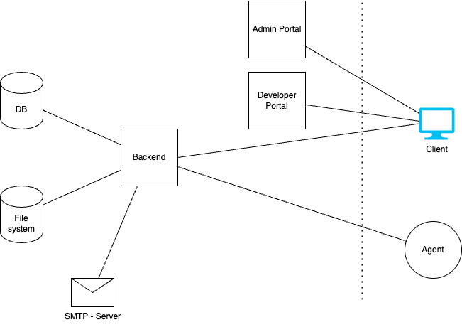
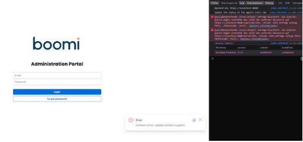

# Host the Control Plane yourself

<head>
  <meta name="guidename" content="API Management"/>
  <meta name="context" content="GUID-299d8ce3-7262-4b0a-bc55-6b92e48c69e2"/>
</head>


## Update Docker

Check if any updates for Docker are available. For the best experience your Docker installation should always be up to date. 

[Get Docker](https://docs.docker.com/get-started/get-docker/)

```
docker -v
```

HELM Charts are also available. Contact Boomi Support for details.


## Overview



## Docker Compose

**Commands:**

```
docker compose pull

docker compose up -d
```

:::note

Do not forget to adjust the frontend/backend url (aws url instead of localhost if necessary).

BACKEND_URL now has the “https://” removed from earlier versions. Also WSS is no longer needed.

Add the DEV_PORTAL_TOKEN to the controlplane-devportal.

Do not forget your certificates!

**controlplane-backend:**

- `'frontend.url=https://localhost:3000'`

**controlplane-frontend:**

- `'BACKEND_URL=https://localhost:8080'`

**controlplane-devportal:**

- `'BACKEND_URL=https://localhost:8080'`

- `DEV_PORTAL_TOKEN=XYZ`

:::

``` xml

version: "3.3"
services:
  # database
  controlplane-backend-db:
    image: mysql:8
    container_name: controlplane-backend-db
    restart: always
    ports:
      - "3309:3306"
    environment:
      MYSQL_ROOT_PASSWORD: 123
      MYSQL_DATABASE: obsidian-backend
      MYSQL_USER: obsidian
      MYSQL_PASSWORD: 123
    volumes:
      - controlplane-backend-db-vol:/var/lib/mysql

  # backend
  controlplane-backend:
    image: ghcr.io/apiida/controlplane-backend:latest
    container_name: controlplane-backend
    depends_on:
      - controlplane-backend-db
    ports:
      - "8080:8080"
    environment:
      # The initial admin. You should change the password later.
      initial-admin.username: admin
      initial-admin.password: admin
      # The connection to the Developer Portal is created directly at startup. The token can be freely selected but must match the one set in the Developer Portal.
      dev-portal.default.url: https://localhost:3009
      dev-portal.default.token: vpfw2d823h8uQRN
      # It is important that you provide a secure password here! This is used to encrypt secrets like git passwords in the database!
      jasypt.encryptor.password: Dont4get$1
      spring.datasource.url: "jdbc:mysql://controlplane-backend-db:3306/obsidian-backend"
      spring.datasource.username: obsidian
      spring.datasource.password: 123
      # required for CORS
      frontend.url: https://localhost:3000
      # you can also configure smtp while ACP is running, so this is optional
      # mail.smtp.host: <host>
      # mail.smtp.port: 25
      # mail.smtp.encryption: TLS
      # mail.smtp.username: <username>
      # mail.smtp.password: <password>
      # mail.smtp.from: hello@apiida.com
      # currently, we open a database connection for each incoming request, so the pool size determines how many requests we can process in parallel
      # you can reduce this, but don't go too small. I would recommend at the very least 20!
      spring.datasource.hikari.maximum-pool-size: 50
      # SSL/TLS configuration - uncomment and configure as needed
      # By default, SSL is enabled and uses a certificate issued for localhost.
      # server.ssl.enabled: true
      # You can provide your own private key and certificate by mounting a .p12 file into the container and configure
      # its location (we recommend /application/certs/backend.p12) and password in the following properties:
      # server.ssl.key-store-type: PKCS12
      # server.ssl.key-store: "/application/certs/backend.p12"
      # server.ssl.key-store-password: <your-p12-password>
      # By default, only TLSv1.3 is supported. You may change the supported protocol(s) here:
      # server.ssl.protocol: TLS
      # server.ssl.enabled-protocols: TLSv1.3
    volumes:
      - controlplane-backend-files-vol:/application/files
      # you probably want to add another volume, for your SSL certificate (.p12 format!)

  # frontend
  controlplane-frontend:
    image: ghcr.io/apiida/controlplane-frontend:latest
    container_name: controlplane-frontend
    depends_on:
      - controlplane-backend
    ports:
      - "3000:443"
    environment:
      BACKEND_URL: https://localhost:8080
      # To disable the insertion of the tenant ID the string must not contain 'addTenantIdToBack'.
      INSERT_TENANT_ID: doNotInsertIt
      # ssl configuration - here you can mount your certificate in the container and if you want, also change the whole nginx configuration.
      # volumes:
      #   - ./frontend.crt:/etc/ssl/certs/frontend.crt
      #   - ./frontend.key:/etc/ssl/private/frontend.key
      # http://nginx.org/en/docs/
      #   - ./nginx.conf:/etc/nginx/conf.d/default.conf

  # devportal
  controlplane-devportal:
    image: ghcr.io/apiida/controlplane-devportal:latest
    container_name: controlplane-devportal
    depends_on:
      - controlplane-backend
    ports:
      - "3009:443"
    environment:
      BACKEND_URL: https://localhost:8080
      # To disable the insertion of the tenant ID the string must not contain 'addTenantIdToBack'.
      INSERT_TENANT_ID: doNotInsertIt
      DEV_PORTAL_TOKEN: vpfw2d823h8uQRN
      # ssl configuration - here you can mount your certificate in the container and if you want, also change the whole nginx configuration.
      # volumes:
      #   - ./frontend.crt:/etc/ssl/certs/devportal.crt
      #   - ./frontend.key:/etc/ssl/private/devportal.key
      # http://nginx.org/en/docs/
      #   - ./nginx.conf:/etc/nginx/conf.d/default.conf

networks:
  default:
    name: controlplane

volumes:
  controlplane-backend-db-vol:
  controlplane-backend-files-vol:

  ```

## Backend Setup

### Database Pool size.
Ensure this is tuned to the amount of concurrent sessions you expect. 20 minimum advised.
`spring.datasource.hikari.maximum-pool-size`

### First Admin User

Ensure the following environment variables are set:

`- 'initial-admin.username=admin'`

`- 'initial-admin.password=admin'`

Then the initial credentials are username admin and password admin. The user and password should be changed later.

## Administration Portal (Frontend)

### Environment Variable 

|Variable|Default Value|Description|
|--------|-------------|-----------|
|`BACKEND_URL`|`https://localhost:8080`|The public URL of your Control Plane backend. This must be accessible from your web browser.|
|`SUPPORT_URL`|support.apiida.com|The link to the support portal. Is displayed as a button in the main menu and on the 'Not Found' page.|
|`AGENT_IMAGE`|apiida/controlplane-agent|Name of the docker image of the agent. This is displayed when an environment is created.|
|`INSERT_TENANT_ID`|`addTenantIdToBackendUrl`|To disable the insertion of the tenant ID the string must not contain `addTenantIdToBack`.|
|`NGINX_PORT_SSL`|443|Nginx Port with SSL.|
|`NGINX_PORT`|80|Nginx Port with out SSL.|


## TLS Certificates

To use production SSL certificates you must move your cert components to the following locations:

 - Mount the certificate in `/etc/ssl/certs/frontend.crt`
 - Mount the private key in `/etc/ssl/private/frontend.key`

These locations are static and not configurable via Environment Variables.

## Developer Portal (Frontend)

### Environment Variable 

|Variable|Default Value|Description|
|--------|-------------|-----------|
|BACKEND_URL|`https://localhost:8080`|The public URL of your Control Plane backend. This must be accessible from your web browser.|
|SUPPORT_URL|support.apiida.com|The link to the support portal. Is displayed as a button in the main menu and on the 'Not Found' page.|
|DEV_PORTAL_TOKEN|0qPG7xXzm65SnioUM2fK|The token of the Developer Portal. You can find this in the Administrations Portal.|
|INSERT_TENANT_ID|addTenantIdToBackendUrl|To disable the insertion of the tenant ID the string must not contain 'addTenantIdToBack'.|              
|NGINX_PORT_SSL|443|Nginx Port with SSL.|
|NGINX_PORT|80|Nginx Port with out SSL.|

## TLS Certificates

To use production SSL certificates you must move your cert components to the following locations:

- Mount the certificate in `/etc/ssl/certs/devportal.crt`
- Mount the private key in `/etc/ssl/private/devportal.key`

These locations are static and not configurable via Environment Variables.

## Backend: TLS Certificates

If you want to enable SSL and provide a certificate + private key for the backend, it must be in form of a `.p12` file, which must contain your private key and the certificate chain. 

See these commands on how to create a certificate chain file and then create a `.p12` from it and your private key:

```
cat backend.crt > backend-chain.pem
cat root.crt >> backend-chain.pem

openssl pkcs12 -export -inkey backend.key -in backend-chain.pem -name backend -out backend.p12 -passout pass:Dont4get$1
```

Mount the certificate into `/application/certs/` in the backend container and then set `server.ssl.key-store` environment variable to the full path of the certificate, e.g. `/applications/certs/backend.p12`.

### About the database encryption password

The value you provide for `jasypt.encryptor.password` is used to derive a key which in turn is used to encrypt sensitive information (e.g. api keys) in the database. If you change the password later and restart the backend, the key will be different you will run into errors. It is recommended to choose a secure password initially and stick to it, but if you have to change the password, you can follow this procedure:

- Set `jasypt.encryptor.password` to your new password and add an additional property `jasypt.encryptor.old-password` set to your old password.

- Now startup the backend. It will decrypt all sensitive information in the database with the key derived from the old password and the encrypt it again with the key derived from the new password. Once the process is finished, the container will exit.

- Now remove `jasypt.encryptor.old-password` and start the backend again.

### About Backend scalability

The backend does currently not support multiple parallel instances. Do not run more than one backend process The main issue is that agents would connect their websocket to only one backend instance and then to some instances the agent would appear connected and to others it would not.

## Analytics

Please refer to the following document to enable analytics/metrics by installing or referencing an InfluxDB.

[Setup and connect InfluxDB](../Topics/cp-Setup_and_connect_InfluxDB.md)

## What else can happen

Cross origin: Either the backend is not up yet or the certificate from it is not trusted either.

Once call the backend directly and accept the certificate as in 1.



