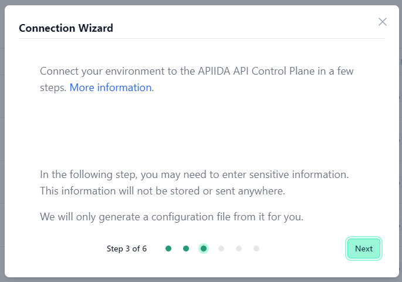

# How to connect to AWS

<head>
  <meta name="guidename" content="API Management"/>
  <meta name="context" content="GUID-13f4a8df-308c-486d-a4f9-2025356b7c1c"/>
</head>

On this page, you will find a step-by-step guide on how to connect your AWS API Gateway to Boomi's API Control Plane.

## Prerequisites

To proceed, you will need the following:

- A running instance of **Boomi´s API Control Plane**. 

- Access to the [Amazon API Gateway Service](https://aws.amazon.com/api-gateway/?nc1=h_ls) with at least one API deployed in a stage

- [Docker](https://www.docker.com/) to utilize the image of our agent, which acts as an intermediary.

   Any other container environment is also possible. 
   Helm Charts are available here: [GitHub - apiida/CPagent-Helm](https://github.com/apiida/CPagent-Helm): This is the Helm Chart installation resource for the APIIDA Control Plane agent .

## Create a new Environment

To get started, simply open your API Control Plane instance and follow the instructions below.

### Add an Environment

- Navigate to “Environments” in the menu on the left side

- Click on the “Create New Environment” button in the top right corner

- Choose your provider by clicking on it

- Confirm by clicking on the "Next" button

### Add Environment Information

- Complete the form below following the example below:

     - In [Environment Settings](../Topics/cp-Environment_settings.md) you will receive detailed information about the fields to be filled in.

- Confirm by clicking on the "Register Environment" button

- Click Next here to start the Connection Wizard.

 **You’ve completed the first step.**

## Provide the Gateway Information

The following describes how to create the gateway configuration for an AWS API Gateway Agent.

### Gateway Configuration

You have two options to grant your agent access to your AWS API Gateway, depending on whether you plan to host the agent inside AWS itself or elsewhere.

### Agents running outside AWS

This is the default, where you run the agent container outside of AWS, e.g. inside your local network or within another cloud provider. For the agent to be able to access the AWS API Gateway, you must provide credentials in form of Access Key and Secret Access Key.

## Agents running inside AWS

For agents running within one of the AWS container services (e.g. ECS or EKS) and pointing to AWS API Gateway you can choose to 'Use AWS Internal Access' instead of providing explicit credentials. This eliminates the storing or transmission of gateway credentials by the agent - Hence tighter security.

In this case you must configure a Task IAM Role for your container in AWS which has the necessary permissions to access the API Gateway. 

Here is the documentation from Amazon describing the process:

- `Use AWS Internal Access:` Enable this if you intend to run your agent container inside AWS and want to use a Task IAM Role instead of providing accessKey and secretAccessKey.

- `accessKey/secretAccessKey:` Id and secret access key of an AWS long-term access key for programmatic access.

- `region:` The region in which your AWS API Gateway is hosted.

- `stage:` The stage to which your APIs are deployed in AWS.

:::note

See our Q&A below if you want to learn more about how to get these values.

:::

:::caution

Currently, each AWS agent is specific to one region and one stage. 
If you want to manage multiple stages or regions, you will require an agent instance for each combination.

:::

- Your configuration file will download automatically.

- Confirm by clicking on the "Download and Next" button

 **You’ve completed the second step.**

## Create an Agent as Intermediary

The following describes how to create a Docker container for the agent. It is described using a Docker compose file so that additional agents can be easily added to your docker stack later.

- `image:` The docker image of the API Control Plane Agent

- `container_name:` You can freely choose the name of your Agent here as well as in line 3.

- `environment`

     - `backendUrl:` The agent will establish a web-socket to this URL and thereby connect to your API Control Plane.
     
     - `gateway-config:` The path inside the container to the configuration you downloaded in step 2.

- `volumes`

     - The outer path of the configuration file : The inner path of the configuration file

- Click on “Download and Next” to download your agent docker compose.

- Put both files in the same folder. Then run the following commands. 

  `docker pull apiida/controlplane-agent`

   - Download the latest image of the agent 
   
   `docker compose up `
   
   - Starts the agent. It will connect automatically.

 **You’ve completed the the third step.**

## Check the Agent's Status

- Head over to your API Control Plane instance

- Select “Environments” in the menu on the left side

     - Your Agent should now be connected to API Control Plane

- Click on the tile or the entry in the table to get more detailed information about the status of the connection. This can be very useful in case of an error.

 **You’ve completed the last step.**

You can now interact with your Gateways through Boomi´s API Control Plane.

Try it right now and discover your APIs.

:::tip

**It is easy to add more agents**
Repeat this guide or that of another gateway and simply add the agents to the existing Docker compose file.

:::

## Q&A

**How do I get my accessKey and secretAccessKey?**

See this AWS link to learn how to get your access keys:
[Understanding and getting your AWS credentials - AWS General Reference](https://docs.aws.amazon.com/IAM/latest/UserGuide/security-creds.html#access-keys-and-secret-access-keys)

**Where can I find the region assigned to my API in AWS?**

Go to the API Overview in the AWS API Gateway Service

- The region identifier of your API can be found in the region tab (see screenshot)

-The region identifier is also part of your overview URL 
`https://{region-identifier}.console.aws...`

**Where can I find the stage(s) in which my API is deployed?**

Go to the API Overview and choose Stages (from the left menu page).

- The stages in which your API is deployed will be displayed in the second column

