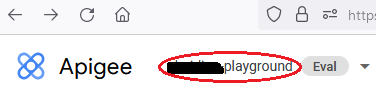
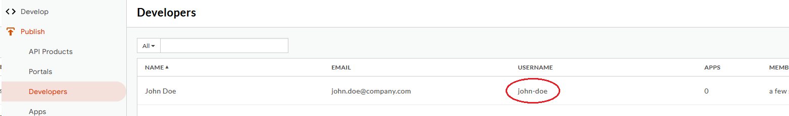

# How to connect to Apigee

<head>
  <meta name="guidename" content="API Management"/>
  <meta name="context" content="GUID-3467a0c6-fe5e-4460-ab02-0e542583b93a"/>
</head>

On this page you will learn how to connect your Apigee Gateway to Boomi´s API Control Plane step-by-step.

## Prerequisites

To proceed, you will need the following:

- A running instance of **Boomi´s API Control Plane**. 

- Access to the instance of your [Apigee Gateway](https://cloud.google.com/apigee)

- [Docker](https://www.docker.com/) to utilize the image of our agent, which acts as an intermediary.

## Create a new Environment

To get started, simply open your API Control Plane instance and follow the instructions below.

### Add an Environment

- Navigate to “Environments” in the menu on the left side

- Click on the “Create New Environment” button in the top right corner

- Choose your provider by clicking on it

- Confirm by clicking on the "Next" button

### Add Environment Information

- Complete the form below following the example below:

     - In [Environment Settings](../Topics/cp-Environment_settings.md) you will receive detailed information about the fields to be filled in.

- Confirm by clicking on the "Register Environment" button

- Click Next here to start the Connection Wizard.

 **You’ve completed the first step.**

## Provide the Gateway Information

The following describes how to create the gateway configuration for a Apigee Gateway Agent.

### Gateway Configuration

- `Organization:` Your Apigee Organization is shown in the top left after logging in to Apigee

- `GoogleKey Filename`: To obtain a key file:

     - log into http://console.cloud.google.com/
     
     - go to IAM & Admin → Service Accounts.
     
     - If necessary, create a new service account. Then click Manage Keys in the Actions menu for your service account.
     
     - Click ADD KEY → Create new key.
     
     - Choose JSON Format and save the generated key file.
     
     - The file must be in the same directory as configuration (from this step).

- `Developer:` This is the username of a developer that you have created in Apigee (under Publish → Developers). All Apigee Apps created by Boomi API Control Plane will use this Developer.

Your configuration file will download automatically.

Confirm by clicking on the "Download and Next" button

 **You’ve completed the second step.**

## Create an Agent as Intermediary

The following describes how to create a Docker container for the agent. It is described using a Docker compose file so that additional agents can be easily added to your docker stack later.

- `image:` The docker image of the API Control Plane Agent

- `container_name:` You can freely choose the name of your Agent here as well as in line 3.

- `environment`

     - `backendUrl:` The agent will establish a web-socket to this URL and thereby connect to your API Control Plane.
     
     - `gateway-config:` The path inside the container to the configuration you downloaded in step 2.

- `volumes`

     - The outer path of the configuration file : The inner path of the configuration file

- Click on “Download and Next” to download your agent docker compose.

- Put both files in the same folder. Then run the following commands. 

  `docker pull apiida/controlplane-agent`

   - Download the latest image of the agent 
   
   `docker compose up `
   
   - Starts the agent. It will connect automatically.

 **You’ve completed the the third step.**

## Check the Agent's Status

- Head over to your API Control Plane instance

- Select “Environments” in the menu on the left side

     - Your Agent should now be connected to API Control Plane

- Click on the tile or the entry in the table to get more detailed information about the status of the connection. This can be very useful in case of an error.

 **You’ve completed the last step.**

You can now interact with your Gateways through Boomi´s API Control Plane.

Try it right now and discover your APIs.

:::tip

**It is easy to add more agents**
Repeat this guide or that of another gateway and simply add the agents to the existing Docker compose file.

:::