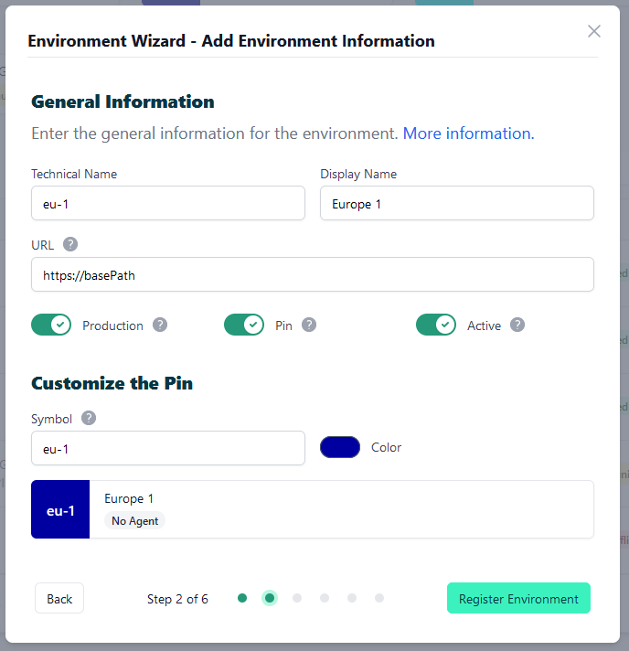
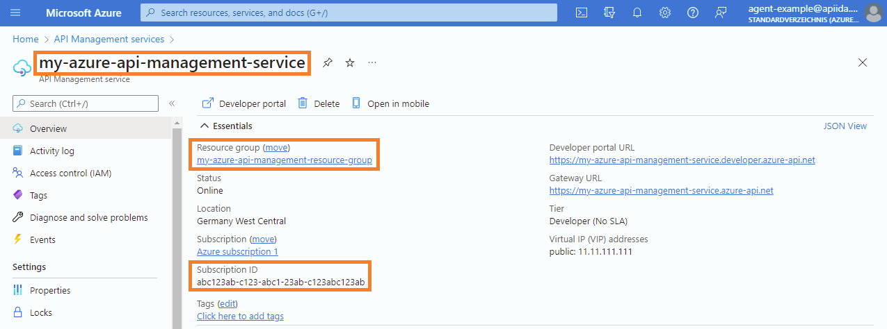

# How to connect to Azure

<head>
  <meta name="guidename" content="API Management"/>
  <meta name="context" content="GUID-6132625c-d065-442c-9edc-1d8c548023da"/>
</head>

On this page, you will find a step-by-step guide on how to connect your AWS API Gateway to Boomi's API Control Plane.

## Prerequisites

To proceed, you will need the following:

- A running instance of **Boomi´s API Control Plane**. 

- Access to the [Azure API Management](https://azure.microsoft.com/en-us/products/api-management/) with at least one API deployed in a stage

- [Docker](https://www.docker.com/) to utilize the image of our agent, which acts as an intermediary.

   Any other container environment is also possible. 
   Helm Charts are available here: [GitHub - apiida/CPagent-Helm](https://github.com/apiida/CPagent-Helm): This is the Helm Chart installation resource for the Control Plane agent .

## Create a new Environment

To get started, simply open your API Control Plane instance and follow the instructions below.

### Add an Environment

- Navigate to “Environments” in the menu on the left side

- Click on the “Create New Environment” button in the top right corner

- Choose your provider by clicking on it

- Confirm by clicking on the "Next" button

### Add Environment Information

- Complete the form below following the example below:

     - In [Environment Settings](../Topics/cp-Environment_settings.md) you will receive detailed information about the fields to be filled in.

- Confirm by clicking on the "Register Environment" button

- Click Next here to start the Connection Wizard.

 **You’ve completed the first step.**

## Provide the Gateway Information

The following describes how to create the gateway configuration for an Azure Gateway Agent.

### Gateway Configuration

- `serviceName`: The name of your Azure API Management service instance.

- `resourceGroupName`: The name of the resource group that contains your API Management service instance.

- `subscriptionId`: The ID of the Azure subscription that contains your API Management service instance.

- `tenantId/clientId/clientSecret`: The credentials of an authorized application.

:::note

See our Q&A below if you want to learn more about how to get these values.

:::

:::caution

Currently, each Azure agent is specific to one API Management service. 
If you want to manage multiple services, you will require an agent instance for each service.

:::

- Your configuration file will download automatically.

- Confirm by clicking on the "Download and Next" button.

 **You’ve completed the second step.**

## Create an Agent as Intermediary

The following describes how to create a Docker container for the agent. It is described using a Docker compose file so that additional agents can be easily added to your docker stack later.

- `image:` The docker image of the API Control Plane Agent

- `container_name:` You can freely choose the name of your Agent here as well as in line 3.

- `environment`

     - `backendUrl:` The agent will establish a web-socket to this URL and thereby connect to your API Control Plane.
     
     - `gateway-config:` The path inside the container to the configuration you downloaded in step 2.

- `volumes`

     - The outer path of the configuration file : The inner path of the configuration file

- Click on “Download and Next” to download your agent docker compose.

- Put both files in the same folder. Then run the following commands. 

  `docker pull apiida/controlplane-agent`

   - Download the latest image of the agent 
   
   `docker compose up `
   
   - Starts the agent. It will connect automatically.

 **You’ve completed the the third step.**

## Check the Agent's Status

- Head over to your API Control Plane instance

- Select “Environments” in the menu on the left side

     - Your Agent should now be connected to API Control Plane

- Click on the tile or the entry in the table to get more detailed information about the status of the connection. This can be very useful in case of an error.

 **You’ve completed the last step.**

You can now interact with your Gateways through Boomi´s API Control Plane.

Try it right now and discover your APIs.

:::tip

**It is easy to add more agents**
Repeat this guide or that of another gateway and simply add the agents to the existing Docker compose file.

:::

## Q&A

(**Look here in case of agent errors**)

**Where do I get the subscriptionId, serviceName and resourceGroupName?**

Go to the Overview page of your Azure API Management service

- The `serviceName` is displayed at the top left (see screenshot)

- The `resourceGroupName` is displayed in the overview under "Resource group”

- The `subscriptionId` is displayed in the overview under “Subscription ID”

**How do I get the tenantId, clientId and clientSecret?**

We recommend creating an application via Azure Active Directory to access the API Management Service. Below is a description of how to do this and how to obtain the required IDs and the client secret.

**Step 1 of 2: Create a new Application in Azure Active Directory**

- See this Microsoft Azure link to learn how to create an Application:
[Quickstart: Register an app in the Microsoft identity platform - Microsoft identity platform](https://learn.microsoft.com/en-us/entra/identity-platform/quickstart-register-app?tabs=certificate)

- After the application is created, the clientId and the associated tenantId are displayed:

- Now click on **Add a certificate** or secret (see Screenshot)

- After that click on **New client secret** and add a new secret

- The requested `clientSecret` will now be displayed

:::caution

Save the secret value, because it will no longer be displayed after you have left the page.

:::

:::note

The created application must also be assigned to the API Management Service (see Step 2), otherwise there is no link between the API Management service and the Application.

:::

**Step 2 of 2: Assign the Application to your Azure API Management Service**

- Go to the Overview page of your Azure API Management service

     - Select **Access control (IAM)** in the menu on the left side.
     
     - Click on **Add role assignment** in the interface.
     
     - Select the **Role “API Management Service Contributor”** to grant the necessary permissions.
     
     - Click on **Members** (next to Role) or **Next** (at the bottom) to continue.
     
     - **Add your Application** to the list of Role members.
     
     - Click on **Review + assign** (next to Members) or **Next** (at the bottom) to continue.
     
     - Confirm by clicking on the **”Review + assign”-Button** (at the bottom)
