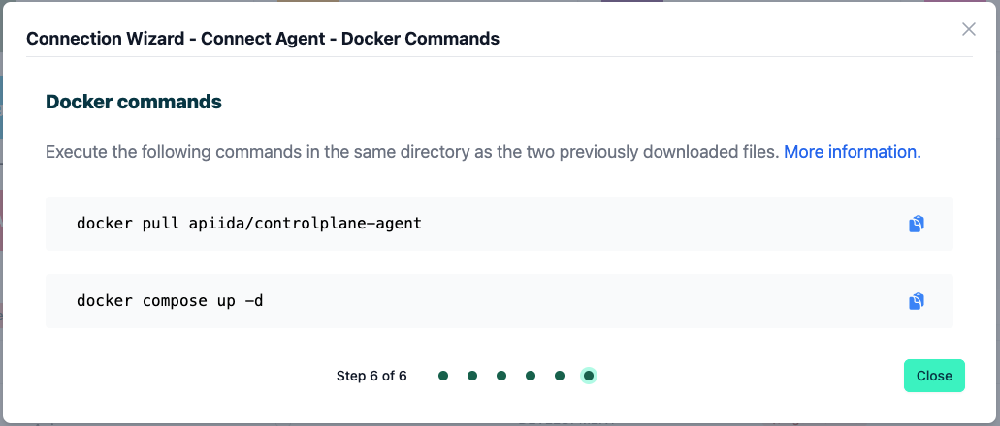

# How to connect to Boomi

<head>
  <meta name="guidename" content="API Management"/>
  <meta name="context" content="GUID-ae29b3dd-c3cc-41df-bc3a-69e159396eb8"/>
</head>

:::note

This method of connecting to your Boomi API gateway will be superseded soon. In the near future Control Plane will be able to automatically connect to all your Boomi API gateways with no extra configuration required.

:::

On this page, you will find a step-by-step guide on how to connect your Boomi API gateway to Boomi's API Control Plane.

## Prerequisites

To proceed, you will need the following:

- A running instance of **Boomi´s API Control Plane**.

- An account on the Boomi platform with at least one API gateway.

- [Docker](https://www.docker.com/) to utilize the image of our agent, which acts as an intermediary.

   Any other container environment is also possible. 
   Helm Charts are available here: [GitHub - CPagent-Helm](https://github.com/apiida/CPagent-Helm): This is the Helm Chart installation resource for the Control Plane agent .

## Create a new Environment

To get started, open your API Control Plane instance and follow the instructions below.

### Add an Environment

- Navigate to “Environments” in the menu on the left side

- Click on the “Create New Environment” button in the top right corner

- Choose your provider by clicking on it

- Confirm by clicking on the "Next" button

### Add Environment Information

- Complete the form below following the example below:

     - In [Environment Settings](../Topics/cp-Environment_settings.md) you will receive detailed information about the fields to be filled in.

- Confirm by clicking on the "Register Environment" button

- Click Next here to start the Connection Wizard.

 **You’ve completed the first step.**

## Provide the Gateway Information

The following describes how to create the gateway configuration for an Boomi API Gateway Agent.

- `Account Id`: Your Boomi account Id. You will find this on the Boomi platform under Settings -> Account Information.

- `User`: The email address you use to log into the Boomi platform.

- `Api token`: You can create an API token in the Boomi platform under Settings -> AtomSphere API Tokens.

- `Gateway Id`: The id of the specific gateway which this environment will connect to. 
You will find this in the Boomi platform under API Management. Go to Configure Server -> Gateways and click on the name of your gateway. You will see the Gateway Information page where you will find the Gateway Id.

:::note

See our Q&A below if you want to learn more about how to get these values.

:::

- Your configuration file will download automatically.

- Confirm by clicking on the "Download and Next" button

 **You’ve completed the the second step.**

## Create an Agent as Intermediary

The following describes how to create a Docker container for the agent. It is described using a Docker compose file so that additional agents can be easily added to your docker stack later.

- `image`: The docker image of the API Control Plane Agent

- `container_name`: You can freely choose the name of your Agent here as well as in line 3.

- environment

     - `backendUrl`: The agent will establish a web-socket to this URL and thereby connect to your API Control Plane.

     - `gateway-config`: The path inside the container to the configuration you downloaded in step 2.

- volumes

     - The outer path of the configuration file : The inner path of the configuration file.

- Click on “Download and Next” to download your agent docker compose.

- Put both files in the same folder. Then run the following commands. 

  `docker pull apiida/controlplane-agent`

   - Download the latest image of the agent 
   
   `docker compose up `
   
   - Starts the agent. It will connect automatically.

 **You’ve completed the the third step.**

## Check the Agent's Status

- Head over to your API Control Plane instance

- Select “Environments” in the menu on the left side

     - Your Agent should now be connected to API Control Plane

- Click on the tile or the entry in the table to get more detailed information about the status of the connection. This can be very useful in case of an error.

 **You’ve completed the last step.**

You can now interact with your Gateways through Boomi´s API Control Plane.

Try it right now and discover your APIs.

:::tip

**It is easy to add more agents**
Repeat this guide or that of another gateway and simply add the agents to the existing Docker compose file.

:::

## Q&A

**Where do I find my Account Id?**

In the Boomi platform, click on **Settings** in the top menu bar and then select **Account Information** and **Setup**. You should now see the **Account Information** page, which lists your Account ID.

**Where can I get an Api token?**

- In the Boomi platform, first click on **Settings** in the top menu bar and select **User Information**. Then, select **AtomSphere API Tokens** in the left-side menu.

- Here you click on **Add New Token**. You willl be asked for a name. Choose a name that will remind you of this tokens purpose, e.g. “Control Plane agent“, then click **Generate Token**.

- Make sure to copy the generated token immediately, as you will not be able to obtain it later, once you close the dialog.

**Where do I find the Gateway Id?**

- In the Boomi platform, first click on **Services** in the top menu bar and select **API Management**. 

- In the API Management menu bar, select **Configure Server** and then **Gateways**. Then click on the name of the gateway you want to connect to.

- In the next screen you will see details about your Gateway, including the Gateway ID.

