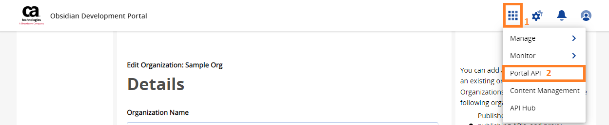
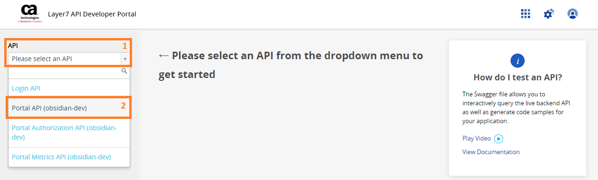
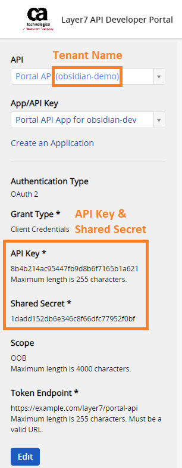
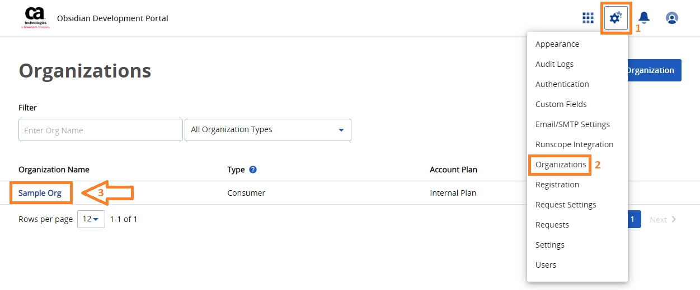
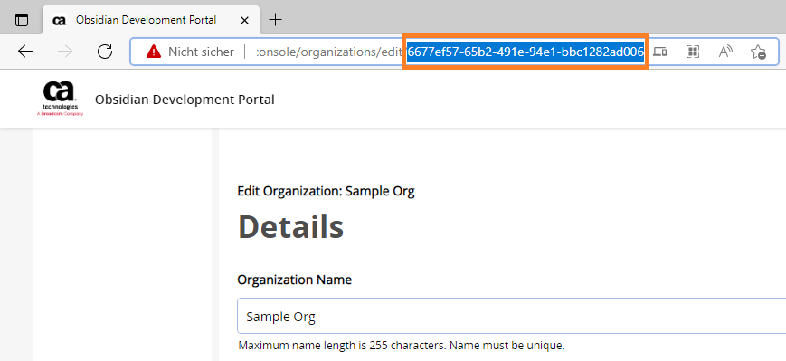

# How to connect to Layer7

<head>
  <meta name="guidename" content="API Management"/>
  <meta name="context" content="GUID-b1d94709-dc6c-40b5-b3cd-3ca07d95c5d3"/>
</head>

On this page you will learn how to connect your Layer7 Gateway to Boomi´s API Control Plane step-by-step.

## Prerequisites

To proceed, you will need the following:

- A running instance of **Boomi´s API Control Plane**.

- Access to the instance of your [Layer7 Gateway/Developer Portal](https://www.broadcom.com/products/software/api-management/layer7-api-gateways)

- [Docker](https://www.docker.com/) to utilize the image of our agent, which acts as an intermediary.

## Create a new Environment

To get started, simply open your API Control Plane instance and follow the instructions below.

### Add an Environment

- Navigate to “Environments” in the menu on the left side

- Click on the “Create New Environment” button in the top right corner

- Choose your provider by clicking on it

- Confirm by clicking on the "Next" button

### Add Environment Information

- Complete the form below following the example below:

     - In [Environment Settings](../Topics/cp-Environment_settings.md) you will receive detailed information about the fields to be filled in.

- Confirm by clicking on the "Register Environment" button

- Click Next here to start the Connection Wizard.

 **You’ve completed the first step.**

## Provide the Gateway Information

The following describes how to create the gateway configuration for a Layer7 Gateway Agent.

## Gateway Configuration

- `url`: Url of the Layer7 Portal API (PAPI).

- `tenant`: Name of the tenant in Layer7 developer portal that you want to use.

- `user/password`: Credentials of a user of your Layer7 developer portal instance with access rights to the portal API.

- `apiKey`: ApiKey required for accessing Portal API.

- `sharedSecret`: Shared secret required for accessing Portal API.

- `organizationUuid`: UUID of an organization in Layer7 developer portal. All applications that Control Plane creates inside Layer7 developer portal, will be assigned to this organization.

:::note

See our Q&A below if you want to learn more about how to get these values.

:::

- Your configuration file will download automatically.

- Confirm by clicking on the "Download and Next" button

 **You’ve completed the second step.**

## Create an Agent as Intermediary

The following describes how to create a Docker container for the agent. It is described using a Docker compose file so that additional agents can be easily added to your docker stack later.

- `image:` The docker image of the API Control Plane Agent

- `container_name:` You can freely choose the name of your Agent here as well as in line 3.

- `environment`

     - `backendUrl:` The agent will establish a web-socket to this URL and thereby connect to your API Control Plane.
     
     - `gateway-config:` The path inside the container to the configuration you downloaded in step 2.

- `volumes`

     - The outer path of the configuration file : The inner path of the configuration file

- Click on “Download and Next” to download your agent docker compose.

- Put both files in the same folder. Then run the following commands. 

  `docker pull apiida/controlplane-agent`

   - Download the latest image of the agent 
   
   `docker compose up `
   
   - Starts the agent. It will connect automatically.

 **You’ve completed the the third step.**

## Check the Agent's Status

- Head over to your API Control Plane instance

- Select “Environments” in the menu on the left side

     - Your Agent should now be connected to API Control Plane

- Click on the tile or the entry in the table to get more detailed information about the status of the connection. This can be very useful in case of an error.

 **You’ve completed the last step.**

You can now interact with your Gateways through Boomi´s API Control Plane.

Try it right now and discover your APIs.

:::tip

**It is easy to add more agents**
Repeat this guide or that of another gateway and simply add the agents to the existing Docker compose file.

:::

## Q&A

**Which settings to I have to enable in my Broadcom Layer7 Developer Portal for the Control Plane?**

- Enable API plans 

- Create a technical user that is used only by the Control Plane

**Where can I find my tenant name, apiKey and the sharedSecret?**

- Open the Development Portal and go to “Portal API”

- Select the Portal API for your tenant.

- You can find the tenantName, apiKey and the sharedSecret in the display that appears.

- Copy the credentials and insert them into your configuration file

**Where can I find my organizationUuid?**

- Open the Development Portal and go to “Organizations”

- Choose your organization

- You can find the organizationUuid as part of the URL.

- Copy the UUID and insert it into your configuration file.

