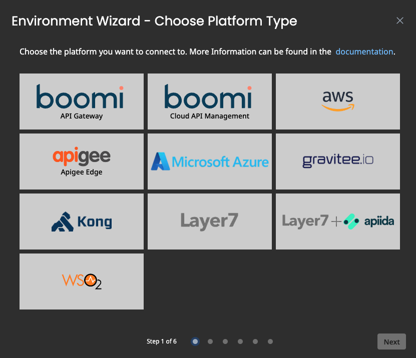
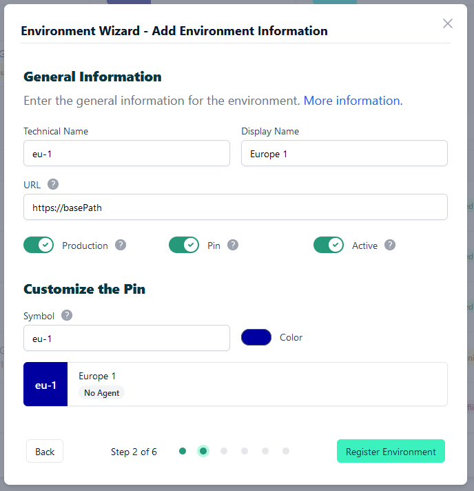
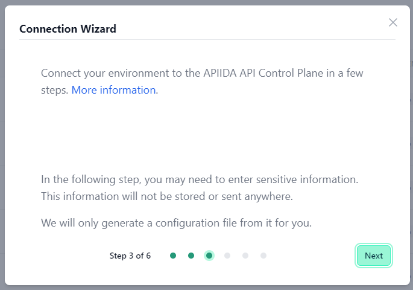
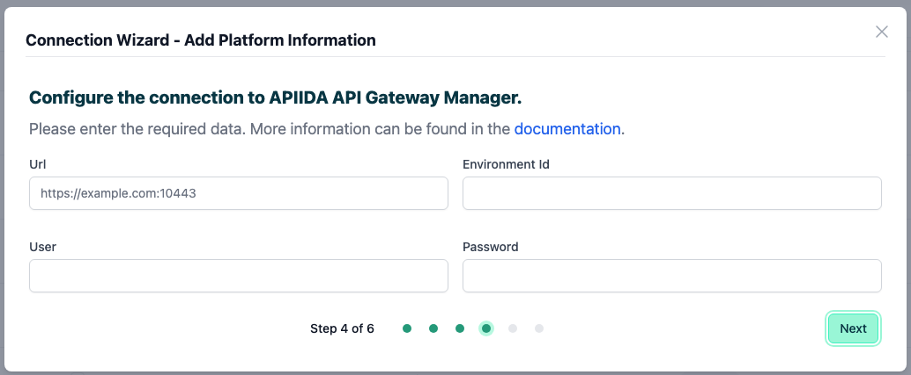
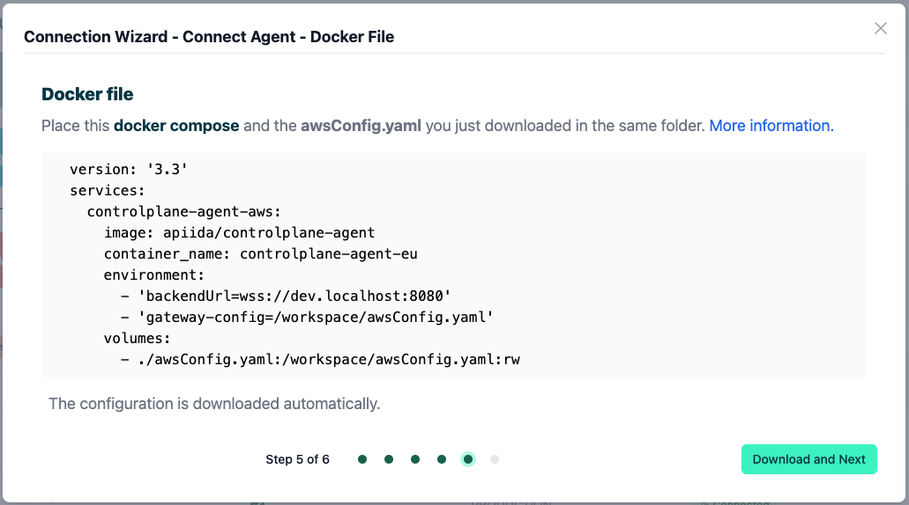
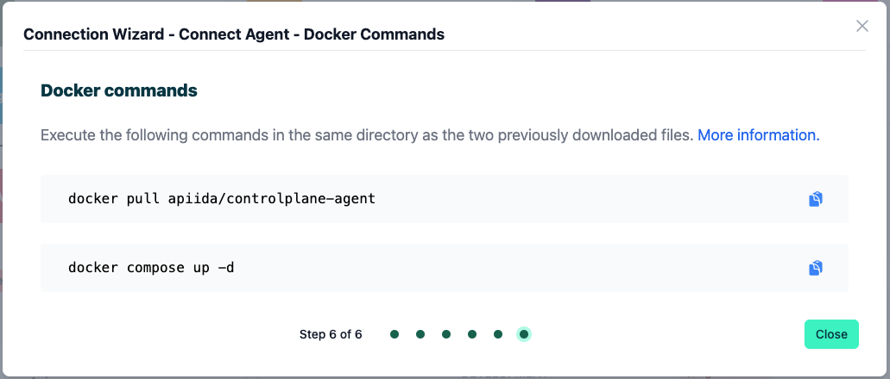
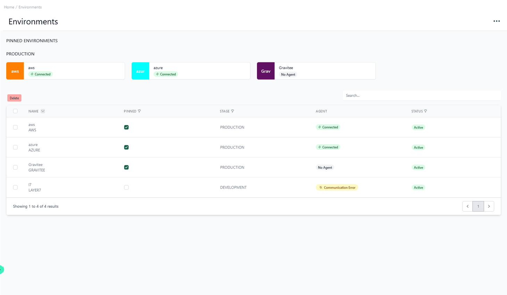
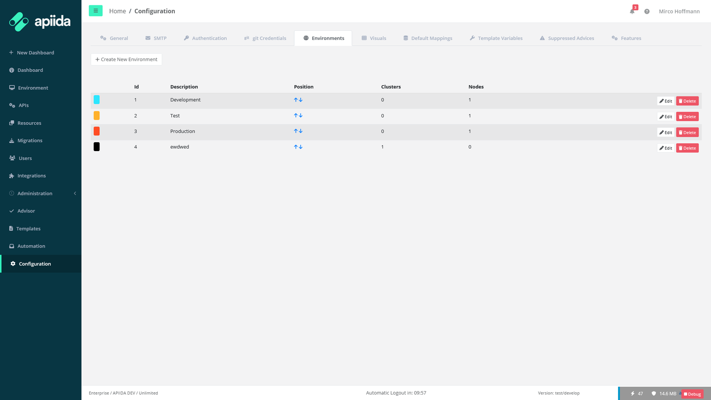

# How to connect to Layer7 without the Layer7 API Developer Portal

<head>
  <meta name="guidename" content="API Management"/>
  <meta name="context" content="GUID-390b7cf2-a6f7-4e0a-8a62-682c712c945d"/>
</head>

On this page you will learn step by step how to connect your Layer7 gateways to the Boomi API Control Plane without using the Layer7 API Developer Portal.

## Prerequisites

The following is required to proceed:

- A running instance of **Boomi´s API Control Plane**.

- A running instance of the **Boomi API Gateway Manager**

     - At least version **2023.2.2**
     
     - Please visit our website and Documentation for more information.
     
     - The APIs to be discovered must be marked in AAGM.
     
        - APIs | Discover APIs with the API Control Plane Agent

- A few adjustments to your gateways and APIs.

- [Docker](https://www.docker.com/) to use the image of our agent (that acts as an intermediary)

### Prepare the Gateways

Refer [Prepare the Gateways](../Topics/cp-Prepare_the_gateways.md)

## Create a new Environment

To get started, simply open your API Control Plane instance and follow the instructions below.

### Add an Environment

- Navigate to “Environments” in the menu on the left side

- Click on the “Create New Environment” button in the top right corner

- Choose your provider by clicking on it

- Confirm by clicking on the "Next" button

### Add Environment Information

- Complete the form below following the example below:

     - In [Environment Settings](../Topics/cp-Environment_settings.md) you will receive detailed information about the fields to be filled in.

- Confirm by clicking on the "Register Environment" button

- Click Next here to start the Connection Wizard.

 **You’ve completed the first step.**

## Provide the Gateway Information

The following describes how to create the gateway configuration for a Layer7 Gateway Agent.

## Gateway Configuration

- `url`: Insert the URL to your Boomi API Gateway Manager

- `Environment Id`: The environment ID from the Boomi API Gateway Manager with which the environment in the Boomi API Control Plane should match.

- `user/password`: Credentials of a user of the Boomi API Gateway Manager (Administrator)

:::note

See our Q&A below if you want to learn more about how to get these values.

:::

- Your configuration file will download automatically.

- Confirm by clicking on the "Download and Next" button

 **You’ve completed the second step.**

## Create an Agent as Intermediary

The following describes how to create a Docker container for the agent. It is described using a Docker compose file so that additional agents can be easily added to your docker stack later.

- `image:` The docker image of the API Control Plane Agent

- `container_name:` You can freely choose the name of your Agent here as well as in line 3.

- `environment`

     - `backendUrl:` The agent will establish a web-socket to this URL and thereby connect to your API Control Plane.
     
     - `gateway-config:` The path inside the container to the configuration you downloaded in step 2.

- `volumes`

     - The outer path of the configuration file : The inner path of the configuration file

- Click on “Download and Next” to download your agent docker compose.

- Put both files in the same folder. Then run the following commands. 

  `docker pull apiida/controlplane-agent`

   - Download the latest image of the agent 
   
   `docker compose up `
   
   - Starts the agent. It will connect automatically.

 **You’ve completed the the third step.**

## Check the Agent's Status

- Head over to your API Control Plane instance

- Select “Environments” in the menu on the left side

     - Your Agent should now be connected to API Control Plane

- Click on the tile or the entry in the table to get more detailed information about the status of the connection. This can be very useful in case of an error.

 **You’ve completed the last step.**

You can now interact with your Gateways through Boomi´s API Control Plane.

Try it right now and discover your APIs.

:::tip

**It is easy to add more agents**
Repeat this guide or that of another gateway and simply add the agents to the existing Docker compose file.

:::

## Q&A

**Where can I find the ID of the environment I want to connect?**

- In API Gateway Manager go to “Configuration” and choose “Environments”

- The ID of the environments is shown in the table as depicted below.

