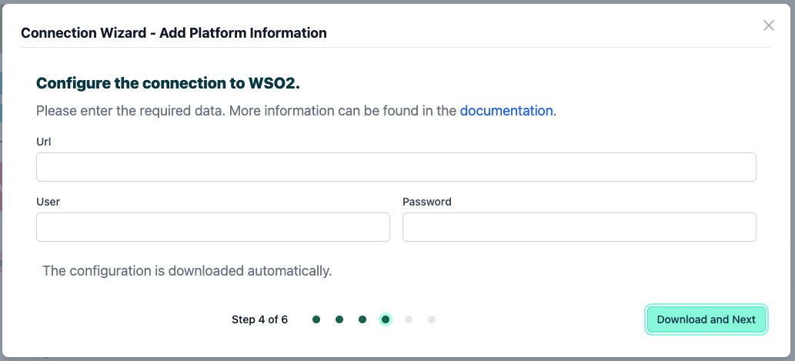
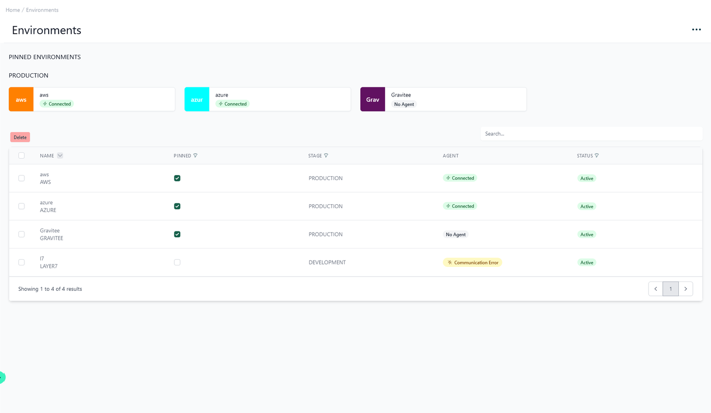

# How to connect to WSO2

<head>
  <meta name="guidename" content="API Management"/>
  <meta name="context" content="GUID-4418306d-c9f1-4d18-abc1-3fbb2c9cd2a1"/>
</head>

On this page you will learn how to connect your WSO2 API Gateway to Boomi´s API Control Plane step-by-step.

## Prerequisites

To proceed, you will need the following:

- A running instance of **Boomi´s API Control Plane**.

- Access to the [WSO2 API Manager](https://wso2.com/api-manager/) with at least one API deployed

- [Docker](https://www.docker.com/) to utilize the image of our agent, which acts as an intermediary.

## Create a new Environment

To get started, simply open your API Control Plane instance and follow the instructions below.

### Add an Environment

- Navigate to “Environments” in the menu on the left side

- Click on the “Create New Environment” button in the top right corner

- Choose your provider by clicking on it

- Confirm by clicking on the "Next" button

### Add Environment Information

- Complete the form below following the example below:

     - In [Environment Settings](../Topics/cp-Environment_settings.md) you will receive detailed information about the fields to be filled in.

- Confirm by clicking on the "Register Environment" button

- Click Next here to start the Connection Wizard.

 **You’ve completed the first step.**

## Provide the Gateway Information

The following describes how to create the gateway configuration for an WSO2 API Gateway Agent.

## Gateway Configuration

- `url`: The base URL of your WSO2 instance. 

- `user/password`: Credentials for a WSO2 user that has been assigned the following roles:

     - `Internal/publisher`
     
     - `Internal/subscriber`

:::note

See our Q&A below if you want to learn more about how to get these values.

:::

- Your configuration file will download automatically.

- Confirm by clicking on the "Download and Next" button

 **You’ve completed the second step.**

## Create an Agent as Intermediary

The following describes how to create a Docker container for the agent. It is described using a Docker compose file so that additional agents can be easily added to your docker stack later.

- `image:` The docker image of the API Control Plane Agent

- `container_name:` You can freely choose the name of your Agent here as well as in line 3.

- `environment`

     - `backendUrl:` The agent will establish a web-socket to this URL and thereby connect to your API Control Plane.
     
     - `gateway-config:` The path inside the container to the configuration you downloaded in step 2.

- `volumes`

     - The outer path of the configuration file : The inner path of the configuration file

- Click on “Download and Next” to download your agent docker compose.

- Put both files in the same folder. Then run the following commands. 

  `docker pull apiida/controlplane-agent`

   - Download the latest image of the agent 
   
   `docker compose up `
   
   - Starts the agent. It will connect automatically.

 **You’ve completed the the third step.**

## Check the Agent's Status

- Head over to your API Control Plane instance

- Select “Environments” in the menu on the left side

     - Your Agent should now be connected to API Control Plane

- Click on the tile or the entry in the table to get more detailed information about the status of the connection. This can be very useful in case of an error.

 **You’ve completed the last step.**

You can now interact with your Gateways through Boomi´s API Control Plane.

Try it right now and discover your APIs.

:::tip

**It is easy to add more agents**
Repeat this guide or that of another gateway and simply add the agents to the existing Docker compose file.

:::

## Q&A

**What is my WSO2 base url?**

If your WSO2 frontends are found under `https://localhost:9443/devportal/`, `https://localhost:9443/publisher/` and so on, the base url would be `https://localhost:9443`.

**How do I manage users in WSO2?**

- See this WSO2 link to learn how to manage users and roles of your WSO2 instance:
[Introduction to User Management - WSO2 API Manager Documentation 4.3.0](https://apim.docs.wso2.com/en/latest/administer/managing-users-and-roles/introduction-to-user-management/)

- IMPORTANT: After creating a new user and assigning the necessary roles, you should log into the WSO2 developer portal (`<base-url>/devportal/`) once with this user. Otherwise the agent might encounter an internal server error when trying to deploy an application.

