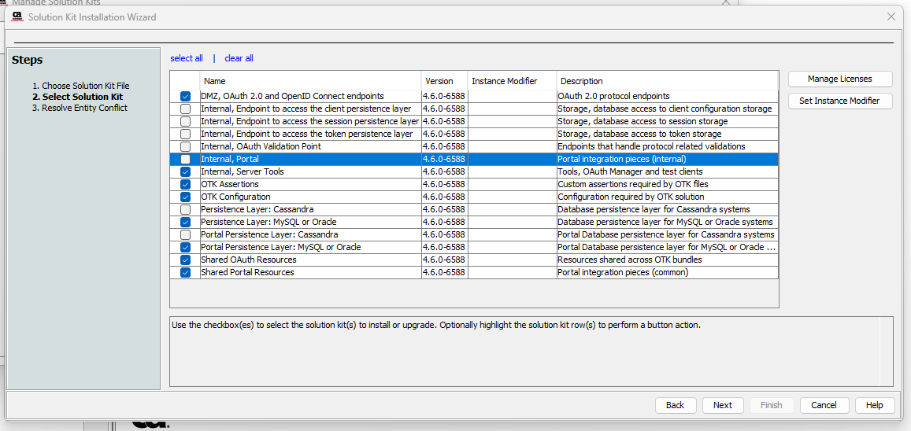
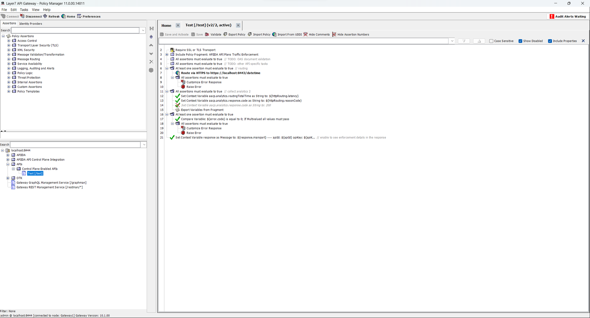

# Prepare the Gateways

<head>
  <meta name="guidename" content="API Management"/>
  <meta name="context" content="GUID-6160a336-e592-4b94-b5a9-c9a14a113f62"/>
</head>

In order to use the API Control Plane together with Broadcom Layer7 and Boomi’s administration portal API Gateway Manager, you need to install the OAuth ToolKit (OTK) from Broadcom as well as the Boomi API Control Plane Solution Kit for Layer7. Both installations are described on this page. 

## Install the Broadcom OAuth ToolKit

:::note

The API Control Plane Solution Kit requires at a version of OTK >= 4.5

:::


For information on how to obtain the installation files of OTK and for detailed installation and upgrade information, please refer to the official documentation of Broadcom: 

[Download OTK Installation Files](https://techdocs.broadcom.com/us/en/ca-enterprise-software/layer7-api-management/api-management-oauth-toolkit/4-4/download-otk-installation-files.html)

[Install the OAuth Solution Kit](https://techdocs.broadcom.com/us/en/ca-enterprise-software/layer7-api-management/api-management-oauth-toolkit/4-4/installation-workflow/install-the-oauth-solution-kit.html) 

## Recommended Selection



## Creating the DB schema for OTK

If you created a new database for OTK, you also have to create its database schema.

- **otk_db_schema.sql**

```xml

Broadcom Inc.
-- Database schema for OTK
--
-- This table holds valid client application values as defined when the application was registered
--
CREATE TABLE oauth_client (
  client_ident varchar(255) primary key,
  name varchar(255) not null COMMENT 'The associated name of the application using this client_id',
  type varchar(128) not null DEFAULT 'oob' COMMENT 'used with oauth 2.0',
  description varchar(256) null,
  organization varchar(128) not null,
  registered_by varchar(128) not null,
  created bigint DEFAULT 0 not null,
  custom longtext null COMMENT 'longtext object containing custom fields',
  software_statement longtext null COMMENT 'software statement assertion'
) ENGINE=InnoDB DEFAULT CHARACTER SET utf8;
--
-- This table holds valid client keys
--
CREATE TABLE oauth_client_key (
  client_key varchar(255) primary key COMMENT 'oauth_consumer_key or client_id',
  secret mediumtext not null COMMENT 'oauth_consumer_key_secret or client_secret or jwks or jwks_uri',
  scope varchar(4000) not null DEFAULT 'oob' COMMENT 'for oauth2, to be defined by the customer and handled accordingly within the policy',
  callback varchar(2048) not null DEFAULT 'oob' COMMENT 'in oauth2 = redirect_uri, contains one URI',
  environment varchar(128) not null DEFAULT 'ALL' COMMENT 'COULD BE SOMETHING LIKE Test, Prod, Integration',
  expiration bigint not null DEFAULT 0 COMMENT 'Date until this key is valid',
  status varchar(128) not null COMMENT 'for validation purposes, ENABLED or DISABLED',
  created bigint DEFAULT 0 not null,
  created_by varchar(128) not null,
  client_ident varchar(255) not null COMMENT 'The client that owns this key',
  client_name varchar(255) not null COMMENT 'The name of the client that owns this key. Not normalized for performance.',
  custom longtext null COMMENT 'longtext object containing custom fields',
  serviceIds varchar(256) null COMMENT 'A list of service IDs that the key is authorized for',
  accountPlanMappingIds varchar(256) null COMMENT 'Account plan associated with the client',
  masterkey_flag tinyint DEFAULT 0 not null COMMENT 'masterkey flag',
  hashing_metadata longtext null COMMENT 'hashing metadata containing algorithm and salt',
  resources varchar(4000) null COMMENT 'permitted resources for which a client can ask an access-token',
  constraint ock_fk_clientIdent foreign key (client_ident) references oauth_client (client_ident) ON DELETE CASCADE
) ENGINE=InnoDB DEFAULT CHARACTER SET utf8;
-- Add IDX to oauth_client_key
CREATE INDEX ock_idx_clientident ON oauth_client_key(client_ident);
CREATE INDEX ock_idx_expiration ON oauth_client_key (expiration);
--
-- This table holds access_tokens and refresh_tokens
-- oauth 2.0 = access_token, refresh_token
--
CREATE TABLE oauth_token (
  otk_token_id varchar(128),
  token varchar(128),
  secret varchar(128) null COMMENT 'null for oauth 2.0, it does not provide a secret',
  expiration bigint not null,
  scope varchar(4000) null COMMENT 'for 0auth 2.0, the scope granted by the resource owner',
  resource_owner varchar(128) not null COMMENT 'the authenticated user that granted the token',
  created bigint DEFAULT 0 COMMENT 'the date this token (or these tokens in oauth 2.0) were created',
  rtoken varchar(128) null,
  rexpiration bigint DEFAULT 0 COMMENT 'DEFAULT 0 because otherwise timestamp will be set to now() on an update',
  status varchar(128) not null COMMENT 'for validation purposes, ENABLED or DISABLED',
  client_key varchar(255) not null COMMENT 'the client_key this token was issued for',
  client_name varchar(255) not null COMMENT 'The name of the client that owns this key. Not normalized for performance.',
  client_ident varchar(255) not null COMMENT 'Client',
  custom longtext null COMMENT 'longtext object containing custom fields',
  resources varchar(4000) null COMMENT 'for oauth 2.0, the resources granted in the token',
  PRIMARY KEY (otk_token_id, expiration),
  CONSTRAINT  uk_token_expiration UNIQUE KEY (token, expiration),
  CONSTRAINT uk_rtoken_expiration UNIQUE KEY (rtoken, expiration)
) ENGINE=InnoDB DEFAULT CHARACTER SET utf8
  PARTITION BY HASH (expiration div (15 * 60)) -- partitioning the tokens by expiration time; each partition hosts the tokens that are going to be expired within the 15minutes window-time.
  PARTITIONS 5; -- Ensure the no. of partitions are at least one greater than the overall token lifetime (60minutes) divided by the partition window-time.
-- Adding indexes to oauth_token. This will improve the overall performance
CREATE INDEX oat_idx_expiration ON oauth_token (expiration);
CREATE INDEX oat_idx_rowner_client ON oauth_token(resource_owner,client_key);
CREATE INDEX oat_idx_client ON oauth_token(client_key);
CREATE INDEX oat_idx_rowner_client_ident ON oauth_token(resource_owner, client_ident,created);
CREATE INDEX oat_idx_rexpiration ON oauth_token (rexpiration);
--
-- This table holds temporary tokens
-- oauth 2.0 = authorization_code
--
CREATE TABLE oauth_initiate (
  token varchar(128) primary key COMMENT 'for oauth 2.0',
  secret varchar(128) null COMMENT 'null for oauth 2.0, it does not provide a secret',
  expiration bigint not null DEFAULT 0 COMMENT 'for oauth 2.0, DEFAULT 0 because otherwise timestamp will be set to now() on an update',
  scope varchar(4000) null COMMENT 'for oauth 2.0, the scope granted by the resource owner',
  resource_owner varchar(128) null COMMENT 'the authenticated user that granted the token',
  created bigint DEFAULT 0 COMMENT 'the date this token (or these tokens in oauth 2.0) were created',
  verifier varchar(128) null COMMENT 'code verifier',
  callback varchar(256) null COMMENT 'for oauth 2.0',
  client_key varchar(255) not null COMMENT 'the client that received this token',
  client_name varchar(255) not null COMMENT 'The name of the client that owns this key. Not normalized for performance.',
  custom longtext null COMMENT 'longtext object containing custom fields',
  resources varchar(4000) null COMMENT 'for oauth 2.0, the resources granted in the token'
) ENGINE=InnoDB DEFAULT CHARACTER SET utf8;
-- Adding indexes to oauth_initiate. This will improve the overall performance
CREATE INDEX oin_idx_expiration ON oauth_initiate (expiration);
--
-- This table holds temporary tokens
-- oauth 2.0 = device_code, user_code
--
CREATE TABLE oauth_device_initiate (
    device_code varchar(128) primary key,
    user_code varchar(128) unique,
    expiration bigint not null DEFAULT 0,
    created bigint DEFAULT 0,
    scope varchar(4000) null,
    resource_owner varchar(128) null,
    resources varchar(4000) null,
    client_key varchar(255) not null,
    client_name varchar(255) not null,
    status varchar(128) null COMMENT 'grant status, APPROVED or DENIED',
    last_polled_time bigint not null DEFAULT  0,
    custom longtext null COMMENT 'longtext JSON object as containing custom fields'
) ENGINE=InnoDB DEFAULT CHARACTER SET utf8;
-- Adding indexes to oauth_device_initiate. This will improve the overall performance
CREATE INDEX odin_idx_expiration ON oauth_device_initiate (expiration);
--
-- This table holds session info
--
CREATE TABLE oauth_session (
  session_key varchar(128) not null,
  session_group varchar(128) not null,
  expiration bigint not null,
  value mediumtext not null,
  primary key (session_key, session_group)
) ENGINE=InnoDB DEFAULT CHARACTER SET utf8;
-- Adding indexes to oauth_session. This will improve the overall performance
CREATE INDEX ose_idx_expiration ON oauth_session (expiration);
--
CREATE TABLE otk_version (
  current_version char(10) NOT NULL
) ENGINE=InnoDB DEFAULT CHARACTER SET utf8;
INSERT INTO otk_version (current_version) VALUES ('otk4.6.0');
--
-- This table will contain all id_token
--
CREATE TABLE oauth_id_token (
  resource_owner varchar(128) not null,
  azp varchar(255) not null,
  sub varchar(255) null,
  jwt_id varchar(512) null,
  jwt mediumtext not null,
  salt varchar(384) null,
  shared_secret mediumtext null,
  shared_secret_type varchar(128) null,
  iss varchar(255) not null,
  expiration bigint not null COMMENT 'expiration date in seconds',
  constraint pk_mag_id_token primary key (resource_owner, azp)
) ENGINE=InnoDB DEFAULT CHARACTER SET utf8;
-- Adding indexes to oauth_id_token. This will improve the overall performance
CREATE INDEX oaidt_idx_expiration ON oauth_id_token (expiration);
CREATE INDEX oaidt_idx_azp ON oauth_id_token (azp);
CREATE INDEX oaidt_idx_jwtid ON oauth_id_token (jwt_id);
--
-- CA API Portal API Keys
--
CREATE TABLE portal_apikey (
  apikey_pk varchar(255) primary key COMMENT 'id from JSON Sync message',
  apikey varchar(255) unique not null COMMENT 'key from JSON Sync message',
  apikey_secret varchar(255) not null COMMENT 'secret from JSON Sync message',
  status varchar(100) not null COMMENT 'status from JSON sync message',
  organization_id varchar(128) not null COMMENT 'organizationId from JSON sync message. Previously this was accountPlanMappingId',
  organization varchar(255) not null COMMENT 'organizationName from JSON sync message',
  label varchar(255) not null COMMENT 'label from JSON sync message',
  created_by varchar(128) not null COMMENT 'createdBy from JSON sync message',
  modified_by varchar(128) not null COMMENT 'modifiedBy from JSON sync message',
  created bigint DEFAULT 0 not null COMMENT 'the date this apikey was created, which is now in the case of it being a new one',
  updated bigint DEFAULT 0 not null COMMENT 'the date this apikey was updated, which is now',
  apis longtext null COMMENT 'apis from JSON sync message',
  value_xml longtext not null COMMENT 'Contains more or less all values again',
  hashing_metadata longtext null COMMENT 'hashing metadata containing algorithm and salt'
) ENGINE=InnoDB DEFAULT CHARACTER SET utf8;
--
CREATE INDEX papikey_updated ON portal_apikey (updated);
--
-- This table contains all the revoked access tokens
--
CREATE TABLE oauth_token_revocation_list (
  token varchar(128) primary key,
  expiration bigint not null
) ENGINE=InnoDB DEFAULT CHARACTER SET utf8;
COMMIT;

```

- **otk_db_testdata.sql**

```xml

Broadcom Inc.
-- Database test data for OTK
--
-- This script is used to create OAuth default test clients for testing purposes in non-production environments.
--
-- To install it run a command on the linux root shell similiar to this:
-- mysql -u root -p 'your-otk-database' < otk_db_testdata.sql
-- e.g.: mysql -u root -p ssg_oauth_toolkit < /home/ssgconfig/otk_db_testdata.sql
-- Delete the existing test clients to install them
--
delete from oauth_client where client_ident = '123456800-otk';
delete from oauth_client_key where client_ident = '123456800-otk';
delete from oauth_client where client_ident = '123456801-otk';
delete from oauth_client_key where client_ident = '123456801-otk';
delete from oauth_client where client_ident = 'TestClient2.0';
delete from oauth_client_key where client_ident = 'TestClient2.0';
delete from oauth_client where client_ident = '2dc86f35-773c-47e2-958f-3f4bdfc5ea3a';
delete from oauth_client_key where client_ident = '2dc86f35-773c-47e2-958f-3f4bdfc5ea3a';
--
-- OpenID Connect Client for the Basic Client Profile specification
--
insert into oauth_client (client_ident, name, description, organization, registered_by, type, custom)
values ('123456800-otk', 'OpenID Connect Basic Client Profile', 'Test for OpenID Connect BCP', 'CA Technologies Inc.', 'admin', 'confidential', '{}');
insert into oauth_client_key (client_key, secret, status, created_by, client_ident, client_name, callback, scope, custom, masterkey_flag)
values ('5eed868e-7ad0-4172-88f2-704bcf78b61e', '2054e4d7-77f2-46c9-bc4d-11a47255a6ec', 'ENABLED', 'admin', '123456800-otk', 'OpenID Connect Basic Client Profile', 'YOUR_SSG/oauth/v2/client/bcp?auth=done', 'openid email profile phone address', '{}',0);
--
-- OpenID Connect Client for the Implicit Client Profile specification
--
insert into oauth_client (client_ident, name, description, organization, registered_by, type, custom)
values ('123456801-otk', 'OpenID Connect Implicit Client Profile', 'Test for OpenID Connect ICP', 'CA Technologies Inc.', 'admin', 'public', '{}');
insert into oauth_client_key (client_key, secret, status, created_by, client_ident, client_name, callback, scope, custom, masterkey_flag)
values ('5edc4a38-75ec-4617-8854-1a71ff1e0a2e', '5005a669-0295-4602-be7d-6a75342db6d8', 'ENABLED', 'admin', '123456801-otk', 'OpenID Connect Implicit Client Profile', 'YOUR_SSG/oauth/v2/client/icp?auth=done', 'openid email profile phone address', '{}',0);
--
-- Create an OAuth 2.0 client
--
INSERT INTO oauth_client (client_ident, name, description, organization, registered_by, type, custom)
VALUES ('TestClient2.0', 'OAuth2Client', 'OAuth 2.0 test client hosted on the ssg', 'CA Technologies Inc.', 'admin', 'confidential', '{}');
INSERT INTO oauth_client_key (client_key, secret, status, created_by, client_ident, client_name, callback, custom, masterkey_flag)
VALUES ('54f0c455-4d80-421f-82ca-9194df24859d', 'a0f2742f-31c7-436f-9802-b7015b8fd8e6', 'ENABLED', 'admin', 'TestClient2.0', 'OAuth2Client', 'YOUR_SSG/oauth/v2/client/authcode?auth=done,YOUR_SSG/oauth/v2/client/implicit?auth=done', '{}',0);
--
-- Swagger OAuth2 Client
--
INSERT INTO oauth_client (client_ident, name, description, organization, registered_by, type, custom)
VALUES ('2dc86f35-773c-47e2-958f-3f4bdfc5ea3a', 'Swagger OAuth2 Client', 'Swagger API testing', 'CA Technologies Inc.', 'admin', 'public', '{}');
INSERT INTO oauth_client_key (client_key, secret, status, created_by, client_ident, client_name, callback, scope, custom, masterkey_flag)
VALUES ('2dc86f35-773c-47e2-958f-3f4bdfc5ea3a', '6aa6b190-056d-4a80-8604-79d9e44896ef', 'ENABLED', 'admin', '2dc86f35-773c-47e2-958f-3f4bdfc5ea3a', 'Swagger OAuth2 Client', 'YOUR_SWAGGER_SERVER/oauth2-redirect.html', 'openid email profile phone address', '{
    "openid_registration": {
        "request": {},
        "response": {
            "client_id": "2dc86f35-773c-47e2-958f-3f4bdfc5ea3a",
            "client_secret": "6aa6b190-056d-4a80-8604-79d9e44896ef",
            "client_secret_expires_at": "0",
            "client_id_issued_at": 0,
            "registration_access_token": "",
            "registration_client_uri": "",
            "token_endpoint_auth_method": "client_secret_basic",
            "token_endpoint_auth_signing_alg": "",
            "application_type": "",
            "redirect_uris": [
                "YOUR_SWAGGER_SERVER/oauth2-redirect.html"
            ],
            "client_name": "Swagger OAuth2 Client",
            "subject_type": "pairwise",
            "sector_identifier_uri": "",
            "contacts": [],
            "response_types": [
                "code",
                "implicit",
                "token"
            ],
            "grant_types": [],
            "id_token_signed_response_alg": "HS256",
            "userinfo_signed_response_alg": "",
            "environment": "ALL",
            "organization": "CA Technologies Inc.",
            "master": false,
            "description": "Swagger API testing",
            "scope": "openid email profile phone address",
            "jwks": "",
            "jwks_uri": ""
        }
    }
}',0);

```

Copy the sql files to the running gateway database, open the database container console and run the following:

```
mysql -u (dbuser) -p # (then enter db password)
use (dbname);
source /otk_db_schema.sql
source /otk_db_testdata.sql

```

Make sure to replace the needed information with the ones for your installation. 

## Install the API Control Plane Solution Kit

1. Contact Boomi Support to access the Solution Kit.


2. After installation, **In policy manager**: Tasks > Extensions and AddOns > Manage Solution Kits > Install 

The folder `Boomi API Control Plane Integration` should appear in your gateway.

## Adjust your APIs

In order for API keys, plan limits, and more to affect your API, you must perform the following changes to your services. An example service is attached below. 



Sample example of **Control Plane**:

```xml
<?xml version="1.0" encoding="UTF-8"?>
<exp:Export Version="3.0"
    xmlns:L7p="http://www.layer7tech.com/ws/policy"
    xmlns:exp="http://www.layer7tech.com/ws/policy/export" xmlns:wsp="http://schemas.xmlsoap.org/ws/2002/12/policy">
    <exp:References>
        <IncludedPolicyReference
            RefType="com.l7tech.console.policy.exporter.IncludedPolicyReference"
            guid="ac9c6c70-be4f-4a0a-b9e9-7378a86276af" included="true"
            name="APIIDA API Plans Traffic Enforcement" soap="false" type="INCLUDE_FRAGMENT">
            <wsp:Policy xmlns:L7p="http://www.layer7tech.com/ws/policy" xmlns:wsp="http://schemas.xmlsoap.org/ws/2002/12/policy">
                <wsp:All wsp:Usage="Required">
                    <L7p:CommentAssertion>
                        <L7p:Comment stringValue="***************************"/>
                    </L7p:CommentAssertion>
                    <L7p:CommentAssertion>
                        <L7p:Comment stringValue="** APIIDA: Control Plane Integration"/>
                    </L7p:CommentAssertion>
                    <L7p:CommentAssertion>
                        <L7p:Comment stringValue="***************************"/>
                    </L7p:CommentAssertion>
                    <L7p:CommentAssertion>
                        <L7p:Comment stringValue="* IN: request.http.parameter.apikey"/>
                    </L7p:CommentAssertion>
                    <L7p:CommentAssertion>
                        <L7p:Comment stringValue="* OUT: error.code, error.message"/>
                    </L7p:CommentAssertion>
                    <L7p:CommentAssertion>
                        <L7p:Comment stringValue="**"/>
                    </L7p:CommentAssertion>
                    <L7p:SetVariable>
                        <L7p:Base64Expression stringValue="JHtyZXF1ZXN0Lmh0dHAuaGVhZGVyLmFwaWtleX0="/>
                        <L7p:VariableToSet stringValue="apikey"/>
                    </L7p:SetVariable>
                    <L7p:SetVariable>
                        <L7p:Base64Expression stringValue="JHtzZXJ2aWNlLm9pZH0="/>
                        <L7p:VariableToSet stringValue="apiId"/>
                    </L7p:SetVariable>
                    <L7p:CommentAssertion>
                        <L7p:Comment stringValue="*"/>
                    </L7p:CommentAssertion>
                    <wsp:All wsp:Usage="Required">
                        <L7p:CommentAssertion>
                            <L7p:AssertionComment assertionComment="included">
                                <L7p:Properties mapValue="included">
                                    <L7p:entry>
                                    <L7p:key stringValue="RIGHT.COMMENT"/>
                                    <L7p:value stringValue=" // Capture incoming request parameters"/>
                                    </L7p:entry>
                                </L7p:Properties>
                            </L7p:AssertionComment>
                            <L7p:Comment stringValue="**"/>
                        </L7p:CommentAssertion>
                        <L7p:SetVariable>
                            <L7p:Base64Expression stringValue="JHtyZXF1ZXN0LnRpbWUubWlsbGlzfQ=="/>
                            <L7p:VariableToSet stringValue="aacp.analytics.request.time.millis"/>
                        </L7p:SetVariable>
                        <L7p:SetVariable>
                            <L7p:Base64Expression stringValue="JHthcGlrZXl9"/>
                            <L7p:VariableToSet stringValue="aacp.analytics.apikey"/>
                        </L7p:SetVariable>
                        <L7p:SetVariable>
                            <L7p:Base64Expression stringValue="JHtzZXJ2aWNlLm9pZH0="/>
                            <L7p:VariableToSet stringValue="aacp.analytics.service.oid"/>
                        </L7p:SetVariable>
                        <L7p:SetVariable>
                            <L7p:Base64Expression stringValue="JHtzZXJ2aWNlLm5hbWV9"/>
                            <L7p:VariableToSet stringValue="aacp.analytics.service.name"/>
                        </L7p:SetVariable>
                        <L7p:SetVariable>
                            <L7p:Base64Expression stringValue="JHtyZXF1ZXN0LnRjcC5yZW1vdGVJcH0="/>
                            <L7p:VariableToSet stringValue="aacp.analytics.request.tcp.remoteIp"/>
                        </L7p:SetVariable>
                        <L7p:SetVariable>
                            <L7p:Base64Expression stringValue="JHtyZXF1ZXN0Lmh0dHAubWV0aG9kfQ=="/>
                            <L7p:VariableToSet stringValue="aacp.analytics.request.http.method"/>
                        </L7p:SetVariable>
                        <L7p:SetVariable>
                            <L7p:Base64Expression stringValue="JHtyZXF1ZXN0LnNpemV9"/>
                            <L7p:VariableToSet stringValue="aacp.analytics.request.size"/>
                        </L7p:SetVariable>
                        <L7p:SetVariable>
                            <L7p:AssertionComment assertionComment="included">
                                <L7p:Properties mapValue="included">
                                    <L7p:entry>
                                    <L7p:key stringValue="RIGHT.COMMENT"/>
                                    <L7p:value stringValue=" // Authentication must be performed before enforcement"/>
                                    </L7p:entry>
                                </L7p:Properties>
                            </L7p:AssertionComment>
                            <L7p:Base64Expression stringValue="JHtyZXF1ZXN0LmF1dGhlbnRpY2F0ZWRVc2VyLmlkfQ=="/>
                            <L7p:VariableToSet stringValue="aacp.analytics.request.authenticatedUser.id"/>
                        </L7p:SetVariable>
                        <L7p:SetVariable>
                            <L7p:AssertionComment assertionComment="included">
                                <L7p:Properties mapValue="included">
                                    <L7p:entry>
                                    <L7p:key stringValue="RIGHT.COMMENT"/>
                                    <L7p:value stringValue=" // Authentication must be performed before enforcement"/>
                                    </L7p:entry>
                                </L7p:Properties>
                            </L7p:AssertionComment>
                            <L7p:Base64Expression stringValue="JHtyZXF1ZXN0LmF1dGhlbnRpY2F0ZWRVc2VyLmxvZ2lufQ=="/>
                            <L7p:VariableToSet stringValue="aacp.analytics.request.authenticatedUser.login"/>
                        </L7p:SetVariable>
                        <L7p:SetVariable>
                            <L7p:AssertionComment assertionComment="included">
                                <L7p:Properties mapValue="included">
                                    <L7p:entry>
                                    <L7p:key stringValue="RIGHT.COMMENT"/>
                                    <L7p:value stringValue=" // Authentication must be performed before enforcement"/>
                                    </L7p:entry>
                                </L7p:Properties>
                            </L7p:AssertionComment>
                            <L7p:Base64Expression stringValue="JHtyZXF1ZXN0LmF1dGhvcml6ZWR9"/>
                            <L7p:VariableToSet stringValue="aacp.analytics.request.authorized"/>
                        </L7p:SetVariable>
                        <L7p:assertionComment>
                            <L7p:Properties mapValue="included">
                                <L7p:entry>
                                    <L7p:key stringValue="RIGHT.COMMENT"/>
                                    <L7p:value stringValue=" // analytics"/>
                                </L7p:entry>
                            </L7p:Properties>
                        </L7p:assertionComment>
                    </wsp:All>
                    <L7p:CommentAssertion>
                        <L7p:Comment stringValue="*"/>
                    </L7p:CommentAssertion>
                    <wsp:OneOrMore wsp:Usage="Required">
                        <wsp:All wsp:Usage="Required">
                            <L7p:Encapsulated>
                                <L7p:EncapsulatedAssertionConfigGuid stringValue="d7941e61-00ac-4a93-9e95-be61d9b295ac"/>
                                <L7p:EncapsulatedAssertionConfigName stringValue="APIIDA API Key Lookup"/>
                                <L7p:Parameters mapValue="included">
                                    <L7p:entry>
                                    <L7p:key stringValue="apikey"/>
                                    <L7p:value stringValue="${apikey}"/>
                                    </L7p:entry>
                                </L7p:Parameters>
                            </L7p:Encapsulated>
                            <wsp:OneOrMore wsp:Usage="Required">
                                <L7p:EvaluateJsonPathExpressionV2>
                                    <L7p:Expression stringValue="$.subscribed_plans"/>
                                    <L7p:OtherTargetMessageVariable stringValue="apikeyJson"/>
                                    <L7p:Target target="OTHER"/>
                                    <L7p:VariablePrefix stringValue="_subscribed_plans"/>
                                </L7p:EvaluateJsonPathExpressionV2>
                                <L7p:SetVariable>
                                    <L7p:Base64Expression stringValue=""/>
                                    <L7p:VariableToSet stringValue="_subscribed_plans.results"/>
                                </L7p:SetVariable>
                            </wsp:OneOrMore>
                            <L7p:Encapsulated>
                                <L7p:EncapsulatedAssertionConfigGuid stringValue="b74b030c-f283-478a-95bb-a760a6bc4dce"/>
                                <L7p:EncapsulatedAssertionConfigName stringValue="APIIDA API Plan Lookup"/>
                                <L7p:Parameters mapValue="included">
                                    <L7p:entry>
                                    <L7p:key stringValue="apiId"/>
                                    <L7p:value stringValue="${apiId}"/>
                                    </L7p:entry>
                                    <L7p:entry>
                                    <L7p:key stringValue="subscribed_plans"/>
                                    <L7p:value stringValue="${_subscribed_plans.results}"/>
                                    </L7p:entry>
                                </L7p:Parameters>
                            </L7p:Encapsulated>
                            <L7p:EvaluateJsonPathExpressionV2>
                                <L7p:Expression stringValue="$.id"/>
                                <L7p:OtherTargetMessageVariable stringValue="apiPlanJson"/>
                                <L7p:Target target="OTHER"/>
                                <L7p:VariablePrefix stringValue="_plan_id"/>
                            </L7p:EvaluateJsonPathExpressionV2>
                            <L7p:CommentAssertion>
                                <L7p:Comment stringValue="*"/>
                            </L7p:CommentAssertion>
                            <L7p:SetVariable>
                                <L7p:Base64Expression stringValue="JHthcGlrZXl9LSR7X3BsYW5faWQucmVzdWx0fQ=="/>
                                <L7p:VariableToSet stringValue="counterName"/>
                            </L7p:SetVariable>
                            <L7p:Encapsulated>
                                <L7p:EncapsulatedAssertionConfigGuid stringValue="fbe97e28-fb68-45c8-91b1-e0e57450f047"/>
                                <L7p:EncapsulatedAssertionConfigName stringValue="APIIDA Apply API Plan Limits"/>
                                <L7p:Parameters mapValue="included">
                                    <L7p:entry>
                                    <L7p:key stringValue="apiPlanJson"/>
                                    <L7p:value stringValue="apiPlanJson"/>
                                    </L7p:entry>
                                    <L7p:entry>
                                    <L7p:key stringValue="counterName"/>
                                    <L7p:value stringValue="${counterName}"/>
                                    </L7p:entry>
                                </L7p:Parameters>
                            </L7p:Encapsulated>
                        </wsp:All>
                        <L7p:TrueAssertion/>
                        <L7p:assertionComment>
                            <L7p:Properties mapValue="included">
                                <L7p:entry>
                                    <L7p:key stringValue="RIGHT.COMMENT"/>
                                    <L7p:value stringValue=" // enforce"/>
                                </L7p:entry>
                            </L7p:Properties>
                        </L7p:assertionComment>
                    </wsp:OneOrMore>
                    <L7p:ExportVariables>
                        <L7p:ExportedVars stringArrayValue="included">
                            <L7p:item stringValue="aacp.analytics.apikey"/>
                            <L7p:item stringValue="aacp.analytics.request.authenticatedUser.id"/>
                            <L7p:item stringValue="aacp.analytics.request.authenticatedUser.login"/>
                            <L7p:item stringValue="aacp.analytics.request.authorized"/>
                            <L7p:item stringValue="aacp.analytics.request.http.method"/>
                            <L7p:item stringValue="aacp.analytics.request.size"/>
                            <L7p:item stringValue="aacp.analytics.request.tcp.remoteIp"/>
                            <L7p:item stringValue="aacp.analytics.request.time.millis"/>
                            <L7p:item stringValue="aacp.analytics.service.name"/>
                            <L7p:item stringValue="aacp.analytics.service.oid"/>
                            <L7p:item stringValue="error.code"/>
                            <L7p:item stringValue="error.message"/>
                        </L7p:ExportedVars>
                    </L7p:ExportVariables>
                </wsp:All>
            </wsp:Policy>
        </IncludedPolicyReference>
        <EncapsulatedAssertionReference RefType="com.l7tech.console.policy.exporter.EncapsulatedAssertionReference">
            <Name>APIIDA API Key Lookup</Name>
            <Guid>d7941e61-00ac-4a93-9e95-be61d9b295ac</Guid>
        </EncapsulatedAssertionReference>
        <EncapsulatedAssertionReference RefType="com.l7tech.console.policy.exporter.EncapsulatedAssertionReference">
            <Name>APIIDA API Plan Lookup</Name>
            <Guid>b74b030c-f283-478a-95bb-a760a6bc4dce</Guid>
        </EncapsulatedAssertionReference>
        <EncapsulatedAssertionReference RefType="com.l7tech.console.policy.exporter.EncapsulatedAssertionReference">
            <Name>APIIDA Apply API Plan Limits</Name>
            <Guid>fbe97e28-fb68-45c8-91b1-e0e57450f047</Guid>
        </EncapsulatedAssertionReference>
    </exp:References>
    <wsp:Policy xmlns:L7p="http://www.layer7tech.com/ws/policy" xmlns:wsp="http://schemas.xmlsoap.org/ws/2002/12/policy">
        <wsp:All wsp:Usage="Required">
            <L7p:SslAssertion/>
            <L7p:Include>
                <L7p:PolicyGuid stringValue="ac9c6c70-be4f-4a0a-b9e9-7378a86276af"/>
            </L7p:Include>
            <wsp:All wsp:Usage="Required">
                <L7p:assertionComment>
                    <L7p:Properties mapValue="included">
                        <L7p:entry>
                            <L7p:key stringValue="RIGHT.COMMENT"/>
                            <L7p:value stringValue=" // TODO: OAS document validation"/>
                        </L7p:entry>
                    </L7p:Properties>
                </L7p:assertionComment>
            </wsp:All>
            <wsp:All wsp:Usage="Required">
                <L7p:assertionComment>
                    <L7p:Properties mapValue="included">
                        <L7p:entry>
                            <L7p:key stringValue="RIGHT.COMMENT"/>
                            <L7p:value stringValue=" // TODO: other API specific tasks"/>
                        </L7p:entry>
                    </L7p:Properties>
                </L7p:assertionComment>
            </wsp:All>
            <wsp:OneOrMore wsp:Usage="Required">
                <L7p:HttpRoutingAssertion>
                    <L7p:ConnectionTimeout stringValue="5000"/>
                    <L7p:HttpMethod httpMethod="GET"/>
                    <L7p:ProtectedServiceUrl stringValue="https://localhost:8443/datetime"/>
                    <L7p:ProxyPassword stringValueNull="null"/>
                    <L7p:ProxyUsername stringValueNull="null"/>
                    <L7p:RequestHeaderRules httpPassthroughRuleSet="included">
                        <L7p:Rules httpPassthroughRules="included"/>
                    </L7p:RequestHeaderRules>
                    <L7p:RequestParamRules httpPassthroughRuleSet="included">
                        <L7p:ForwardAll booleanValue="true"/>
                        <L7p:Rules httpPassthroughRules="included"/>
                    </L7p:RequestParamRules>
                    <L7p:ResponseHeaderRules httpPassthroughRuleSet="included">
                        <L7p:Rules httpPassthroughRules="included"/>
                    </L7p:ResponseHeaderRules>
                    <L7p:SamlAssertionVersion intValue="2"/>
                    <L7p:Timeout stringValue="5000"/>
                </L7p:HttpRoutingAssertion>
                <wsp:All wsp:Usage="Required">
                    <L7p:CustomizeErrorResponse>
                        <L7p:Content stringValueReference="inline"><![CDATA[{
    "code": "500",
    "message": "Backend routing failure"
}]]></L7p:Content>
                        <L7p:ContentType stringValue="application/json; charset=UTF-8"/>
                        <L7p:ExtraHeaders nameValuePairArray="included"/>
                    </L7p:CustomizeErrorResponse>
                    <L7p:RaiseError/>
                </wsp:All>
                <L7p:assertionComment>
                    <L7p:Properties mapValue="included">
                        <L7p:entry>
                            <L7p:key stringValue="RIGHT.COMMENT"/>
                            <L7p:value stringValue=" // routing"/>
                        </L7p:entry>
                    </L7p:Properties>
                </L7p:assertionComment>
            </wsp:OneOrMore>
            <wsp:All wsp:Usage="Required">
                <L7p:SetVariable>
                    <L7p:Base64Expression stringValue="JHtodHRwUm91dGluZy5sYXRlbmN5fQ=="/>
                    <L7p:VariableToSet stringValue="aacp.analytics.routingTotalTime"/>
                </L7p:SetVariable>
                <L7p:SetVariable>
                    <L7p:Base64Expression stringValue="JHtodHRwUm91dGluZy5yZWFzb25Db2RlfQ=="/>
                    <L7p:VariableToSet stringValue="aacp.analytics.response.code"/>
                </L7p:SetVariable>
                <L7p:SetVariable>
                    <L7p:Base64Expression stringValue="MjAw"/>
                    <L7p:Enabled booleanValue="false"/>
                    <L7p:VariableToSet stringValue="aacp.analytics.response.code"/>
                </L7p:SetVariable>
                <L7p:ExportVariables>
                    <L7p:ExportedVars stringArrayValue="included">
                        <L7p:item stringValue="aacp.analytics.response.code"/>
                        <L7p:item stringValue="aacp.analytics.routingTotalTime"/>
                    </L7p:ExportedVars>
                </L7p:ExportVariables>
                <L7p:assertionComment>
                    <L7p:Properties mapValue="included">
                        <L7p:entry>
                            <L7p:key stringValue="RIGHT.COMMENT"/>
                            <L7p:value stringValue=" // collect analytics 2"/>
                        </L7p:entry>
                    </L7p:Properties>
                </L7p:assertionComment>
            </wsp:All>
            <wsp:OneOrMore wsp:Usage="Required">
                <L7p:ComparisonAssertion>
                    <L7p:CaseSensitive booleanValue="false"/>
                    <L7p:Expression1 stringValue="${error.code}"/>
                    <L7p:Expression2 stringValue="0"/>
                    <L7p:Predicates predicates="included">
                        <L7p:item binary="included">
                            <L7p:CaseSensitive booleanValue="false"/>
                            <L7p:RightValue stringValue="0"/>
                        </L7p:item>
                    </L7p:Predicates>
                </L7p:ComparisonAssertion>
                <wsp:All wsp:Usage="Required">
                    <L7p:CustomizeErrorResponse>
                        <L7p:Content stringValueReference="inline"><![CDATA[{
    "code": "429",
    "message": "code: ${error.code}, message: ${error.message}"
}]]></L7p:Content>
                        <L7p:ContentType stringValue="application/json; charset=UTF-8"/>
                        <L7p:ExtraHeaders nameValuePairArray="included"/>
                        <L7p:HttpStatus stringValue="429"/>
                    </L7p:CustomizeErrorResponse>
                    <L7p:RaiseError/>
                </wsp:All>
            </wsp:OneOrMore>
            <L7p:SetVariable>
                <L7p:AssertionComment assertionComment="included">
                    <L7p:Properties mapValue="included">
                        <L7p:entry>
                            <L7p:key stringValue="RIGHT.COMMENT"/>
                            <L7p:value stringValue=" // enable to see enforcement details in the response"/>
                        </L7p:entry>
                    </L7p:Properties>
                </L7p:AssertionComment>
                <L7p:Base64Expression stringValue="JHtyZXNwb25zZS5tYWlucGFydH0NCi0tLS0NCmFwaUlkOiAke2FwaUlkfQ0KYXBpS2V5OiAke2FwaUtleX0NCg0KYXBpQXV0aHo6ICR7YXBpQXV0aHp9DQphcGlBdXRoekRldGFpbHM6ICR7YXBpQXV0aHpEZXRhaWxzfQ0KDQplcnJvci5jb2RlOiAke2Vycm9yLmNvZGV9DQplcnJvci5tZXNzYWdlOiAke2Vycm9yLm1lc3NhZ2V9DQoNCmxvb2t1cC5xdW90YTogJHtsb29rdXAucXVvdGF9DQpsb29rdXAudGltZXVuaXQ6ICR7bG9va3VwLnRpbWV1bml0fQ0KbG9va3VwLm1heHJlcXVlc3RyYXRlOiAke2xvb2t1cC5tYXhyZXF1ZXN0cmF0ZX0NCmxvb2t1cC53aW5kb3dzaXplaW5zZWNvbmRzOiAke2xvb2t1cC53aW5kb3dzaXplaW5zZWNvbmRzfQ0KbG9va3VwLm5hbWU6ICR7bG9va3VwLm5hbWV9DQotLS0tDQphYWNwLmFuYWx5dGljcy5yb3V0aW5nVG90YWxUaW1lOiAke2FhY3AuYW5hbHl0aWNzLnJvdXRpbmdUb3RhbFRpbWV9DQphYWNwLmFuYWx5dGljcy5yZXNwb25zZS5jb2RlOiAke2FhY3AuYW5hbHl0aWNzLnJlc3BvbnNlLmNvZGV9"/>
                <L7p:ContentType stringValue="application/json; charset=utf-8"/>
                <L7p:DataType variableDataType="message"/>
                <L7p:VariableToSet stringValue="response"/>
            </L7p:SetVariable>
        </wsp:All>
    </wsp:Policy>
</exp:Export>
```

 The preparations in the gateway are done! Keep in mind that the **apikey** must be passed as a parameter.

:::note

When adding additional gateways, make sure that they have the same database state.

:::
