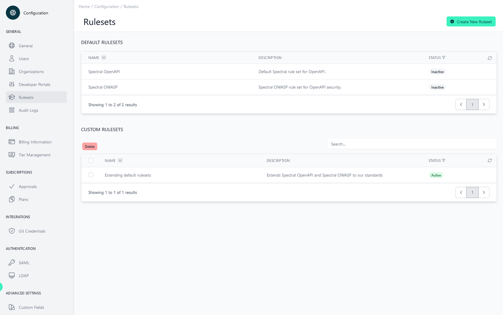

# Rulesets Explained 

<head>
  <meta name="guidename" content="API Management"/>
  <meta name="context" content="GUID-0cc4835ce-e099-47a8-9ee7-ff19ba34ce43"/>
</head> 

API specifications are validated by API Control Plane by using [Spectral](https://stoplight.io/open-source/spectral) in combination with one or more rulesets. A ruleset consists of one or more rules that verify a single aspect of the specification. For example, a rule may demand that each operation must have a success response.

Some rulesets are available in API Control Plane by default, but it is also possible to add custom rulesets. Each ruleset can be enabled/disabled individually, however at least one ruleset must be enabled at all time. If you attempt to disable all rulesets, the default ruleset ‘Spectral OpenAPI’ will be automatically enabled.

## Default rulesets

The following rulesets are always available. They can be disabled, but not deleted.

- [Spectral OpenAPI:](https://docs.stoplight.io/docs/spectral/4dec24461f3af-open-api-rules) The default ruleset that spectral provides for OpenAPI documents.

- [Spectral OWASP:](https://github.com/stoplightio/spectral-owasp-ruleset) Additional rules regarding API security.

## Writing custom rulesets

Custom rulesets can be added to API Control Plane by uploading a ruleset file written in yaml or json. Rulesets written in javascript are currently not supported. In addition to the [official ruleset specification from Spectral](https://docs.stoplight.io/docs/spectral/e5b9616d6d50c-rulesets), API Control Plane adds the following requirements to custom rulesets:

Each rule must have a field named `x-apiida-type` which must be set to either `"security"` or `"quality"`. This will determine if violations of that rule impact the APIs security score or quality score.

Each rule must have a description. This is optional in the Spectral specification, but required by API Control Plane. The description is what is shown in API Control Plane Frontend, instead of the often cryptic rule identifier.

The following is an example of a valid basic ruleset with 2 rules.

```
rules:
  path-must-match-api-standards:
    description: API Path must match company API uri standards
    message: "{{description}}; {{property}} incorrect. Example: /digital-twin/api/v1/products"
    x-apiida-type: "quality"
    severity: error
    resolved: false
    given: $.paths[?(!@property.match(/well-known/ig))~]
    then:
      function: pattern
      functionOptions:
        match: ^\/([a-z-]+)\/api\/(v[1-9])\/([a-z]+(\w+s\b.*))
  common-responses-unauthorized:
    description: Responses should contain common response - 401 (unauthorized)
    message: "{{description}}. Missing {{property}}"
    severity: error
    x-apiida-type: "security"
    given: $.paths[?(!@property.match(/well-known/ig))]..responses
    then:
      - field: '401'
        function: truthy
```

## Extending default rulesets

It is possible for custom rulesets to extend one or more existing rulesets. In this case you can add new rules, but also change the details of existing rules. See Spectral documentation for more details.

One important feature, when extending custom rulesets, is the ability to alter the severity of an existing rule or to disable it entirely. The following example demonstrates extending two existing rulesets. It adds a new rule, changes the severity of another and also disables one of the existing rules. 

```
extends:
  - "spectral:oas"
  - "@stoplight/spectral-owasp-ruleset"
rules:
    operation-tag-defined: off           # disable this rule from spectral:oas
    operation-success-response: error    # by default, this would be a warning
    must-have-path:                      # add a new rule
      description: Every API must have at least one path
      message: "{{description}}; property `paths` is empty"
      x-apiida-type: "quality"    
      severity: error
      given: $
      then:
        - field: paths
          function: length
          functionOptions:
            min: 1
```

To extend one of the default rulesets, you have to use the following identifiers (as seen in the previous example). It is not possible to extend another custom ruleset. 

- Spectral OpenAPI: `spectral:oas`

- Spectral OWASP: `@stoplight/spectral-owasp-ruleset`

If you choose to extend one of the default rulesets, be sure to disable the default ruleset in API Control Plane. Otherwise, both your extended version of the ruleset as well as the original ruleset would be applied separately!

