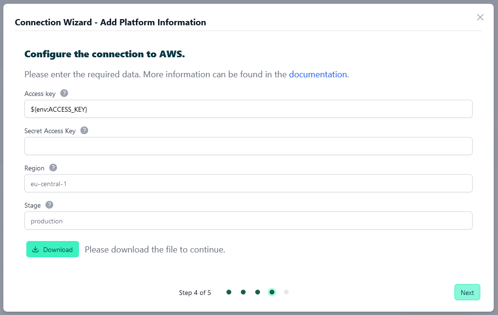
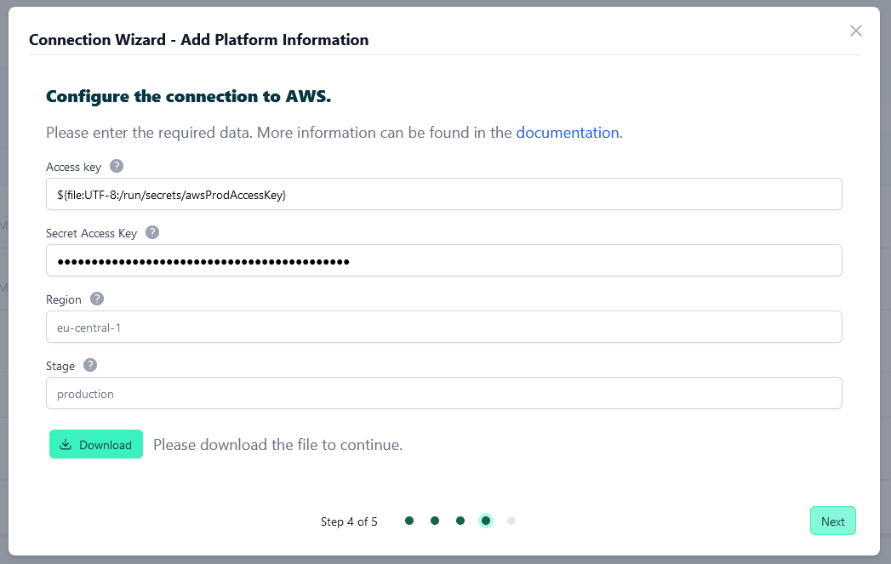

# Securely configure secrets

<head>
  <meta name="guidename" content="API Management"/>
  <meta name="context" content="GUID-603b55aa-da48-4b2d-8ad9-1233abb2b7e5"/>
</head>

## Environment variables in the agent configuration

### Adjust agent configuration - AgentConfig.yaml

If you prefer to pass your secrets with environment variables, that's no problem.
Instead of your secret, specify the name of an environment variable in the corresponding field. 

```
${env:VARIABLE_NAME}
```



When you have downloaded your configuration. It should look something like this.

```xml

type: AWS
agentToken: 12:72211049-cfbc-4ba7-9f45-7139a14e302b
accessKey: ${env:ACCESS_KEY}
secretAccessKey: ${env:SECRET_ACCESS_KEY}
region: eu-central-1
stage: test

```

### Adjust the agent - docker-compose.yml

Now you just need to tell Docker to forward the environment variables. To do this, add the following for each environment variable.

```
VARIABLE_NAME=${VARIABLE_NAME}
```

The docker-compose file should look something like this.

```
version: '3.3'
services:
  controlplane-agent-aws:
    image: apiida/controlplane-agent
    container_name: controlplane-agent-aws
    environment:
      - 'ACCESS_KEY=${ACCESS_KEY}'
      - 'SECRET_ACCESS_KEY=${SECRET_ACCESS_KEY}'
      - 'backendUrl=wss://myfirsttenant.dev.localhost:8080'
      - 'gateway-config=/workspace/awsConfig.yaml'
    volumes:
      - ./awsConfig.yaml:/workspace/awsConfig.yaml:rw

```

### Set the environment variables in your system

Now you just have to set the environment variables in your system.

## Using docker secrets in the agent configuration

In terms of Docker Swarm services, a secret is a blob of data, such as a password, SSH private key, SSL certificate, or another piece of data that should not be transmitted over a network or stored unencrypted in a Dockerfile or in your application’s source code. You can use Docker secrets to centrally manage this data and securely transmit it to only those containers that need access to it. Secrets are encrypted during transit and at rest in a Docker swarm. A given secret is only accessible to those services which have been granted explicit access to it, and only while those service tasks are running.

[Manage sensitive data with Docker secrets](https://docs.docker.com/engine/swarm/secrets/)

### Adjust agent configuration - AgentConfig.yaml

Docker secrets are mounted into the container as files. In the agent's configuration we just need to enter where it can find it.

```
${file:UTF-8:/run/secrets/<secret-name>}
```


When you have downloaded your configuration. It should look something like this.

```
type: AWS
agentToken: 12:96c0c848-67b7-40e9-9d9a-64089ed309fb
accessKey: ${file:UTF-8:/run/secrets/awsProdAccessKey}
secretAccessKey: ${file:UTF-8:/run/secrets/awsProdSecretAccessKey}
region: eu-central-1
stage: test
```

### Create docker secrets

The first thing you need to do is enable Swarm mode if you are not already using it.

[Swarm mode overview](https://docs.docker.com/engine/swarm/)

```
docker swarm init
```

After that, you can create your secrets.

```
echo "myAccessKey" | docker secret create awsProdAccessKey -
```

```
echo "mySecretAccessKey" | docker secret create awsProdSecretAccessKey -
```

### Adjust the agent  - docker-compose.yml
After that, we need to make a few changes in docker-compose. First, we need to remove the container_name. This is not supported in Swarm mode.

After that, we need to tell docker which Secrets to use for this service (lines 11-13) and where they are located (lines 15-19).

```
version: '3.3'
services:
  controlplane-agent-aws:
    image: apiida/controlplane-agent
    environment:
      - 'backendUrl=wss://mirco.backend.obsidian.local'
      - 'gateway-config=/workspace/awsConfig.yaml'
    volumes:
      - ./awsConfig.yaml:/workspace/awsConfig.yaml:rw
    secrets:
     - awsProdAccessKey
     - awsProdSecretAccessKey
secrets:
  awsProdAccessKey:
    external: true
  awsProdSecretAccessKey:
    external: true

```

### Now we can start our agent

```
docker stack deploy --compose-file=docker-compose.yml apiida
```


