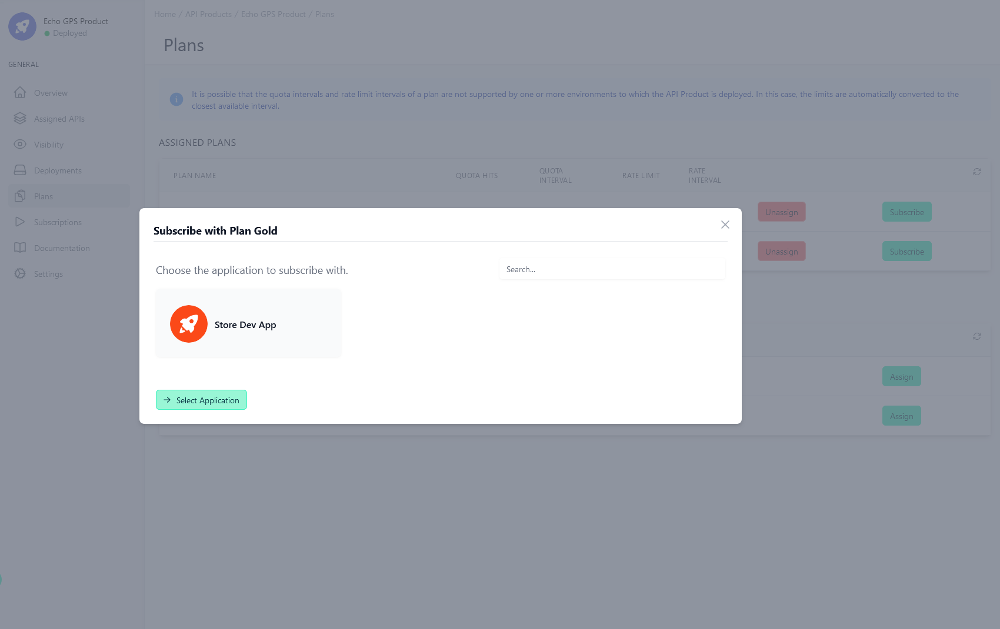
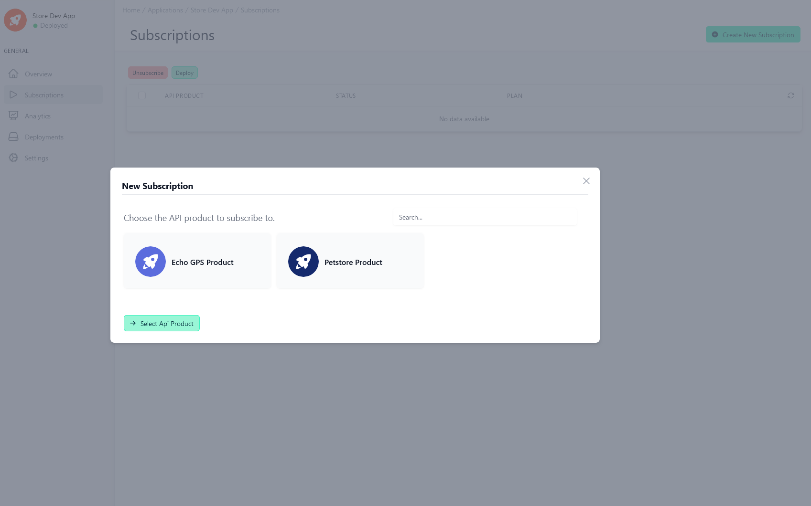
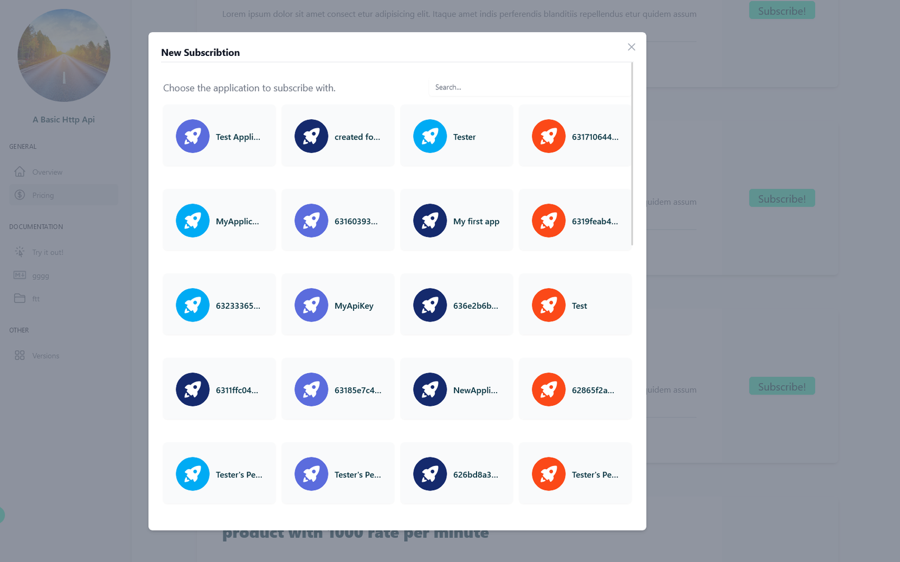

# Subscribe an API Product

<head>
  <meta name="guidename" content="API Management"/>
  <meta name="context" content="GUID-401fad27-fad5-49bd-8280-e17b1e09518e"/>
</head>

Subscribing in the Admin Portal and Developer Portal is slightly different. However, it can be subscribed in both portals in the detailed view of the API product, as well as in the detailed view of the application.

## Admin Portal

All API products to which the user has permissions are available for subscription here. Whether this API product is displayed in the Developer Portal is not relevant. It only needs to be deployed on one environment.

## From an API Product

First select the corresponding API product, then go to the plans and select a plan by clicking "Subscribe" in the related line. Now you just have to choose your application.

## From an Application

First select the application, select subscriptions and then click on new subscription. Choose the API product and a plan.

## Developer Portal

Only APIs that are visible, active and deployed on at least one production environment can be subscribed to.

