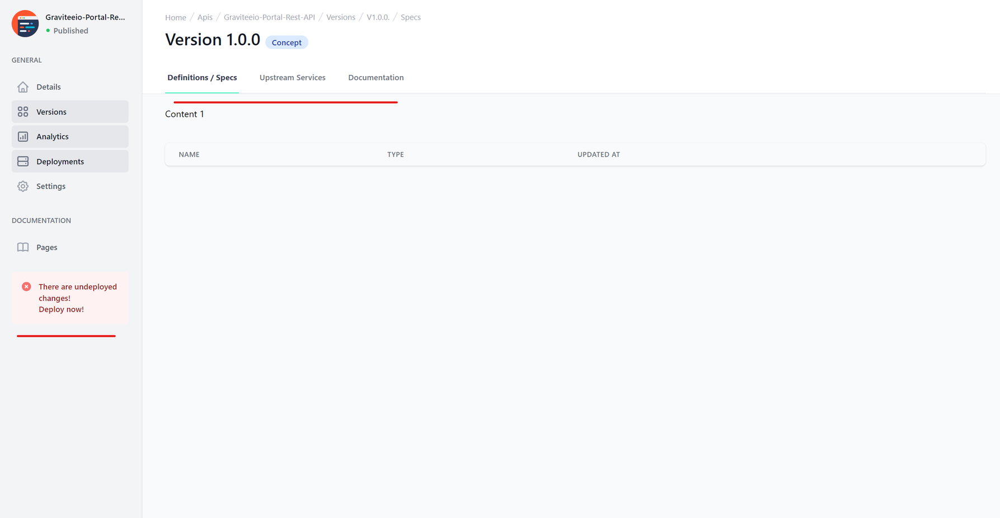

# UI - Structure

<head>
  <meta name="guidename" content="API Management"/>
  <meta name="context" content="GUID-b541ba4d-2e52-487b-b0bc-bcee2bfd030d"/>
</head>



The UI features three levels of menus. 

1. The first level should be restricted to high level concepts like APIs and Environments 

2. The second level is limited to one entity of a high level concept, i.e. a specific API. It can be grouped to give more structure to the options and allow for a quick scan of available options

3. The third level is limited to sub-entities of an entity, i.e. a specific version of an API

## View Naming

Views for a specific entity are named `<Entity><View>.vue`. There are two special views. The first is the list of all entities of this type (called `<Entity>List.vue>`) and the second is the view shell that displays the second level nav and hosts the detail pages (called `<Entity>Details.vue`). 

:::note

This convention replaces the `Index<Entity>` and `Edit<Entity>` naming.

:::

Example for environments


```
EnvironmentList
EnvironmentDetails
-----
EnvironmentOverview
EnvironmentSettings
EnvironmentDeployedAPIs
```

While this convention feels overly complex, it fulfills the requirement of the vue.js style guide that component names always have to consist of multiple words. 

Properties Promotion 
We do not hand over objects via properties from the `<Entity>Details` page to the different sub pages. Instead we carry over the ID. This has the downside, that we now need to load the object for this ID in the onMounted method of every view, but has the upside of being free to do, whatever we want in the sub pages without getting “unexpected mutation of prop”. The record is fetched from the store, so that there are no additional roundtrips to the backend. This looks cleaner like creating a computed property that mirrors the prop. 

 