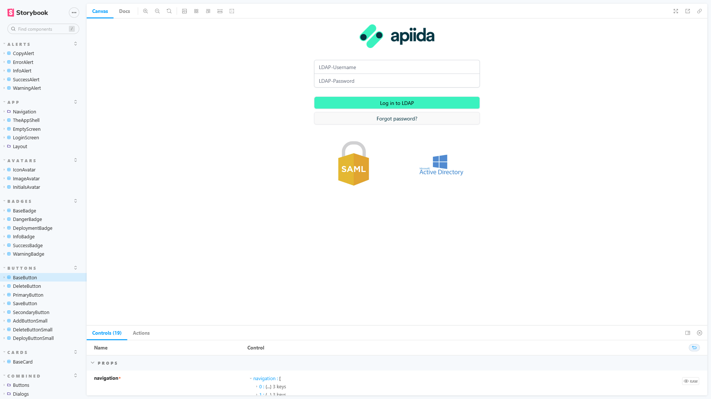

# Vue Components Library

<head>
  <meta name="guidename" content="API Management"/>
  <meta name="context" content="GUID-6c5972d6-cde7-4412-8c11-4ee09867ae07"/>
</head>

The aim is to create a solid basis of html components for all future projects with Vue. Base on [UI Framework and Icons](../Topics/cp-UI_framework_and_icons.md).

## Storybook

Storybook is an open source tool for building UI components and pages in isolation. It streamlines UI development, testing, and documentation.

[Storybook: Frontend workshop for UI development](https://storybook.js.org/)

## The Library

[npm: @apiida/vue-components](https://www.npmjs.com/package/@apiida/vue-components) 

