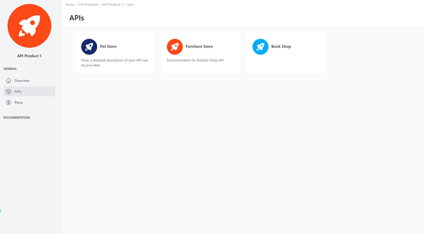

# Assigned APIs of the API Product in Developer Portal 

<head>
  <meta name="guidename" content="API Management"/>
  <meta name="context" content="GUID-95d467bd-88c5-4e3c-bcfa-b12d96f61c6c"/>
</head> 

## Overview

The interface presents a user-friendly view of the APIs associated with an API product, allowing for streamlined interaction and management. The APIs are neatly organized in a card layout. Icons, names, and concise descriptions on each card aid in quick identification. This setup enhances the user's ability to oversee and understand the suite of APIs at a glance.

 

## Assigned APIs

Each API card features an icon, the API name, a brief description, and the assigned tags.