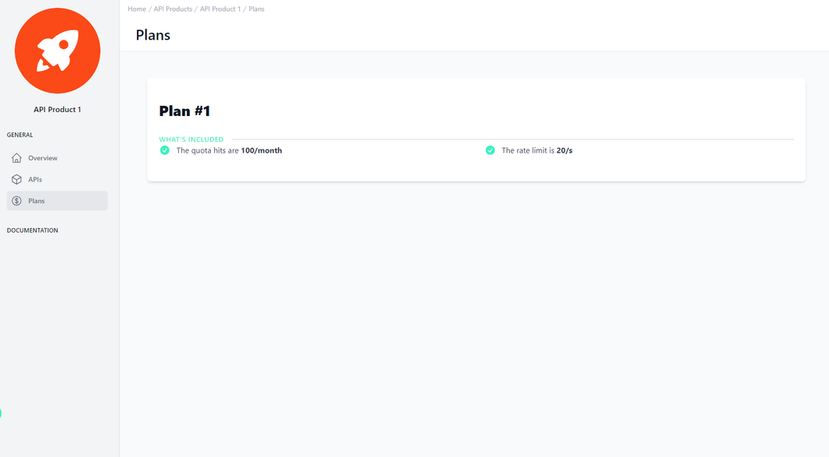

# Assigned Plans of the API Product in Developer Portal 

<head>
  <meta name="guidename" content="API Management"/>
  <meta name="context" content="GUID-1119750f-36b1-4445-81a0-ab6531c6c6f2"/>
</head> 

## Overview

Plans establish essential guidelines, including access levels, permissible usage, and various other vital stipulations for the API's end-users.

Laid out in an accessible card-style arrangement, the plans articulate the conditions of API usage. Each card shows details that are pertinent to administrators who oversee the API's functionality, as well as to consumers who utilize the API. Such details are fundamental in conveying the boundaries and possibilities of API interaction.

## Plan Details

Each card details the quota and rate limits associated with it.