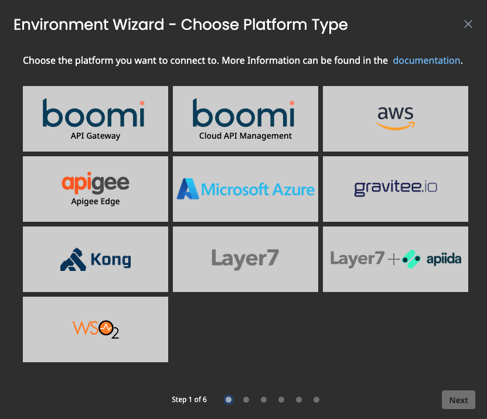

# How to Connect to Cloud API Management

<head>
  <meta name="guidename" content="API Management"/>
  <meta name="context" content="GUID-983c66f9-88ff-4509-9fd1-b172dc9197e0"/>
</head>

:::note

This method of connecting to Cloud API Management will be superseded soon. In the near future Control Plane will be able to automatically connect to Cloud API Management with no extra configuration required.

:::

On this page, you will find a step-by-step guide on how to connect Cloud API Management to the API Control Plane.

## Prerequisites

To proceed, you will need the following:

- Your Boomi account must be provisioned to use the API Control Plane.

- An account on Cloud API Management with at least one API.
- Developer API Key for executing Mashery APIs: V2 + V3 (Basic) APIs. You can create the key by logging in to https://developer.mashery.com/ with your service user credentials. After you create the key, contact Boomi Support to increase the quota to 10 QPS. The agent requires a higher quota allowance than is provided when the API Key is created for your service user. 

- [Docker](https://www.docker.com/) to utilize the image of our agent, which acts as an intermediary.

   Any other container environment is also possible. 
   Helm Charts are available here: [GitHub - CPagent-Helm](https://github.com/apiida/CPagent-Helm): This is the Helm Chart installation resource for the Control Plane agent.

## Create a new Environment

To get started, open your API Control Plane instance and follow the instructions below.

### Add an Environment

- Navigate to **Environments** in the menu on the left side.

- Click the **Register Environment** button in the top right corner.

- Click **Boomi Cloud API Management**.

- Confirm by clicking the **Next** button.

### Add Environment Information

- Complete the form below following the example below:

     - In [Environment Settings](../Topics/cp-Environment_settings.md) you will receive detailed information about the fields to be filled in.

- Confirm by clicking on the **Register Environment** button

- Click **Next** to start the Connection Wizard.

## Provide the Connection Information

The following describes how to create the configuration for Cloud API Management.

- `Area UUID`: To find the Area UUID, in Boomi Cloud API Management, click the API Control Center dashboard and then click the **Area** button.
- `Area ID`: To find the Area ID, in Boomi Cloud API Management, click the API Control Center dashboard and then click the **Area** button.
- `Username`: The username for the service user of your Boomi Cloud API Management account.
- `Password`: The password for the service user of your Boomi Cloud API Management account.
- `Client ID`: The API Key for the service user that was created on `developer.mashery.com` for API access. 
- `Client Secret`: The password for the Client ID.

- Your configuration file will download automatically.

- Confirm by clicking on the **Download and Next** button.

## Create an Agent as Intermediary

The following describes how to create a Docker container for the agent. It is described using a Docker compose file so that additional agents can be easily added to your Docker stack later.

- `image`: The docker image of the Cloud API Management Agent

- `container_name`: You can freely choose the name of your Agent here as well as in line 3.

- `environment`

     - `backendUrl`: The agent will establish a web-socket to this URL and thereby connect to your API Control Plane.

     - `gateway-config`: The path inside the container to the configuration you previously downloaded.

- `volumes`

     - The outer path of the configuration file : The inner path of the configuration file.

- Click **Download and Next** to download your agent docker compose.

- Put both files in the same folder. Then run the following commands. 

  `docker pull apiida/controlplane-agent`

   - Download the latest image of the agent 
   
   `docker compose up `
   
   - Starts the agent. It will connect automatically.

## Check the Agent's Status

- Open your API Control Plane instance.

- Select **Environments** in the menu on the left side.

     - Your Agent should now be connected to API Control Plane

- Click on the tile or the entry in the table to get more detailed information about the status of the connection. This can be very useful in case of an error.

:::note

**It is easy to add more agents**
Repeat the steps here and add the agents to the existing Docker compose file.

:::

## Cloud API Management Discovery and Deployment

Discovering API definitions from Cloud API Management allows you to:
- Create API Products in Control Plane 
- Create and assign plans for API Product subscriptions
- Subscribe to and consume the APIs through Control Plane Applications
- Publish Applications from Control Plane into Cloud API Management

:::note
Control Plane uses the API specification that exists in Cloud API Management. If you make changes to the API via the UI, you must also make that change in the API specification document.
:::

Use this guide for terminology mapping between Control Plane and Cloud API Management:

|Control Plane Entity Name|Cloud API Management Name|
|---|---|
|API|API Definition (and specs)|
|Application|Application|
|API Product| Package|
|Plan|Plan|

After you've registered your Cloud API Management environment in Control Plane, you can discover and package your APIs. 

:::note
This process assumes that you have created API Definitions in Cloud API Management.
:::

### Discover APIs

 In Control Plane **Environments**, select **Discover**. API Definitions from Cloud API Management display in the APIs list. 

### Create API Product

1. In **APIs**>**API Products**, select **Assign to API Product**.

2. Assign plans to the API product. In **API Products** > **Plans**, find or create the plan(s) and select **Assign**.

4. Subscribe to the API Product. In **API Products** > **Subscriptions**, find the plan name and select **Subscribe**.
5. Create an Application for the API Product. In **Applications**, select **Create New Application**. 

### Subscribe

1. Subscribe to the Application. In **Applications** > **Subscriptions**, select **Create New Subscription** and select the API product name. 
7. Subscriptions must be approved by an Administrator. In **Home**, find the approval request and select **Approve.** 

After approving, a package and package key are created in Cloud API Management for the API Product. In Cloud API Management, the Package and Plan are part of the package key and the API Package name is the API Product created in the Control Plane.

:::note
If you change the plan in Control Plane, the existing package key is deleted in Cloud API Management and a new one is created.
:::