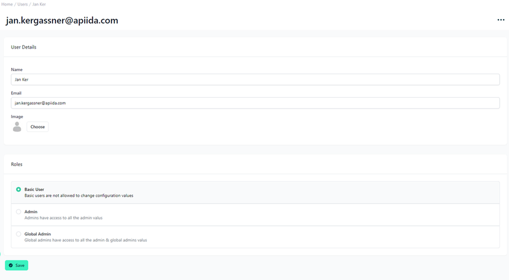

# Individual Users

<head>
  <meta name="guidename" content="API Management"/>
  <meta name="context" content="GUID-d41314d5-89f9-456a-bde2-bd0b2431dc61"/>
</head> 

## Overview

In this view, we have a closer look at the individual user management capabilities within the API Control Plane. This part of the platform is designed for an in-depth configuration of user accounts, including contact information, profile images, and role definitions.

## Detailing User Information 

At the top, we see the user's contact details prominently displayed with their name and email address. The layout prioritizes ease of reading and immediate access to user identification. Below the contact details is an option to add or change a user's profile image. 

At the bottom of this section, there is a "Save" button, which is used to commit any changes made to the user profile.

By clicking the “…” at the top-right corner, the option to delete a user or resend an invitation appears.

## Role Configuration

Further down, the interface presents a way to assign roles to the user. Three roles are available: Basic User, Admin, and Global Admin. Each role comes with a brief explanation of the access level it grants:

- The Basic User role restricts the ability to alter configuration values, suggesting that this role is intended for users who need to access the system but not modify it.

- The Admin role offers broader privileges, related to managing specific segments or features within the platform.

- The Global Admin role extends the most comprehensive access across the system, which includes permissions of the basic admin and more.